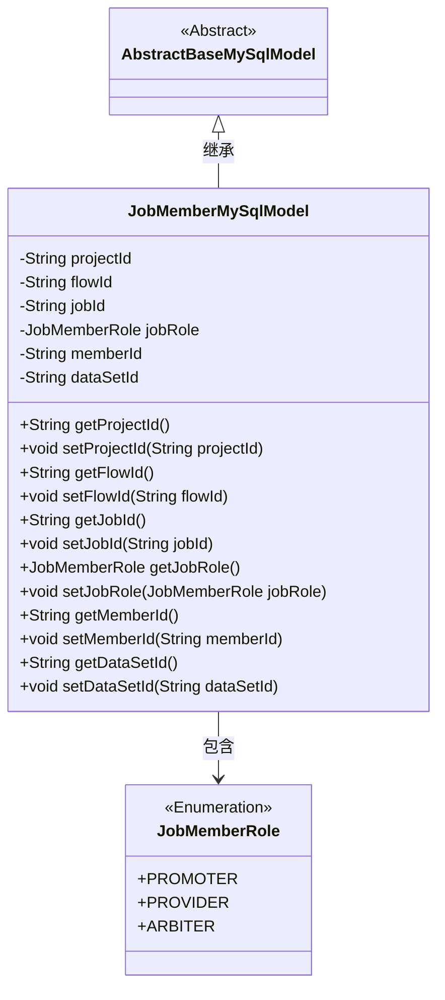

# 基础信息

|      |      |
|------|------|
| 名称 | JobMemberMySqlModel |
| 编码语言 | .java |
| 代码路径 | WeFe/board/board-service/src/main/java/com/welab/wefe/board/service/database/entity/job/JobMemberMySqlModel.java |
| 包名 | com.welab.wefe.board.service.database.entity.job |
| 依赖项 | ['com.welab.wefe.board.service.database.entity.base.AbstractBaseMySqlModel', 'com.welab.wefe.common.wefe.enums.JobMemberRole', 'javax.persistence.Entity', 'javax.persistence.EnumType', 'javax.persistence.Enumerated'] |
| 概述说明 | JobMemberMySqlModel类表示任务成员，包含项目、流程、任务ID，成员角色（promoter/provider/arbiter）、成员ID和数据集ID。 |

# 说明

这是一个名为JobMemberMySqlModel的Java实体类，映射到数据库表job_member。它继承自AbstractBaseMySqlModel，包含六个主要字段：projectId表示项目ID，flowId表示流程ID，jobId表示任务ID，jobRole表示成员在任务中的角色（枚举类型，包括promoter/provider/arbiter），memberId表示成员ID，dataSetId表示数据集ID。每个字段都有对应的getter和setter方法用于访问和修改属性值。

# 类列表 Class Summary

| 名称   | 类型  | 说明 |
|-------|------|-------------|
| JobMemberMySqlModel | class | JobMemberMySqlModel实体类，包含项目、流程、任务ID，成员角色（promoter/provider/arbiter）、成员ID及数据集ID字段及其getter/setter方法。 |

## 类 JobMemberMySqlModel

|      |      |
|------|------|
| 访问范围 | @Entity(name = "job_member");public |
| 类型 | class |
| 名称 | JobMemberMySqlModel |
| 说明 | JobMemberMySqlModel实体类，包含项目、流程、任务ID，成员角色（promoter/provider/arbiter）、成员ID及数据集ID字段及其getter/setter方法。 |

### UML类图

这段代码定义了一个名为JobMemberMySqlModel的实体类，用于表示任务成员在MySQL中的模型。该类继承自AbstractBaseMySqlModel抽象基类，包含项目ID、流程ID、任务ID等字段，并使用枚举类型JobMemberRole来表示成员在任务中的角色。类中为每个字段提供了getter和setter方法，实现了对成员数据的封装和访问控制。

### 内部方法调用关系图

```mermaid
graph TD
    A["类JobMemberMySqlModel"]
    B["继承: AbstractBaseMySqlModel"]
    C["属性: String projectId"]
    D["属性: String flowId"]
    E["属性: String jobId"]
    F["属性: JobMemberRole jobRole"]
    G["属性: String memberId"]
    H["属性: String dataSetId"]
    I["方法: getProjectId()"]
    J["方法: setProjectId(String)"]
    K["方法: getFlowId()"]
    L["方法: setFlowId(String)"]
    M["方法: getJobId()"]
    N["方法: setJobId(String)"]
    O["方法: getJobRole()"]
    P["方法: setJobRole(JobMemberRole)"]
    Q["方法: getMemberId()"]
    R["方法: setMemberId(String)"]
    S["方法: getDataSetId()"]
    T["方法: setDataSetId(String)"]

    A --> B
    A --> C
    A --> D
    A --> E
    A --> F
    A --> G
    A --> H
    A --> I
    A --> J
    A --> K
    A --> L
    A --> M
    A --> N
    A --> O
    A --> P
    A --> Q
    A --> R
    A --> S
    A --> T
```

这段代码定义了一个名为JobMemberMySqlModel的JPA实体类，继承自AbstractBaseMySqlModel。该类包含7个核心属性，分别表示项目ID、流程ID、任务ID、成员角色、成员ID和数据集ID，其中jobRole属性使用枚举类型JobMemberRole。类中为每个属性提供了标准的getter和setter方法，用于属性的读取和修改。该实体映射到数据库表"job_member"，是一个典型的数据持久化模型，用于存储任务成员的相关信息。

### 字段列表 Field List

| 名称  | 类型  | 说明 |
|-------|-------|------|
| projectId | String | 项目ID字符串变量 |
| flowId | String | 声明一个私有字符串变量flowId。 |
| dataSetId | String | 私有字符串类型变量dataSetId。 |
| jobRole | JobMemberRole | 枚举类型字段jobRole，使用字符串形式存储角色值。 |
| jobId | String | 私有字符串类型变量jobId |
| memberId | String | 成员ID字符串类型私有变量。 |

### 方法列表

| 名称  | 类型  | 说明 |
|-------|-------|------|
| setJobId | void | 这是一个Java方法，用于设置类中的jobId属性值。方法接收一个字符串参数jobId，并将其赋值给类的成员变量this.jobId。 |
| getFlowId | String | 获取当前流程ID的方法，直接返回成员变量flowId的值。 |
| getJobId | String | 获取当前任务的唯一标识符jobId。 |
| getProjectId | String | 这是一个Java方法，返回字符串类型的projectId成员变量值。 |
| setJobRole | void | 方法setJobRole用于设置成员的工作角色，参数为JobMemberRole类型。 |
| setFlowId | void | 设置流程ID的方法，将参数flowId赋值给类的成员变量flowId。 |
| setProjectId | void | 设置项目ID的方法，将输入参数赋值给类的projectId成员变量。 |
| getJobRole | JobMemberRole | 获取当前对象的jobRole属性值。 |
| getMemberId | String | 获取成员ID的方法，返回字符串类型的memberId。 |
| setMemberId | void | 设置成员ID的方法，将输入字符串赋值给成员变量memberId。 |
| getDataSetId | String | 获取数据集ID的方法，返回字符串类型的数据集ID。 |
| setDataSetId | void | 设置数据集ID的方法，将输入参数赋值给类的成员变量dataSetId。 |

