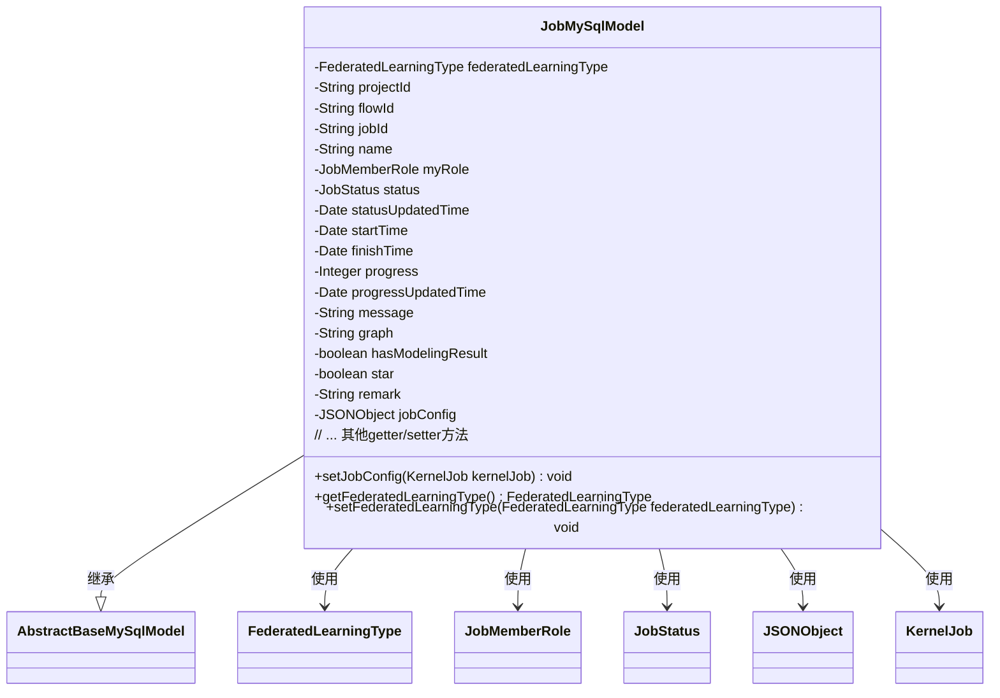

# 基础信息

|      |      |
|------|------|
| 名称 | JobMySqlModel |
| 编码语言 | .java |
| 代码路径 | WeFe/board/board-service/src/main/java/com/welab/wefe/board/service/database/entity/job/JobMySqlModel.java |
| 包名 | com.welab.wefe.board.service.database.entity.job |
| 依赖项 | ['com.alibaba.fastjson.JSONObject', 'com.vladmihalcea.hibernate.type.json.JsonStringType', 'com.welab.wefe.board.service.database.entity.base.AbstractBaseMySqlModel', 'com.welab.wefe.board.service.dto.kernel.machine_learning.KernelJob', 'com.welab.wefe.common.wefe.enums.FederatedLearningType', 'com.welab.wefe.common.wefe.enums.JobMemberRole', 'com.welab.wefe.common.wefe.enums.JobStatus', 'org.hibernate.annotations.Type', 'org.hibernate.annotations.TypeDef', 'javax.persistence.Column', 'javax.persistence.Entity', 'javax.persistence.EnumType', 'javax.persistence.Enumerated', 'java.util.Date'] |
| 概述说明 | JobMySqlModel类定义了联邦学习任务的数据模型，包含任务类型、ID、状态、时间、进度、配置等字段，支持JSON存储配置信息。 |

# 说明

JobMySqlModel是一个用于表示联邦学习任务的实体类，继承自AbstractBaseMySqlModel。该类包含任务类型（横向/纵向）、项目ID、流程ID、任务ID、名称、身份角色（promoter/provider/arbiter）、状态、状态更新时间、开始时间、结束时间、进度、进度更新时间、消息备注、有向无环图、是否包含建模结果、收藏标记、备注以及JSON格式的任务配置信息。所有字段均提供了对应的getter和setter方法。

# 类列表 Class Summary

| 名称   | 类型  | 说明 |
|-------|------|-------------|
| JobMySqlModel | class | JobMySqlModel类定义了联邦学习任务的数据模型，包含任务类型、项目ID、流程ID、任务ID、名称、角色、状态、时间、进度、消息、配置等字段，用于数据库存储和操作。 |

## 类 JobMySqlModel

|      |      |
|------|------|
| 访问范围 | @Entity(name = "job");@TypeDef(name = "json", typeClass = JsonStringType.class);public |
| 类型 | class |
| 名称 | JobMySqlModel |
| 说明 | JobMySqlModel类定义了联邦学习任务的数据模型，包含任务类型、项目ID、流程ID、任务ID、名称、角色、状态、时间、进度、消息、配置等字段，用于数据库存储和操作。 |

### UML类图

这段代码定义了一个名为JobMySqlModel的实体类，继承自AbstractBaseMySqlModel，用于表示数据库中的任务信息。该类包含多个字段，如任务类型、项目ID、流程ID、任务ID、名称、角色、状态、时间信息、进度、消息、图形配置等，并提供了相应的getter和setter方法。特别地，jobConfig字段使用JSON格式存储任务配置信息，并通过setJobConfig方法接受KernelJob对象进行转换。该类通过注解与数据库表"job"映射，并支持JSON类型的字段存储。

### 内部方法调用关系图

```mermaid
graph TD
    A["类JobMySqlModel"]
    B["注解: @Entity('job')"]
    C["注解: @TypeDef(name='json', typeClass=JsonStringType.class)"]
    D["继承: AbstractBaseMySqlModel"]
    E["枚举属性: FederatedLearningType federatedLearningType"]
    F["字符串属性: projectId, flowId, jobId, name, message, graph, remark"]
    G["枚举属性: JobMemberRole myRole, JobStatus status"]
    H["日期属性: statusUpdatedTime, startTime, finishTime, progressUpdatedTime"]
    I["数值属性: Integer progress"]
    J["布尔属性: hasModelingResult, star"]
    K["JSON属性: JSONObject jobConfig"]
    L["特殊方法: setJobConfig(KernelJob)"]
    M["标准getter/setter方法"]

    A --> B
    A --> C
    A --> D
    A --> E
    A --> F
    A --> G
    A --> H
    A --> I
    A --> J
    A --> K
    A --> L
    A --> M
```

这段代码定义了一个名为JobMySqlModel的JPA实体类，用于映射数据库中的job表。该类继承自AbstractBaseMySqlModel，包含多种类型的属性：枚举类型（联邦学习类型、成员角色、任务状态）、字符串类型（项目ID、流程ID等）、日期类型（状态更新时间、开始时间等）、数值类型（进度）、布尔类型（是否包含建模结果、收藏标记）以及JSON类型的任务配置。类中提供了标准的getter/setter方法，并包含一个特殊方法setJobConfig用于将KernelJob对象转换为JSON配置。通过注解实现了JSON类型字段的数据库映射和表名定义。

### 字段列表 Field List

| 名称  | 类型  | 说明 |
|-------|-------|------|
| hasModelingResult | boolean | 变量hasModelingResult是布尔类型，用于表示是否存在建模结果。 |
| progress | Integer | 整型变量progress，用于记录进度。 |
| progressUpdatedTime | Date | 私有日期类型变量，记录进度更新时间。 |
| startTime | Date | 私有日期类型变量startTime |
| remark | String | 私有字符串类型备注字段。 |
| serialVersionUID = 8933206598650203308L | long | 定义了一个私有静态不可变的长整型序列化版本ID，值为8933206598650203308。 |
| statusUpdatedTime | Date | 私有日期类型变量statusUpdatedTime，记录状态更新时间。 |
| status | JobStatus | 枚举类型字段status，使用字符串形式存储。 |
| finishTime | Date | 私有日期类型变量finishTime，用于存储完成时间。 |
| name | String | 私有字符串类型变量name。 |
| star | boolean | 私有布尔类型变量star |
| message | String | 私有字符串变量message。 |
| projectId | String | 声明一个私有字符串变量projectId。 |
| jobConfig | JSONObject | 实体类字段jobConfig使用JSON类型，数据库列定义为json格式。 |
| federatedLearningType | FederatedLearningType | 代码定义了一个枚举类型字段federatedLearningType，使用@Enumerated注解指定按字符串形式存储枚举值。 |
| flowId | String | 私有字符串变量flowId，用于存储流程标识。 |
| graph | String | 声明一个私有字符串变量graph。 |
| jobId | String | 私有字符串类型变量jobId。 |
| myRole | JobMemberRole | 使用@Enumerated注解将枚举类型JobMemberRole的myRole字段以字符串形式存储到数据库。 |

### 方法列表

| 名称  | 类型  | 说明 |
|-------|-------|------|
| setMessage | void | 这是一个Java方法，用于设置类的message属性值。方法接收一个字符串参数message，并将其赋值给类的成员变量this.message。 |
| setProgress | void | 这是一个Java方法，用于设置进度值。方法名为setProgress，接收一个Integer参数progress，并将其赋值给类的成员变量progress。 |
| isHasModelingResult | boolean | 检查是否包含建模结果，返回布尔值。 |
| getStartTime | Date | 获取开始时间的方法，返回Date类型变量startTime。 |
| isStar | boolean | 方法isStar返回布尔值star。 |
| getJobId | String | 获取jobId的公共方法，返回字符串类型的jobId。 |
| getFinishTime | Date | 获取完成时间的方法，返回finishTime对象。 |
| setName | void | 这是一个Java方法，用于设置对象的名称属性。方法接受一个字符串参数name，并将其赋值给当前对象的name字段。 |
| getRemark | String | 获取备注信息的公共方法，返回字符串类型备注内容。 |
| setJobConfig | void | 方法setJobConfig接收KernelJob对象，将其转为JSON字符串并赋值给jobConfig。 |
| setProgressUpdatedTime | void | 设置进度更新时间的方法，将参数progressUpdatedTime赋值给类的同名成员变量。 |
| setJobId | void | 设置任务ID的方法，将输入参数jobId赋值给类的成员变量jobId。 |
| getProjectId | String | 获取项目ID的方法，返回字符串类型的projectId。 |
| setRemark | void | 这是一个Java方法，用于设置对象的备注信息。方法接收字符串参数remark，并将其赋值给对象的remark属性。 |
| setStatus | void | 设置任务状态的方法，将传入的状态参数赋值给当前对象的status属性。 |
| getStatus | JobStatus | 方法返回JobStatus对象的状态值。 |
| setFlowId | void | 设置流程ID的方法，将参数flowId赋值给当前对象的flowId属性。 |
| getName | String | 这是一个Java方法，返回字符串类型的name变量值。 |
| getGraph | String | 获取graph字符串的方法。 |
| setFederatedLearningType | void | 设置联邦学习类型的方法，参数为FederatedLearningType类型。 |
| setStartTime | void | 设置开始时间的方法，参数为Date类型。 |
| getFederatedLearningType | FederatedLearningType | 方法返回联邦学习类型对象federatedLearningType。 |
| setFinishTime | void | 设置完成时间的方法，将参数finishTime赋值给类的finishTime属性。 |
| getJobConfig | JSONObject | 方法返回jobConfig的JSONObject对象。 |
| setJobConfig | void | 方法setJobConfig接收JSONObject参数jobConfig，并将其赋值给当前对象的同名属性。 |
| getProgressUpdatedTime | Date | 获取进度更新时间的方法，返回progressUpdatedTime变量值。 |
| setMyRole | void | 这是一个Java方法，用于设置当前对象的myRole属性值为传入的JobMemberRole类型参数。 |
| setStatusUpdatedTime | void | 设置状态更新时间的方法，将输入参数赋值给对象的statusUpdatedTime属性。 |
| setGraph | void | 设置图形属性的方法，将输入字符串赋给类变量graph。 |
| setStar | void | 设置对象星标状态的方法，参数为布尔值star。 |
| getProgress | Integer | 获取进度值的方法，返回整数类型的progress变量。 |
| getStatusUpdatedTime | Date | 获取状态更新时间的方法，返回statusUpdatedTime变量值。 |
| getMessage | String | 方法返回字符串类型的message变量值。 |
| getMyRole | JobMemberRole | 获取当前用户的角色信息。 |
| setProjectId | void | 设置项目ID的方法，将输入参数projectId赋值给当前对象的projectId属性。 |
| setHasModelingResult | void | 设置模型结果标志的方法，用于更新hasModelingResult布尔值。 |
| getFlowId | String | 这是一个Java方法，返回字符串类型的flowId成员变量值。 |

