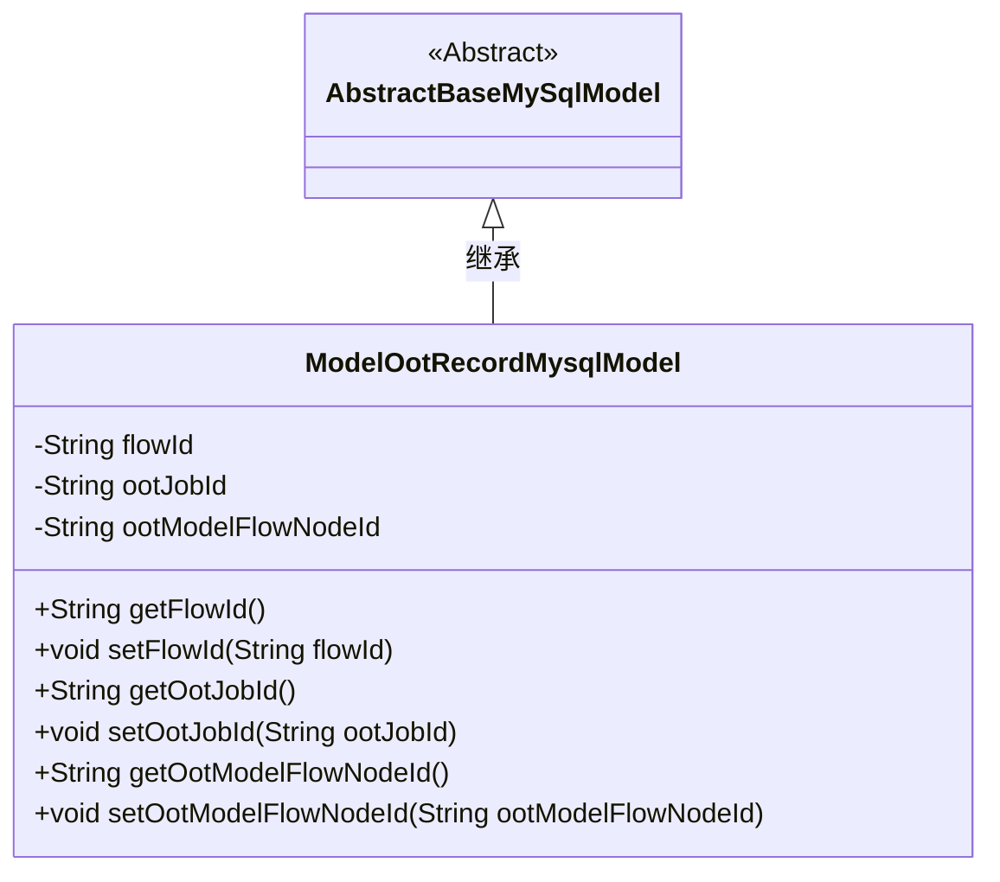
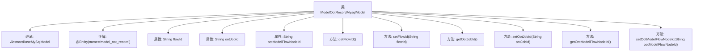

# 基础信息

|      |      |
|------|------|
| 名称 | ModelOotRecordMysqlModel |
| 编码语言 | .java |
| 代码路径 | WeFe/board/board-service/src/main/java/com/welab/wefe/board/service/database/entity/job/ModelOotRecordMysqlModel.java |
| 包名 | com.welab.wefe.board.service.database.entity.job |
| 依赖项 | ['com.welab.wefe.board.service.database.entity.base.AbstractBaseMySqlModel', 'javax.persistence.Entity'] |
| 概述说明 | 实体类ModelOotRecordMysqlModel包含流程ID、被oot的作业ID和被oot的模型id三个字段及其getter和setter方法。 |

# 说明

这是一个名为ModelOotRecordMysqlModel的Java实体类，映射到数据库表model_oot_record。它继承自AbstractBaseMySqlModel，包含三个字符串类型字段：flowId表示流程ID，ootJobId表示被oot的作业ID，ootModelFlowNodeId表示被oot的模型节点ID。每个字段都有对应的getter和setter方法用于访问和修改属性值。

# 类列表 Class Summary

| 名称   | 类型  | 说明 |
|-------|------|-------------|
| ModelOotRecordMysqlModel | class | ModelOotRecordMysqlModel是存储OOT记录的实体类，包含流程ID、被OOT的作业ID和模型节点ID三个字段及其getter/setter方法。 |

## 类 ModelOotRecordMysqlModel

|      |      |
|------|------|
| 访问范围 | @Entity(name = "model_oot_record");public |
| 类型 | class |
| 名称 | ModelOotRecordMysqlModel |
| 说明 | ModelOotRecordMysqlModel是存储OOT记录的实体类，包含流程ID、被OOT的作业ID和模型节点ID三个字段及其getter/setter方法。 |

### UML类图

这段代码展示了一个名为ModelOotRecordMysqlModel的实体类，它继承自抽象基类AbstractBaseMySqlModel。该类用于存储与模型OOT（Out of Time）记录相关的数据，包含三个核心属性：流程ID（flowId）、被OOT的作业ID（ootJobId）和被OOT的模型流程节点ID（ootModelFlowNodeId）。每个属性都有对应的getter和setter方法，遵循标准的JavaBean规范。通过@Entity注解表明这是一个JPA实体类，映射到数据库中的"model_oot_record"表。类图清晰地展示了继承关系和类的成员结构。

### 内部方法调用关系图

这段代码定义了一个名为ModelOotRecordMysqlModel的实体类，继承自AbstractBaseMySqlModel，并使用@Entity注解标记为数据库实体。类中包含三个私有属性：flowId、ootJobId和ootModelFlowNodeId，分别表示流程ID、被OOT的作业ID和被OOT的模型节点ID。每个属性都有对应的getter和setter方法，用于属性的读取和设置。该类主要用于在数据库中存储和管理OOT（Out of Time）记录的相关信息。

### 字段列表 Field List

| 名称  | 类型  | 说明 |
|-------|-------|------|
| flowId | String | 定义字符串类型变量flowId，用于存储流程ID。 |
| ootModelFlowNodeId | String | 私有字符串变量ootModelFlowNodeId，用于存储模型流程节点ID。 |
| ootJobId | String | 私有字符串变量ootJobId，用于存储任务ID。 |

### 方法列表

| 名称  | 类型  | 说明 |
|-------|-------|------|
| setOotModelFlowNodeId | void | 设置OOT模型流程节点ID的方法。 |
| setOotJobId | void | 设置OOT作业ID的方法，将参数值赋给类变量ootJobId。 |
| getOotJobId | String | 这是一个Java方法，返回名为ootJobId的字符串变量值。 |
| setFlowId | void | 设置流程ID的方法，将参数flowId赋值给当前对象的flowId属性。 |
| getOotModelFlowNodeId | String | 获取OOT模型流程节点ID的方法，返回字符串类型的节点ID值。 |
| getFlowId | String | 获取当前流程ID的方法，返回字符串类型的flowId。 |

