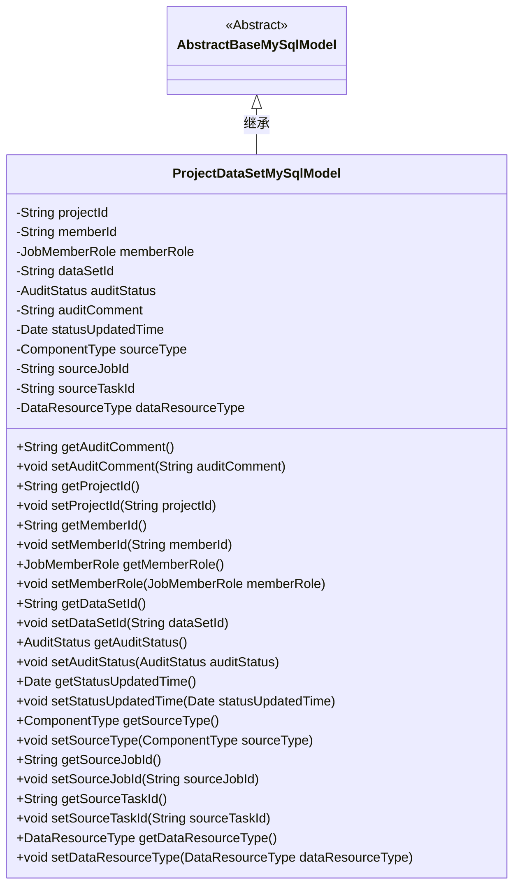

# 基础信息

|      |      |
|------|------|
| 名称 | ProjectDataSetMySqlModel |
| 编码语言 | .java |
| 代码路径 | WeFe/board/board-service/src/main/java/com/welab/wefe/board/service/database/entity/job/ProjectDataSetMySqlModel.java |
| 包名 | com.welab.wefe.board.service.database.entity.job |
| 依赖项 | ['com.welab.wefe.board.service.database.entity.base.AbstractBaseMySqlModel', 'com.welab.wefe.common.wefe.enums.AuditStatus', 'com.welab.wefe.common.wefe.enums.ComponentType', 'com.welab.wefe.common.wefe.enums.DataResourceType', 'com.welab.wefe.common.wefe.enums.JobMemberRole', 'javax.persistence.Entity', 'javax.persistence.EnumType', 'javax.persistence.Enumerated', 'java.util.Date'] |
| 概述说明 | 项目数据集MySQL模型类，包含项目ID、成员ID、角色、数据集ID、审核状态、来源组件类型、任务ID、子任务ID及数据集类型等字段，提供getter/setter方法。 |

# 说明

这是一个名为ProjectDataSetMySqlModel的Java实体类，映射到数据库表project_data_set。它继承自AbstractBaseMySqlModel，包含项目ID、成员ID、成员角色、数据集ID等核心字段。成员角色使用JobMemberRole枚举区分数据集归属，状态字段auditStatus使用AuditStatus枚举表示审核状态。类中还包含审核意见、状态更新时间、来源组件类型、来源任务ID、来源子任务ID以及数据集类型等字段。所有字段都配有对应的getter和setter方法，便于数据访问和修改。

# 类列表 Class Summary

| 名称   | 类型  | 说明 |
|-------|------|-------------|
| ProjectDataSetMySqlModel | class | 项目数据集实体类，包含项目ID、成员ID、角色、数据集ID、审核状态、来源类型、任务ID等字段，用于管理数据集相关信息。 |

## 类 ProjectDataSetMySqlModel

|      |      |
|------|------|
| 访问范围 | @Entity(name = "project_data_set");public |
| 类型 | class |
| 名称 | ProjectDataSetMySqlModel |
| 说明 | 项目数据集实体类，包含项目ID、成员ID、角色、数据集ID、审核状态、来源类型、任务ID等字段，用于管理数据集相关信息。 |

### UML类图

类图描述：ProjectDataSetMySqlModel类继承自AbstractBaseMySqlModel抽象类，用于表示项目数据集在MySQL中的模型。包含项目ID、成员ID、成员角色、数据集ID、审核状态、审核意见、状态更新时间、来源组件类型、来源任务ID、来源子任务ID和数据集类型等私有字段，并为每个字段提供了对应的getter和setter方法。该类通过继承获得了基类的通用数据库操作能力，同时扩展了特定于项目数据集的属性和行为。

### 内部方法调用关系图

```mermaid
graph TD
    A["类ProjectDataSetMySqlModel"]
    B["继承: AbstractBaseMySqlModel"]
    C["属性: String projectId"]
    D["属性: String memberId"]
    E["属性: JobMemberRole memberRole"]
    F["属性: String dataSetId"]
    G["属性: AuditStatus auditStatus"]
    H["属性: String auditComment"]
    I["属性: Date statusUpdatedTime"]
    J["属性: ComponentType sourceType"]
    K["属性: String sourceJobId"]
    L["属性: String sourceTaskId"]
    M["属性: DataResourceType dataResourceType"]
    N["方法: getAuditComment/setAuditComment"]
    O["方法: getProjectId/setProjectId"]
    P["方法: getMemberId/setMemberId"]
    Q["方法: getMemberRole/setMemberRole"]
    R["方法: getDataSetId/setDataSetId"]
    S["方法: getAuditStatus/setAuditStatus"]
    T["方法: getStatusUpdatedTime/setStatusUpdatedTime"]
    U["方法: getSourceType/setSourceType"]
    V["方法: getSourceJobId/setSourceJobId"]
    W["方法: getSourceTaskId/setSourceTaskId"]
    X["方法: getDataResourceType/setDataResourceType"]

    A --> B
    A --> C
    A --> D
    A --> E
    A --> F
    A --> G
    A --> H
    A --> I
    A --> J
    A --> K
    A --> L
    A --> M
    A --> N
    A --> O
    A --> P
    A --> Q
    A --> R
    A --> S
    A --> T
    A --> U
    A --> V
    A --> W
    A --> X
```

这段代码定义了一个名为ProjectDataSetMySqlModel的JPA实体类，继承自AbstractBaseMySqlModel。该类包含12个属性，分别表示项目ID、成员ID、成员角色、数据集ID、审核状态、审核意见、状态更新时间、来源组件类型、来源任务ID、来源子任务ID和数据集类型。每个属性都有对应的getter和setter方法。该类用于映射数据库中的project_data_set表，通过注解实现了枚举类型与字符串的映射，并包含了数据集的完整元信息管理功能。

### 字段列表 Field List

| 名称  | 类型  | 说明 |
|-------|-------|------|
| auditStatus | AuditStatus | 实体类字段auditStatus使用字符串枚举类型映射。 |
| dataResourceType | DataResourceType | 定义枚举类型字段dataResourceType，使用字符串形式存储枚举值。 |
| auditComment | String | 私有字符串类型变量auditComment，用于存储审核意见。 |
| projectId | String | 项目ID字符串变量 |
| memberRole | JobMemberRole | 枚举类型字段memberRole，使用字符串形式存储角色值。 |
| dataSetId | String | 数据集ID的私有字符串变量。 |
| memberId | String | 成员ID字符串变量 |
| sourceType | ComponentType | 定义枚举类型字段sourceType，使用字符串形式存储枚举值。 |
| serialVersionUID = 7360644396326460699L | long | 定义序列化版本UID，值为7360644396326460699L。 |
| sourceTaskId | String | 私有字符串变量，存储源任务ID。 |
| sourceJobId | String | 私有字符串变量sourceJobId，用于存储源作业ID。 |
| statusUpdatedTime | Date | 私有日期类型变量，记录状态更新时间。 |

### 方法列表

| 名称  | 类型  | 说明 |
|-------|-------|------|
| setDataSetId | void | 设置数据集ID的方法，将传入的dataSetId赋值给当前对象的同名属性。 |
| setStatusUpdatedTime | void | 设置状态更新时间的方法，将参数值赋给类的成员变量statusUpdatedTime。 |
| setAuditStatus | void | 设置审核状态的方法，将传入的auditStatus赋值给当前对象的auditStatus属性。 |
| setMemberRole | void | 设置成员角色方法，将传入的memberRole赋值给当前对象的memberRole属性。 |
| getProjectId | String | 方法返回项目ID字符串。 |
| getAuditStatus | AuditStatus | 获取审核状态的方法，返回auditStatus变量值。 |
| getAuditComment | String | 获取审计评语的方法，返回auditComment字符串。 |
| setAuditComment | void | 方法setAuditComment用于设置auditComment属性的值。 |
| getMemberRole | JobMemberRole | 方法getMemberRole返回成员角色对象memberRole。 |
| setProjectId | void | 这是一个Java方法，用于设置类的projectId属性值。方法接收一个字符串参数projectId，并将其赋值给类的同名成员变量。 |
| getStatusUpdatedTime | Date | 获取状态更新时间的方法，返回statusUpdatedTime值。 |
| getSourceType | ComponentType | 获取源组件类型的方法，返回sourceType变量值。 |
| setMemberId | void | Java方法：设置成员ID，参数为字符串memberId，赋值给当前对象的memberId属性。 |
| getMemberId | String | 获取成员ID的方法，返回字符串类型的memberId。 |
| setSourceType | void | Java方法：设置组件类型参数。 |
| getSourceJobId | String | 获取sourceJobId的方法，返回字符串类型的sourceJobId值。 |
| setSourceJobId | void | 设置源作业ID的方法，将输入参数赋值给类的成员变量sourceJobId。 |
| getSourceTaskId | String | 获取源任务ID的方法，直接返回成员变量sourceTaskId的值。 |
| setSourceTaskId | void | 设置源任务ID的方法，将输入参数赋值给类的成员变量sourceTaskId。 |
| getDataResourceType | DataResourceType | 该方法返回数据资源类型对象dataResourceType。 |
| setDataResourceType | void | 这是一个Java方法，用于设置类的数据资源类型属性。方法接收一个DataResourceType类型的参数，并将其赋值给类的成员变量dataResourceType。 |
| getDataSetId | String | 该方法返回数据集ID字符串。 |

