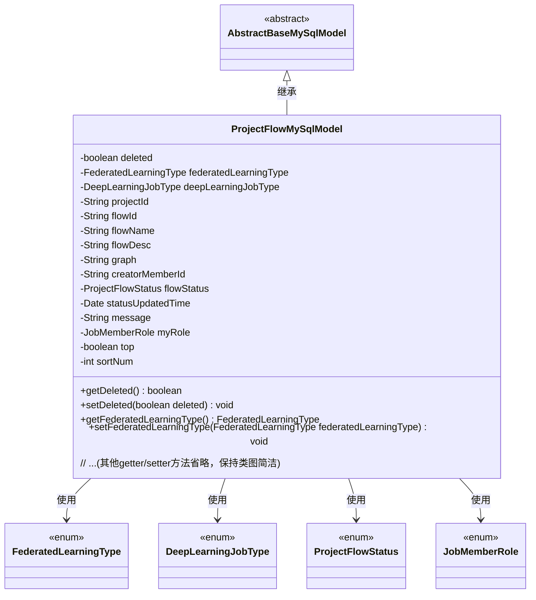

# 基础信息

|      |      |
|------|------|
| 名称 | ProjectFlowMySqlModel |
| 编码语言 | .java |
| 代码路径 | WeFe/board/board-service/src/main/java/com/welab/wefe/board/service/database/entity/job/ProjectFlowMySqlModel.java |
| 包名 | com.welab.wefe.board.service.database.entity.job |
| 依赖项 | ['com.welab.wefe.board.service.database.entity.base.AbstractBaseMySqlModel', 'com.welab.wefe.common.wefe.enums.DeepLearningJobType', 'com.welab.wefe.common.wefe.enums.FederatedLearningType', 'com.welab.wefe.common.wefe.enums.JobMemberRole', 'com.welab.wefe.common.wefe.enums.ProjectFlowStatus', 'javax.persistence.Entity', 'javax.persistence.EnumType', 'javax.persistence.Enumerated', 'java.util.Date'] |
| 概述说明 | 项目流程实体类，包含流程ID、名称、描述、状态、类型、创建者、排序等属性，用于管理联邦学习项目流程。 |

# 说明

这是一个名为ProjectFlowMySqlModel的Java实体类，映射到数据库表project_flow。它继承自AbstractBaseMySqlModel，包含序列化ID和多个字段：删除标志、联邦学习类型、深度学习任务类型、项目ID、流程ID、名称和描述、流程图数据、创建者ID、流程状态及更新时间、消息、我方角色、置顶标志和排序序号。每个字段都有对应的getter和setter方法。

# 类列表 Class Summary

| 名称   | 类型  | 说明 |
|-------|------|-------------|
| ProjectFlowMySqlModel | class | 项目流程实体类，包含ID、名称、描述、状态、类型、创建者、排序等属性，用于管理联邦学习和深度学习任务流程。 |

## 类 ProjectFlowMySqlModel

|      |      |
|------|------|
| 访问范围 | @Entity(name = "project_flow");public |
| 类型 | class |
| 名称 | ProjectFlowMySqlModel |
| 说明 | 项目流程实体类，包含ID、名称、描述、状态、类型、创建者、排序等属性，用于管理联邦学习和深度学习任务流程。 |

### UML类图

该代码定义了一个名为ProjectFlowMySqlModel的实体类，继承自AbstractBaseMySqlModel，用于表示项目流程的数据库模型。类中包含多个私有字段，如流程ID、名称、描述、状态等，以及对应的getter和setter方法。该类使用了四种枚举类型（FederatedLearningType、DeepLearningJobType、ProjectFlowStatus、JobMemberRole）来限定特定字段的取值范围。作为JPA实体，该类通过@Entity注解映射到数据库表"project_flow"，并继承了基础模型类的通用字段和方法。

### 内部方法调用关系图

```mermaid
graph TD
    A["类ProjectFlowMySqlModel"]
    B["继承: AbstractBaseMySqlModel"]
    C["属性: boolean deleted"]
    D["属性: FederatedLearningType federatedLearningType"]
    E["属性: DeepLearningJobType deepLearningJobType"]
    F["属性: String projectId"]
    G["属性: String flowId"]
    H["属性: String flowName"]
    I["属性: String flowDesc"]
    J["属性: String graph"]
    K["属性: String creatorMemberId"]
    L["属性: ProjectFlowStatus flowStatus"]
    M["属性: Date statusUpdatedTime"]
    N["属性: String message"]
    O["属性: JobMemberRole myRole"]
    P["属性: boolean top"]
    Q["属性: int sortNum"]
    R["方法: getter/setter (共22个)"]

    A --> B
    A --> C
    A --> D
    A --> E
    A --> F
    A --> G
    A --> H
    A --> I
    A --> J
    A --> K
    A --> L
    A --> M
    A --> N
    A --> O
    A --> P
    A --> Q
    A -.-> R
```

该流程图展示了ProjectFlowMySqlModel类的完整结构，包含从AbstractBaseMySqlModel继承的属性和自身定义的15个核心属性，覆盖了联邦学习类型、深度学习任务类型、流程状态等关键字段。所有属性均配有对应的getter/setter方法，其中枚举类型字段使用@Enumerated注解进行特殊处理。类设计采用标准的JPA实体规范，通过deleted标志实现逻辑删除功能，并通过sortNum和top字段支持排序需求。

### 字段列表 Field List

| 名称  | 类型  | 说明 |
|-------|-------|------|
| graph | String | 私有字符串变量graph的声明。 |
| federatedLearningType | FederatedLearningType | 枚举类型字段federatedLearningType，使用字符串形式存储枚举值。 |
| message | String | 声明一个私有字符串变量message。 |
| sortNum | int | 私有整型变量sortNum，用于排序编号。 |
| projectId | String | 项目ID字符串变量 |
| top | boolean | 私有布尔类型变量top。 |
| flowName | String | 私有字符串变量flowName，用于存储流程名称。 |
| creatorMemberId | String | 私有字符串变量，存储创建者成员ID。 |
| flowDesc | String | 私有字符串变量flowDesc，用于描述流程信息。 |
| serialVersionUID = -2604406277609318163L | long | 声明一个私有静态不可变的序列化版本ID，值为-2604406277609318163L。 |
| flowId | String | 私有字符串变量flowId，用于存储流程标识。 |
| myRole | JobMemberRole | 该代码定义了一个枚举类型字段myRole，使用字符串形式存储枚举值。 |
| deleted = false | boolean | 布尔变量deleted标记删除状态，默认false。 |
| flowStatus | ProjectFlowStatus | 实体类中定义枚举类型字段flowStatus，使用字符串形式存储枚举值。 |
| deepLearningJobType | DeepLearningJobType | 实体类字段，使用字符串枚举类型标注，存储深度学习任务类型。 |
| statusUpdatedTime | Date | 私有日期类型变量，记录状态更新时间。 |

### 方法列表

| 名称  | 类型  | 说明 |
|-------|-------|------|
| getFlowName | String | 方法返回flowName字符串值。 |
| setFlowDesc | void | 设置流程描述的方法，将输入参数赋值给类的flowDesc属性。 |
| getFlowDesc | String | 方法返回流程描述字符串。 |
| getMessage | String | 获取message字符串的方法。 |
| getDeepLearningJobType | DeepLearningJobType | 获取深度学习任务类型的方法，返回当前设置的deepLearningJobType值。 |
| getDeleted | boolean | 方法返回布尔值deleted，表示删除状态。 |
| getProjectId | String | 获取项目ID的方法，返回字符串类型的projectId。 |
| setProjectId | void | 设置项目ID的方法，将输入参数projectId赋值给当前对象的projectId属性。 |
| getStatusUpdatedTime | Date | 获取状态更新时间的方法，返回statusUpdatedTime值。 |
| setMyRole | void | 这是一个Java方法，用于设置当前对象的角色属性，参数为JobMemberRole类型。 |
| setFederatedLearningType | void | 设置联邦学习类型的方法，参数为FederatedLearningType类型。 |
| setTop | void | 这是一个Java方法，用于设置布尔类型的top属性值。方法接受一个布尔参数top，并将其赋值给当前对象的top字段。 |
| setDeleted | void | 设置对象删除状态的布尔值方法。 |
| getMyRole | JobMemberRole | 获取当前用户的角色信息，返回JobMemberRole类型对象myRole。 |
| setDeepLearningJobType | void | 设置深度学习任务类型的方法，参数为DeepLearningJobType类型。 |
| setGraph | void | 设置图形属性的方法，将输入字符串赋给类变量graph。 |
| setCreatorMemberId | void | 设置创建者成员ID的方法，将参数值赋给类的成员变量。 |
| getFederatedLearningType | FederatedLearningType | 获取联邦学习类型的方法，返回私有变量federatedLearningType的值。 |
| getGraph | String | 获取graph字符串的方法。 |
| getCreatorMemberId | String | 获取创建者成员ID的方法，返回字符串类型的creatorMemberId。 |
| getFlowId | String | 这是一个Java方法，返回字符串类型的flowId变量值。 |
| setFlowName | void | 设置流程名称的方法，将输入参数赋值给类成员变量flowName。 |
| isTop | boolean | 这是一个Java方法，返回布尔值top，表示对象是否处于顶部状态。 |
| setMessage | void | 这是一个Java方法，用于设置类的message属性值。方法接收一个字符串参数message，并将其赋值给类的成员变量this.message。 |
| getSortNum | int | 获取排序数字的方法，返回sortNum值。 |
| setSortNum | void | Java方法：设置排序数字属性值。 |
| getFlowStatus | ProjectFlowStatus | 获取项目流程状态的方法，返回flowStatus变量值。 |
| setFlowStatus | void | 设置项目流程状态的方法，将传入参数赋值给成员变量flowStatus。 |
| setStatusUpdatedTime | void | 设置状态更新时间的方法，将传入的日期参数赋值给对象的statusUpdatedTime属性。 |
| setFlowId | void | 设置流程ID的方法，将参数flowId赋值给当前对象的flowId属性。 |

