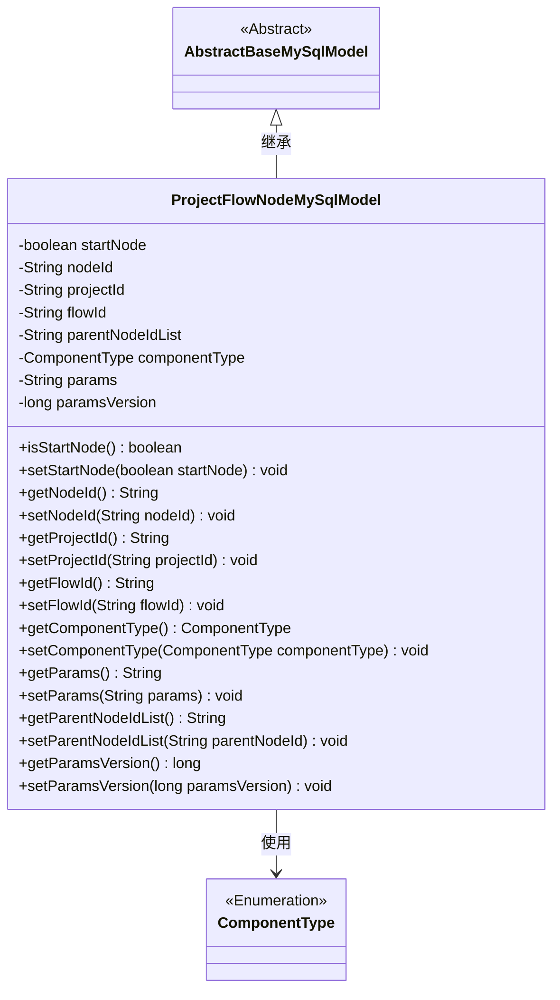

# 基础信息

|      |      |
|------|------|
| 名称 | ProjectFlowNodeMySqlModel |
| 编码语言 | .java |
| 代码路径 | WeFe/board/board-service/src/main/java/com/welab/wefe/board/service/database/entity/job/ProjectFlowNodeMySqlModel.java |
| 包名 | com.welab.wefe.board.service.database.entity.job |
| 依赖项 | ['com.welab.wefe.board.service.database.entity.base.AbstractBaseMySqlModel', 'com.welab.wefe.common.wefe.enums.ComponentType', 'javax.persistence.Entity', 'javax.persistence.EnumType', 'javax.persistence.Enumerated'] |
| 概述说明 | 项目流程节点实体类，包含起始节点标识、节点ID、项目ID、流程ID、父节点列表、组件类型、参数及版本号等字段。 |

# 说明

这是一个名为ProjectFlowNodeMySqlModel的Java类，继承自AbstractBaseMySqlModel，用于表示项目流程节点数据模型。该类包含多个属性：startNode标识是否为起始节点，nodeId存储前端生成的节点ID，projectId和flowId分别关联项目和流程，parentNodeIdList记录父节点ID列表，componentType表示组件类型枚举，params存储组件参数，paramsVersion记录参数版本时间戳。类中为每个属性提供了对应的getter和setter方法。

# 类列表 Class Summary

| 名称   | 类型  | 说明 |
|-------|------|-------------|
| ProjectFlowNodeMySqlModel | class | 项目流程节点实体类，包含起始节点标识、节点ID、项目ID、流程ID、父节点列表、组件类型、参数及版本号等字段。 |

## 类 ProjectFlowNodeMySqlModel

|      |      |
|------|------|
| 访问范围 | @Entity(name = "project_flow_node");public |
| 类型 | class |
| 名称 | ProjectFlowNodeMySqlModel |
| 说明 | 项目流程节点实体类，包含起始节点标识、节点ID、项目ID、流程ID、父节点列表、组件类型、参数及版本号等字段。 |

### UML类图

该类图展示了ProjectFlowNodeMySqlModel继承自AbstractBaseMySqlModel，并包含多个私有字段及其对应的getter/setter方法。该类用于表示项目流程节点数据，包含节点ID、项目ID、流程ID、父节点列表、组件类型等属性，其中ComponentType是一个枚举类型。该模型通过JPA注解标记为实体类，用于数据库持久化操作，适用于工作流或项目管理系统中节点数据的存储与管理。

### 内部方法调用关系图

```mermaid
graph TD
    A["类ProjectFlowNodeMySqlModel"]
    B["继承: AbstractBaseMySqlModel"]
    C["注解: @Entity"]
    D["属性: boolean startNode"]
    E["属性: String nodeId"]
    F["属性: String projectId"]
    G["属性: String flowId"]
    H["属性: String parentNodeIdList"]
    I["属性: ComponentType componentType"]
    J["属性: String params"]
    K["属性: long paramsVersion"]
    L["方法: isStartNode()"]
    M["方法: setStartNode(boolean)"]
    N["方法: getNodeId()"]
    O["方法: setNodeId(String)"]
    P["方法: getProjectId()"]
    Q["方法: setProjectId(String)"]
    R["方法: getFlowId()"]
    S["方法: setFlowId(String)"]
    T["方法: getComponentType()"]
    U["方法: setComponentType(ComponentType)"]
    V["方法: getParams()"]
    W["方法: setParams(String)"]
    X["方法: getParentNodeIdList()"]
    Y["方法: setParentNodeIdList(String)"]
    Z["方法: getParamsVersion()"]
    AA["方法: setParamsVersion(long)"]

    A --> B
    A --> C
    A --> D
    A --> E
    A --> F
    A --> G
    A --> H
    A --> I
    A --> J
    A --> K
    A --> L
    A --> M
    A --> N
    A --> O
    A --> P
    A --> Q
    A --> R
    A --> S
    A --> T
    A --> U
    A --> V
    A --> W
    A --> X
    A --> Y
    A --> Z
    A --> AA
```

该流程图展示了ProjectFlowNodeMySqlModel类的完整结构，包括继承关系、实体注解、9个核心属性及其对应的getter/setter方法。这个JPA实体类用于存储项目流程节点数据，包含节点标识、项目关联ID、组件类型和参数等关键字段，通过paramsVersion实现参数版本控制。所有属性均通过标准JavaBean规范进行封装，支持数据库持久化操作。

### 字段列表 Field List

| 名称  | 类型  | 说明 |
|-------|-------|------|
| params | String | 私有字符串参数params。 |
| nodeId | String | 私有字符串类型变量nodeId。 |
| startNode | boolean | 私有布尔类型变量，标识是否为起始节点。 |
| serialVersionUID = 2722275392448819712L | long | 定义了一个私有静态不可变长整型序列化ID，值为2722275392448819712L。 |
| projectId | String | 项目ID字符串变量 |
| parentNodeIdList | String | 存储父节点ID列表的私有字符串变量。 |
| paramsVersion = System.currentTimeMillis() | long | 定义长整型变量paramsVersion，初始值为当前系统时间毫秒数。 |
| componentType | ComponentType | 定义枚举类型字段componentType，使用字符串形式存储枚举值。 |
| flowId | String | 私有字符串变量flowId，用于存储流程标识。 |

### 方法列表

| 名称  | 类型  | 说明 |
|-------|-------|------|
| setNodeId | void | 方法设置节点ID，将参数nodeId赋值给当前对象的nodeId属性。 |
| getProjectId | String | 获取项目ID的方法，返回字符串类型的projectId。 |
| setFlowId | void | 方法setFlowId用于设置flowId属性值，参数为字符串类型。 |
| getComponentType | ComponentType | 获取组件类型的方法，返回componentType变量值。 |
| getNodeId | String | 获取节点ID的方法，返回字符串类型的nodeId。 |
| setStartNode | void | 设置当前节点是否为起始节点的方法，参数为布尔值startNode。 |
| getParams | String | 获取params参数的字符串值。 |
| setComponentType | void | 这是一个Java方法，用于设置组件类型属性。方法接收一个ComponentType参数，并将其赋值给类的componentType成员变量。 |
| getFlowId | String | 这是一个Java方法，返回字符串类型的flowId值。 |
| isStartNode | boolean | 方法isStartNode返回布尔值startNode，表示是否为起始节点。 |
| setProjectId | void | 定义了一个公共方法setProjectId，用于设置类的projectId属性值。参数为字符串类型projectId。 |
| setParams | void | 这是一个Java方法，用于设置类的params属性值。方法接收一个字符串参数params，并将其赋值给类的同名成员变量。 |
| getParentNodeIdList | String | 获取父节点ID列表的方法。 |
| setParentNodeIdList | void | 设置父节点ID列表的方法，参数为父节点ID字符串。 |
| getParamsVersion | long | 获取参数版本号的方法，返回长整型数值paramsVersion。 |
| setParamsVersion | void | 设置参数版本号的方法，将输入值赋给类成员变量paramsVersion。 |

