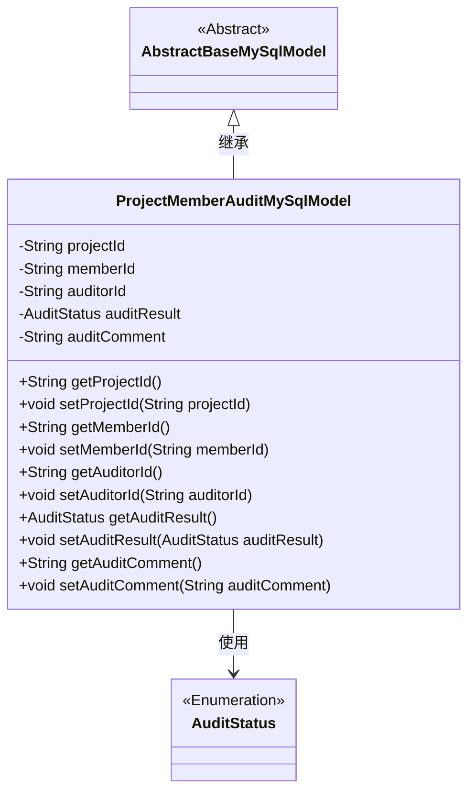

# 基础信息

|      |      |
|------|------|
| 名称 | ProjectMemberAuditMySqlModel |
| 编码语言 | .java |
| 代码路径 | WeFe/board/board-service/src/main/java/com/welab/wefe/board/service/database/entity/job/ProjectMemberAuditMySqlModel.java |
| 包名 | com.welab.wefe.board.service.database.entity.job |
| 依赖项 | ['com.welab.wefe.board.service.database.entity.base.AbstractBaseMySqlModel', 'com.welab.wefe.common.wefe.enums.AuditStatus', 'javax.persistence.Entity', 'javax.persistence.EnumType', 'javax.persistence.Enumerated'] |
| 概述说明 | 项目成员审核实体类，包含项目ID、成员ID、审核人ID、审核结果和审核意见字段。 |

# 说明

这是一个名为ProjectMemberAuditMySqlModel的Java实体类，用于映射数据库表project_member_audit。它继承自AbstractBaseMySqlModel基类，包含项目ID、成员ID、审核人ID、审核结果和审核意见等字段。审核结果使用枚举类型AuditStatus表示，取值包括adopt和disagree。类中为每个字段提供了标准的getter和setter方法，并实现了序列化接口。该实体类主要用于记录项目成员的审核信息。

# 类列表 Class Summary

| 名称   | 类型  | 说明 |
|-------|------|-------------|
| ProjectMemberAuditMySqlModel | class | 项目成员审核实体类，包含项目ID、成员ID、审核人ID、审核结果和审核意见字段。 |

## 类 ProjectMemberAuditMySqlModel

|      |      |
|------|------|
| 访问范围 | @Entity(name = "project_member_audit");public |
| 类型 | class |
| 名称 | ProjectMemberAuditMySqlModel |
| 说明 | 项目成员审核实体类，包含项目ID、成员ID、审核人ID、审核结果和审核意见字段。 |

### UML类图

这段代码定义了一个名为ProjectMemberAuditMySqlModel的实体类，继承自AbstractBaseMySqlModel抽象类，用于存储项目成员审核相关的数据。该类包含项目ID、成员ID、审核人ID、审核结果（枚举类型）和审核意见等字段，并提供了相应的getter和setter方法。类图清晰地展示了继承关系和枚举类型的使用，体现了JPA实体类的基本结构。

### 内部方法调用关系图

```mermaid
graph TD
    A["类ProjectMemberAuditMySqlModel"]
    B["继承: AbstractBaseMySqlModel"]
    C["属性: String projectId"]
    D["属性: String memberId"]
    E["属性: String auditorId"]
    F["属性: AuditStatus auditResult"]
    G["属性: String auditComment"]
    H["方法: getProjectId()"]
    I["方法: setProjectId(String)"]
    J["方法: getMemberId()"]
    K["方法: setMemberId(String)"]
    L["方法: getAuditorId()"]
    M["方法: setAuditorId(String)"]
    N["方法: getAuditResult()"]
    O["方法: setAuditResult(AuditStatus)"]
    P["方法: getAuditComment()"]
    Q["方法: setAuditComment(String)"]

    A --> B
    A --> C
    A --> D
    A --> E
    A --> F
    A --> G
    A --> H
    A --> I
    A --> J
    A --> K
    A --> L
    A --> M
    A --> N
    A --> O
    A --> P
    A --> Q
```

这段代码定义了一个名为ProjectMemberAuditMySqlModel的实体类，用于存储项目成员审核相关的数据。该类继承自AbstractBaseMySqlModel，包含五个核心属性：项目ID、成员ID、审核人ID、审核结果（枚举类型）和审核意见。每个属性都有对应的getter和setter方法，用于数据的读取和修改。该类通过@Entity注解标记为JPA实体，表明其与数据库表"project_member_audit"的映射关系。整体结构清晰，遵循了JavaBean的规范，适合用于ORM框架的数据持久化操作。

### 字段列表 Field List

| 名称  | 类型  | 说明 |
|-------|-------|------|
| serialVersionUID = 8870060097218263816L | long | 声明一个私有静态不可变的序列化版本ID，值为8870060097218263816L。 |
| auditResult | AuditStatus | 枚举类型字段auditResult，使用字符串形式存储审核状态。 |
| auditComment | String | 私有字符串类型变量，用于存储审核意见。 |
| projectId | String | 声明一个私有字符串变量projectId。 |
| memberId | String | 成员ID字符串类型私有变量。 |
| auditorId | String | 私有字符串类型变量auditorId |

### 方法列表

| 名称  | 类型  | 说明 |
|-------|-------|------|
| setProjectId | void | 这是一个Java方法，用于设置类的projectId属性。方法接收一个字符串参数projectId，并将其赋值给当前对象的同名成员变量。 |
| setAuditorId | void | 这是一个Java方法，用于设置auditorId属性的值。方法接收一个字符串参数auditorId，并将其赋值给当前对象的auditorId字段。 |
| getAuditorId | String | 获取auditorId的公共方法，返回字符串类型auditorId。 |
| setMemberId | void | 设置成员ID的方法，将传入的字符串参数赋值给类的成员变量memberId。 |
| getProjectId | String | 获取项目ID的方法，返回字符串类型的projectId。 |
| getAuditResult | AuditStatus | 获取审计结果的方法，返回AuditStatus类型值。 |
| getMemberId | String | 这是一个Java方法，返回成员ID字符串。 |
| setAuditResult | void | 设置审计结果的方法，参数为AuditStatus类型。 |
| getAuditComment | String | 获取审计评语的方法，返回auditComment字符串。 |
| setAuditComment | void | 设置审计评语的方法，将传入的auditComment赋值给当前对象的auditComment属性。 |

