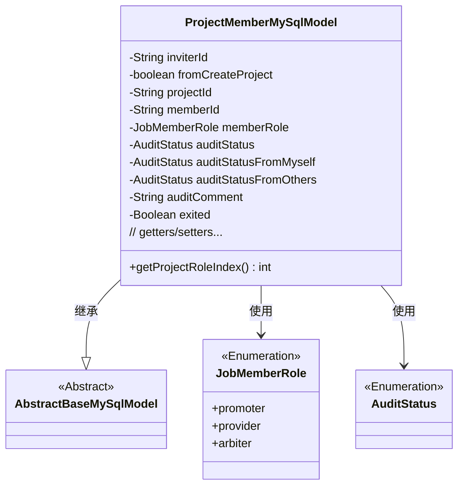
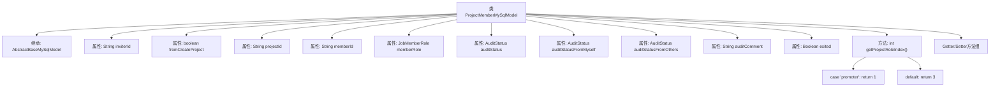

# 基础信息

|      |      |
|------|------|
| 名称 | ProjectMemberMySqlModel |
| 编码语言 | .java |
| 代码路径 | WeFe/board/board-service/src/main/java/com/welab/wefe/board/service/database/entity/job/ProjectMemberMySqlModel.java |
| 包名 | com.welab.wefe.board.service.database.entity.job |
| 依赖项 | ['com.welab.wefe.board.service.database.entity.base.AbstractBaseMySqlModel', 'com.welab.wefe.common.wefe.enums.AuditStatus', 'com.welab.wefe.common.wefe.enums.JobMemberRole', 'javax.persistence.Entity', 'javax.persistence.EnumType', 'javax.persistence.Enumerated'] |
| 概述说明 | 项目成员实体类，包含成员ID、项目ID、邀请人ID、角色、审核状态及意见、是否退出等字段，提供排序和getter/setter方法。 |

# 说明

这是一个名为ProjectMemberMySqlModel的Java实体类，用于表示项目成员信息。类中包含成员ID、项目ID、邀请人ID、成员角色（promoter/provider/arbiter）、是否来自项目创建标志、审核状态（综合、自身、他人）、审核意见、是否退出等字段。提供了各字段的getter和setter方法，以及一个根据成员角色返回排序索引的方法。该类继承自AbstractBaseMySqlModel，使用JPA注解进行数据库映射。

# 类列表 Class Summary

| 名称   | 类型  | 说明 |
|-------|------|-------------|
| ProjectMemberMySqlModel | class | 项目成员实体类，包含成员ID、项目ID、邀请人ID、角色、审核状态及意见、是否退出等字段，提供排序和getter/setter方法。 |

## 类 ProjectMemberMySqlModel

|      |      |
|------|------|
| 访问范围 | @Entity(name = "project_member");public |
| 类型 | class |
| 名称 | ProjectMemberMySqlModel |
| 说明 | 项目成员实体类，包含成员ID、项目ID、邀请人ID、角色、审核状态及意见、是否退出等字段，提供排序和getter/setter方法。 |

### UML类图

该类图展示了ProjectMemberMySqlModel继承自AbstractBaseMySqlModel，并包含多个私有字段和公共方法。该类使用两个枚举类型JobMemberRole和AuditStatus来表示成员角色和审核状态。ProjectMemberMySqlModel作为实体类，主要用于存储项目成员信息，包括邀请关系、审核状态和角色等核心属性，同时提供了按角色排序的辅助方法。

### 内部方法调用关系图

这段代码定义了一个名为ProjectMemberMySqlModel的JPA实体类，用于表示项目成员信息。该类继承自AbstractBaseMySqlModel，包含11个成员变量和对应的getter/setter方法，以及一个根据成员角色返回排序索引的getProjectRoleIndex方法。主要属性包括邀请人ID、项目ID、成员ID、角色类型、审核状态等，通过@Enumerated注解实现了枚举类型的持久化存储。流程图展示了类继承关系、属性定义和核心方法调用结构。

### 字段列表 Field List

| 名称  | 类型  | 说明 |
|-------|-------|------|
| inviterId | String | 私有字符串变量inviterId，用于存储邀请者ID。 |
| serialVersionUID = -2632889286058354328L | long | 定义了一个私有静态不可变的序列化版本ID，值为-2632889286058354328L。 |
| auditStatus | AuditStatus | 实体类中定义枚举类型字段auditStatus，使用@Enumerated注解指定存储为字符串形式。 |
| memberId | String | 成员ID字符串变量 |
| memberRole | JobMemberRole | 定义枚举类型字段memberRole，使用字符串值存储角色类型。 |
| exited = false | Boolean | 声明了一个私有布尔变量exited，初始值为false。 |
| projectId | String | 项目ID字符串变量 |
| auditComment | String | 私有字符串类型变量，用于存储审核评论。 |
| auditStatusFromOthers | AuditStatus | 实体字段auditStatusFromOthers使用@Enumerated注解，以字符串形式存储枚举类型AuditStatus的值。 |
| auditStatusFromMyself | AuditStatus | 实体类字段auditStatusFromMyself使用@Enumerated注解，以字符串形式存储枚举类型AuditStatus的值。 |
| fromCreateProject | boolean | 私有布尔变量，标识是否来自创建项目。 |

### 方法列表

| 名称  | 类型  | 说明 |
|-------|-------|------|
| getAuditStatusFromOthers | AuditStatus | 获取其他来源的审核状态。 |
| setAuditStatusFromMyself | void | 设置自身审核状态的方法，参数为AuditStatus类型。 |
| setProjectId | void | 定义了一个公共方法setProjectId，用于设置当前对象的projectId属性值。参数为字符串类型的projectId。 |
| getProjectId | String | 这是一个Java方法，返回名为projectId的字符串变量。 |
| setFromCreateProject | void | 设置是否来自创建项目的布尔值方法。 |
| setMemberRole | void | 方法setMemberRole用于设置成员角色，参数memberRole赋值给当前对象的成员变量memberRole。 |
| getProjectRoleIndex | int | 方法根据成员角色返回项目角色索引，推广者返回1，其他返回3。 |
| setInviterId | void | 设置邀请人ID的方法，将参数inviterId赋值给当前对象的同名属性。 |
| setAuditStatus | void | 方法setAuditStatus用于设置auditStatus属性值。 |
| setMemberId | void | 设置成员ID的方法，将输入参数赋值给类的成员变量。 |
| getMemberId | String | 方法返回成员ID字符串。 |
| getAuditStatusFromMyself | AuditStatus | 该方法返回当前对象的auditStatusFromMyself属性值，类型为AuditStatus。 |
| getInviterId | String | 获取邀请人ID的方法，返回字符串类型的inviterId。 |
| getMemberRole | JobMemberRole | 获取成员角色方法，返回成员角色对象。 |
| getAuditStatus | AuditStatus | 获取审计状态的方法，返回auditStatus字段值。 |
| isFromCreateProject | boolean | 这是一个Java方法，返回布尔值，表示是否来自创建项目。 |
| setAuditStatusFromOthers | void | 设置来自其他方的审核状态，将参数auditStatusFromOthers赋值给当前对象的auditStatusFromOthers字段。 |
| getAuditComment | String | 获取审计评语的方法，返回auditComment字符串。 |
| setAuditComment | void | 这是一个Java方法，用于设置auditComment属性的值。方法接受一个字符串参数auditComment，并将其赋值给类的成员变量this.auditComment。 |
| isExited | Boolean | 这是一个返回布尔值的方法，检查是否已退出。 |
| setExited | void | 设置退出状态的布尔值方法。 |

