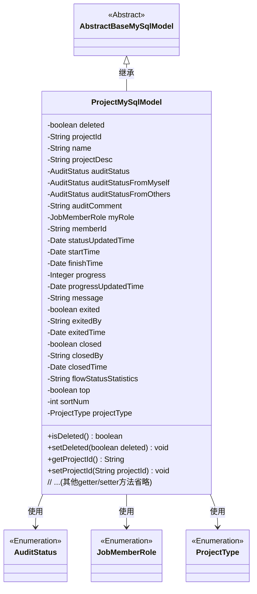

# 基础信息

|      |      |
|------|------|
| 名称 | ProjectMySqlModel |
| 编码语言 | .java |
| 代码路径 | WeFe/board/board-service/src/main/java/com/welab/wefe/board/service/database/entity/job/ProjectMySqlModel.java |
| 包名 | com.welab.wefe.board.service.database.entity.job |
| 依赖项 | ['com.welab.wefe.board.service.database.entity.base.AbstractBaseMySqlModel', 'com.welab.wefe.common.wefe.enums.AuditStatus', 'com.welab.wefe.common.wefe.enums.JobMemberRole', 'com.welab.wefe.common.wefe.enums.ProjectType', 'javax.persistence.Entity', 'javax.persistence.EnumType', 'javax.persistence.Enumerated', 'java.util.Date'] |
| 概述说明 | 项目实体类，包含ID、名称、描述、审核状态、进度、时间、成员角色、操作记录等字段，用于管理项目信息。 |

# 说明

这是一个名为ProjectMySqlModel的Java实体类，用于表示项目数据模型。类中包含项目的基本信息如项目ID、名称、描述、创建者ID，以及审核相关的状态和意见。还包含时间相关的字段如开始时间、结束时间、状态更新时间等。此外，还有进度、消息备注、退出和关闭状态等字段。枚举类型用于表示审核状态、我方身份和项目类型。类中提供了所有字段的getter和setter方法。

# 类列表 Class Summary

| 名称   | 类型  | 说明 |
|-------|------|-------------|
| ProjectMySqlModel | class | 项目实体类，包含ID、名称、描述、审核状态、进度、时间、操作者及状态等字段，用于管理项目信息。 |

## 类 ProjectMySqlModel

|      |      |
|------|------|
| 访问范围 | @Entity(name = "project");public |
| 类型 | class |
| 名称 | ProjectMySqlModel |
| 说明 | 项目实体类，包含ID、名称、描述、审核状态、进度、时间、操作者及状态等字段，用于管理项目信息。 |

### UML类图

该代码定义了一个名为ProjectMySqlModel的实体类，继承自AbstractBaseMySqlModel抽象类。该类包含项目管理的各种属性，如项目ID、名称、描述、审核状态、时间信息、进度等，并使用了多个枚举类型（AuditStatus、JobMemberRole、ProjectType）来表示特定字段的类型。类中提供了完整的getter和setter方法用于属性访问和修改。该类通过@Entity注解标记为JPA实体，用于数据库映射。

### 内部方法调用关系图

该流程图展示了ProjectMySqlModel类的完整结构，包括继承关系、所有属性和对应的getter/setter方法。这个JPA实体类用于表示项目数据模型，包含项目基本信息、审核状态、时间信息、进度跟踪、状态变更记录等核心字段，并通过枚举类型处理特定状态字段。所有属性都配有标准的访问器方法，便于数据操作和持久化处理。

### 字段列表 Field List

| 名称  | 类型  | 说明 |
|-------|-------|------|
| statusUpdatedTime | Date | 私有日期类型变量statusUpdatedTime，记录状态更新时间。 |
| finishTime | Date | 私有成员变量finishTime，类型为Date，表示完成时间。 |
| exitedBy | String | 私有字符串变量exitedBy，用于记录退出操作者信息。 |
| top | boolean | 私有布尔类型变量top，表示是否处于顶部状态。 |
| myRole | JobMemberRole | 枚举字段myRole使用字符串类型存储角色值。 |
| exitedTime | Date | 私有日期类型变量，记录退出时间。 |
| deleted | boolean | 布尔类型字段，标记是否已删除。 |
| sortNum | int | 私有整型变量sortNum，用于排序编号。 |
| memberId | String | 成员ID字符串变量 |
| startTime | Date | 私有日期类型变量startTime |
| flowStatusStatistics | String | 私有字符串变量，用于记录流程状态统计信息。 |
| progress | Integer | 私有整型变量progress，用于记录进度。 |
| closedBy | String | 字段closedBy表示关闭操作的执行者。 |
| auditStatusFromMyself | AuditStatus | 枚举类型AuditStatus的字段auditStatusFromMyself，使用字符串形式存储。 |
| closedTime | Date | 私有日期类型变量closedTime，用于记录关闭时间。 |
| projectDesc | String | 项目描述字段，存储项目说明信息。 |
| exited = false | boolean | 变量exited标记退出状态，初始为false。 |
| auditComment | String | 私有字符串类型变量auditComment，用于存储审核意见。 |
| auditStatus | AuditStatus | 使用字符串形式存储枚举类型AuditStatus的字段auditStatus。 |
| serialVersionUID = -2632889286058354328L | long | 声明一个私有静态不可变的长整型序列化版本ID，值为-2632889286058354328。 |
| message | String | 私有字符串变量message |
| closed = false | boolean | 变量closed初始化为false，表示未关闭状态。 |
| auditStatusFromOthers | AuditStatus | 实体类字段auditStatusFromOthers使用字符串形式存储枚举类型AuditStatus的值。 |
| progressUpdatedTime | Date | 私有日期类型变量progressUpdatedTime，记录进度更新时间。 |
| projectId | String | 项目ID字符串变量 |
| projectType | ProjectType | 实体类中定义枚举类型字段，使用字符串形式存储枚举值。 |
| name | String | 私有字符串变量name。 |

### 方法列表

| 名称  | 类型  | 说明 |
|-------|-------|------|
| getClosedBy | String | 获取closedBy字段值的公共方法。 |
| getProgressUpdatedTime | Date | 获取进度更新时间的方法，返回progressUpdatedTime变量。 |
| setFinishTime | void | 设置完成时间的方法，将参数finishTime赋值给对象的finishTime属性。 |
| getFinishTime | Date | 方法返回完成时间对象。 |
| getExitedBy | String | 获取退出者信息的方法，返回exitedBy字符串。 |
| setFlowStatusStatistics | void | 设置流程状态统计信息的方法，将输入参数赋值给类成员变量flowStatusStatistics。 |
| setStartTime | void | 设置开始时间的方法，将参数startTime赋值给类的成员变量startTime。 |
| getAuditStatusFromOthers | AuditStatus | 方法getAuditStatusFromOthers返回auditStatusFromOthers的值。 |
| isDeleted | boolean | 这是一个Java方法，用于返回布尔值deleted，表示对象是否被删除。 |
| getProgress | Integer | 获取进度值的方法，返回整数类型的progress变量。 |
| setExitedBy | void | 设置退出者方法，将参数exitedBy赋值给当前对象的同名属性。 |
| getStartTime | Date | 这是一个Java方法，返回名为startTime的Date类型对象。 |
| setClosed | void | 设置对象关闭状态的布尔值方法。 |
| setStatusUpdatedTime | void | 设置状态更新时间的方法，将参数赋值给类变量statusUpdatedTime。 |
| isClosed | boolean | 方法isClosed返回布尔值closed，表示对象是否关闭。 |
| setDeleted | void | 设置对象删除状态的布尔值方法。 |
| setAuditComment | void | 设置审计评注的方法，将参数auditComment赋值给类的auditComment属性。 |
| getStatusUpdatedTime | Date | 获取状态更新时间的方法，返回statusUpdatedTime值。 |
| getExitedTime | Date | 获取退出时间的方法，返回exitedTime变量。 |
| setAuditStatusFromOthers | void | 设置来自其他方的审核状态。 |
| getProjectDesc | String | 获取项目描述的方法，返回projectDesc字符串。 |
| setName | void | 设置对象名称的方法，将参数name赋值给对象的name属性。 |
| setTop | void | 设置对象置顶状态的布尔值方法。 |
| setExited | void | 设置退出状态的布尔值方法。 |
| setProjectDesc | void | 这是一个Java方法，用于设置项目描述。方法接收字符串参数projectDesc，并将其赋值给类的成员变量projectDesc。 |
| getName | String | 方法返回字符串类型的name变量值。 |
| isTop | boolean | 这是一个Java方法，返回布尔值top的状态，用于判断是否为顶部。 |
| setMyRole | void | Java方法：设置当前对象的成员角色属性。参数为JobMemberRole类型。 |
| getAuditStatusFromMyself | AuditStatus | 该方法返回当前对象的auditStatusFromMyself属性值，类型为AuditStatus。 |
| setMemberId | void | 定义了一个公共方法setMemberId，用于设置成员ID。方法接收一个字符串参数memberId，并将其赋值给当前对象的成员变量memberId。 |
| getProjectType | ProjectType | 获取项目类型的方法，返回projectType属性值。 |
| getProjectId | String | 方法返回项目ID字符串。 |
| setExitedTime | void | 设置退出时间的方法，将参数exitedTime赋值给类的成员变量this.exitedTime。 |
| getMemberId | String | 获取成员ID的方法，返回字符串类型的memberId。 |
| setClosedTime | void | 设置关闭时间的方法，将参数closedTime赋值给类的成员变量closedTime。 |
| setMessage | void | 这是一个Java方法，用于设置类中的message属性值。方法接收一个字符串参数message，并将其赋值给类的成员变量this.message。 |
| setProjectId | void | 这是一个Java方法，用于设置类的projectId属性，接受字符串参数projectId并将其赋值给类的同名成员变量。 |
| getAuditStatus | AuditStatus | 获取审核状态的方法，返回auditStatus属性值。 |
| getClosedTime | Date | 获取关闭时间的方法，返回closedTime变量。 |
| getMessage | String | 获取message字符串的方法。 |
| isExited | boolean | 该方法检查是否已退出，返回布尔值exited的状态。 |
| setClosedBy | void | 这是一个Java方法，用于设置closedBy属性的值。方法接受一个字符串参数closedBy，并将其赋值给类的成员变量closedBy。 |
| setProjectType | void | 设置项目类型的方法，将参数projectType赋值给当前对象的projectType属性。 |
| setAuditStatusFromMyself | void | 该方法用于设置对象的自身审核状态，接收一个AuditStatus类型参数并赋值给成员变量auditStatusFromMyself。 |
| setProgressUpdatedTime | void | 设置进度更新时间的方法，将参数progressUpdatedTime赋值给类的同名成员变量。 |
| getSortNum | int | 这是一个Java方法，返回sortNum整数值。 |
| setSortNum | void | Java方法：设置排序数字，将输入参数sortNum赋值给当前对象的sortNum属性。 |
| getMyRole | JobMemberRole | 获取当前用户的角色信息。 |
| setProgress | void | 设置进度值的方法，将输入参数progress赋值给类成员变量progress。 |
| setAuditStatus | void | 设置审计状态的方法，将传入的auditStatus赋值给当前对象的auditStatus属性。 |
| getAuditComment | String | 获取审计评语的方法，返回auditComment字符串。 |
| getFlowStatusStatistics | String | 获取流程状态统计信息的方法，返回字符串类型结果。 |

