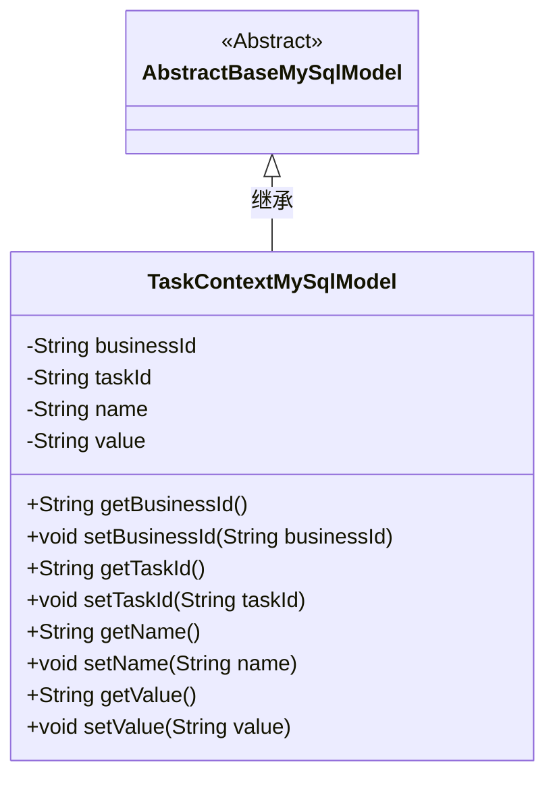
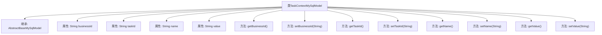

# 基础信息

|      |      |
|------|------|
| 名称 | TaskContextMySqlModel |
| 编码语言 | .java |
| 代码路径 | WeFe/board/board-service/src/main/java/com/welab/wefe/board/service/database/entity/job/TaskContextMySqlModel.java |
| 包名 | com.welab.wefe.board.service.database.entity.job |
| 依赖项 | ['com.welab.wefe.board.service.database.entity.base.AbstractBaseMySqlModel', 'javax.persistence.Entity'] |
| 概述说明 | TaskContextMySqlModel是MySQL实体类，包含任务ID、子任务ID、名称和值字段及其getter/setter方法。 |

# 说明

该内容定义了一个名为TaskContextMySqlModel的Java类，继承自AbstractBaseMySqlModel，并标注为实体类，对应数据库表名为task_context。类中包含四个私有字段：businessId表示任务Id，taskId表示子任务Id，name表示名称，value表示值。每个字段都有对应的getter和setter方法用于访问和修改字段值。

# 类列表 Class Summary

| 名称   | 类型  | 说明 |
|-------|------|-------------|
| TaskContextMySqlModel | class | TaskContextMySqlModel类包含任务ID、子任务ID、名称和值字段及其getter/setter方法。 |

## 类 TaskContextMySqlModel

|      |      |
|------|------|
| 访问范围 | @Entity(name = "task_context");public |
| 类型 | class |
| 名称 | TaskContextMySqlModel |
| 说明 | TaskContextMySqlModel类包含任务ID、子任务ID、名称和值字段及其getter/setter方法。 |

### UML类图

这段代码描述了一个名为TaskContextMySqlModel的实体类，它继承自抽象基类AbstractBaseMySqlModel。该类包含四个私有字段：businessId（业务ID）、taskId（任务ID）、name（名称）和value（值），并为每个字段提供了公共的getter和setter方法。该类使用JPA注解@Entity标记，表明它是一个持久化实体，对应数据库中的"task_context"表。这个类主要用于在MySQL数据库中存储任务上下文相关的数据。

### 内部方法调用关系图

这段代码定义了一个名为TaskContextMySqlModel的实体类，继承自AbstractBaseMySqlModel，用于表示任务上下文数据。类中包含四个私有属性：businessId（任务ID）、taskId（子任务ID）、name（名称）和value（值），并为每个属性提供了对应的getter和setter方法。该实体类通过JPA注解标记为数据库表"task_context"的映射，主要用于持久化任务相关的上下文信息。

### 字段列表 Field List

| 名称  | 类型  | 说明 |
|-------|-------|------|
| businessId | String | 私有字符串类型变量businessId，用于存储业务标识。 |
| taskId | String | 私有字符串类型变量taskId，用于存储任务标识符。 |
| value | String | 私有字符串变量value。 |
| name | String | 私有字符串变量name |

### 方法列表

| 名称  | 类型  | 说明 |
|-------|-------|------|
| getName | String | 这是一个Java方法，返回字符串类型的name变量值。 |
| getBusinessId | String | 获取业务ID的方法，直接返回成员变量businessId的值。 |
| setTaskId | void | 设置任务ID的方法，将输入参数taskId赋值给当前对象的taskId属性。 |
| setBusinessId | void | 定义了一个公共方法setBusinessId，用于设置类中的businessId属性值。 |
| setName | void | 设置对象名称的方法，将参数name赋值给当前对象的name属性。 |
| getValue | String | 这是一个Java方法，返回字符串类型的成员变量value的值。 |
| setValue | void | 设置字符串类型值的方法，将输入参数赋给对象的value属性。 |
| getTaskId | String | 获取当前任务的ID字符串。 |

