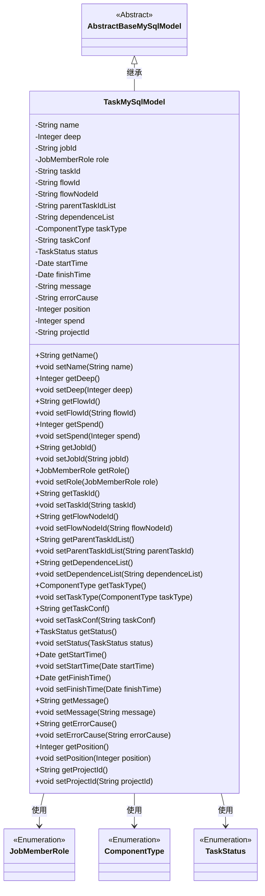

# 基础信息

|      |      |
|------|------|
| 名称 | TaskMySqlModel |
| 编码语言 | .java |
| 代码路径 | WeFe/board/board-service/src/main/java/com/welab/wefe/board/service/database/entity/job/TaskMySqlModel.java |
| 包名 | com.welab.wefe.board.service.database.entity.job |
| 依赖项 | ['com.welab.wefe.board.service.database.entity.base.AbstractBaseMySqlModel', 'com.welab.wefe.common.wefe.enums.ComponentType', 'com.welab.wefe.common.wefe.enums.JobMemberRole', 'com.welab.wefe.common.wefe.enums.TaskStatus', 'javax.persistence.Entity', 'javax.persistence.EnumType', 'javax.persistence.Enumerated', 'java.util.Date'] |
| 概述说明 | TaskMySqlModel是任务实体类，包含名称、深度、任务ID、角色、流程号、节点ID、父任务、依赖、类型、配置、状态、时间、消息、错误原因、执行顺序、耗时和项目ID等字段。 |

# 说明

TaskMySqlModel是一个用于表示任务实体的Java类，继承自AbstractBaseMySqlModel。该类包含任务名称、深度、任务ID、角色、业务ID、流程号、流程节点ID、父任务ID列表、依赖列表、任务类型、任务配置、状态、开始时间、结束时间、消息备注、错误原因、执行顺序、耗时和项目ID等属性。每个属性都有对应的getter和setter方法，用于获取和设置属性值。任务类型和状态使用枚举类型表示。该类用于在MySQL数据库中存储和管理任务相关信息。

# 类列表 Class Summary

| 名称   | 类型  | 说明 |
|-------|------|-------------|
| TaskMySqlModel | class | TaskMySqlModel类定义了任务实体，包含名称、深度、任务ID、角色、流程信息、父子任务关系、任务类型、配置、状态、时间、错误信息及执行顺序等字段。 |

## 类 TaskMySqlModel

|      |      |
|------|------|
| 访问范围 | @Entity(name = "task");public |
| 类型 | class |
| 名称 | TaskMySqlModel |
| 说明 | TaskMySqlModel类定义了任务实体，包含名称、深度、任务ID、角色、流程信息、父子任务关系、任务类型、配置、状态、时间、错误信息及执行顺序等字段。 |

### UML类图

该类图展示了TaskMySqlModel继承自AbstractBaseMySqlModel，并包含多个私有字段及其对应的getter/setter方法。TaskMySqlModel使用了三个枚举类型：JobMemberRole表示角色，ComponentType表示任务类型，TaskStatus表示任务状态。该类主要用于存储任务相关的信息，包括任务名称、深度、流程ID、状态等，并通过继承获得基础模型的功能。

### 内部方法调用关系图

```mermaid
graph TD
    A["类TaskMySqlModel"]
    B["继承: AbstractBaseMySqlModel"]
    C["实体注解: @Entity('task')"]
    D["属性: String name"]
    E["属性: Integer deep"]
    F["属性: String jobId"]
    G["属性: JobMemberRole role"]
    H["属性: String taskId"]
    I["属性: String flowId"]
    J["属性: String flowNodeId"]
    K["属性: String parentTaskIdList"]
    L["属性: String dependenceList"]
    M["属性: ComponentType taskType"]
    N["属性: String taskConf"]
    O["属性: TaskStatus status"]
    P["属性: Date startTime"]
    Q["属性: Date finishTime"]
    R["属性: String message"]
    S["属性: String errorCause"]
    T["属性: Integer position"]
    U["属性: Integer spend"]
    V["属性: String projectId"]
    W["方法区域: getter/setter"]

    A --> B
    A --> C
    A --> D
    A --> E
    A --> F
    A --> G
    A --> H
    A --> I
    A --> J
    A --> K
    A --> L
    A --> M
    A --> N
    A --> O
    A --> P
    A --> Q
    A --> R
    A --> S
    A --> T
    A --> U
    A --> V
    A --> W
```

该流程图展示了TaskMySqlModel类的结构，包括其继承关系、属性定义和方法区域。该类是一个JPA实体，用于表示任务数据模型，包含任务名称、深度、状态、时间信息等核心字段，并通过枚举类型强化字段约束。所有属性均配有标准的getter/setter方法，支持ORM框架操作。流程图中清晰呈现了类与父类的关系、属性分类及方法聚合关系。

### 字段列表 Field List

| 名称  | 类型  | 说明 |
|-------|-------|------|
| position | Integer | 私有整型变量position，用于存储位置信息。 |
| errorCause | String | 私有字符串变量，用于存储错误原因。 |
| taskConf | String | 私有字符串变量taskConf，用于存储任务配置信息。 |
| startTime | Date | 私有日期类型变量startTime。 |
| taskType | ComponentType | 定义枚举类型字段taskType，使用字符串形式存储枚举值。 |
| spend | Integer | 私有整型变量spend，用于存储消费金额。 |
| name | String | 声明一个私有字符串变量name。 |
| role | JobMemberRole | 枚举类型字段role，使用字符串形式存储。 |
| parentTaskIdList | String | 私有字符串变量，存储父任务ID列表。 |
| projectId | String | 项目ID字符串变量声明。 |
| dependenceList | String | 私有字符串变量dependenceList，用于存储依赖列表。 |
| flowId | String | 私有字符串变量flowId，用于存储流程标识。 |
| jobId | String | 私有字符串类型变量jobId。 |
| finishTime | Date | 私有日期类型变量finishTime，用于记录完成时间。 |
| deep | Integer | 私有整型变量deep |
| message | String | 私有字符串变量message。 |
| status | TaskStatus | 枚举类型字段status，使用字符串形式存储。 |
| flowNodeId | String | 私有字符串变量flowNodeId，用于存储流程节点标识。 |
| taskId | String | 私有字符串变量taskId，用于存储任务标识符。 |

### 方法列表

| 名称  | 类型  | 说明 |
|-------|-------|------|
| setTaskId | void | 设置任务ID的方法，将参数taskId赋值给类的成员变量taskId。 |
| setErrorCause | void | 这是一个Java方法，用于设置错误原因字符串。方法接受一个字符串参数errorCause，并将其赋值给当前对象的errorCause成员变量。 |
| setTaskConf | void | 设置任务配置参数的方法，将输入字符串赋值给类变量taskConf。 |
| setSpend | void | 这是一个Java方法，用于设置类成员变量spend的值。方法接受一个Integer参数，并将其赋值给当前对象的spend属性。 |
| setStatus | void | 方法setStatus用于设置任务状态，将传入的status参数赋值给当前对象的status属性。 |
| setDeep | void | 设置深度值的方法，将参数deep赋值给类成员变量deep。 |
| getMessage | String | 获取message字符串的方法。 |
| getRole | JobMemberRole | 方法getRole返回JobMemberRole类型的角色值。 |
| getDependenceList | String | 获取依赖列表的方法，直接返回dependenceList变量。 |
| setFlowId | void | 设置流程ID的方法，将参数flowId赋值给当前对象的flowId属性。 |
| setStartTime | void | 设置开始时间的方法，将参数startTime赋值给类的成员变量startTime。 |
| getDeep | Integer | 获取deep值的公共方法，返回Integer类型。 |
| setFlowNodeId | void | 设置流程节点ID的方法，将传入的字符串参数赋值给类的flowNodeId成员变量。 |
| getParentTaskIdList | String | 获取父任务ID列表的方法。 |
| getFinishTime | Date | 获取完成时间的方法，返回finishTime日期对象。 |
| getTaskId | String | 获取任务ID的方法，返回字符串类型的taskId。 |
| setTaskType | void | 这是一个Java方法，用于设置任务类型。方法名为setTaskType，接受一个ComponentType类型的参数taskType，并将其赋值给当前对象的taskType属性。 |
| setDependenceList | void | 设置依赖列表字符串的方法。 |
| setRole | void | 这是一个Java方法，用于设置成员角色属性。方法名为setRole，接受JobMemberRole类型参数role，并将其赋值给当前对象的role字段。 |
| getStatus | TaskStatus | 获取当前任务状态的方法，返回TaskStatus类型的状态值。 |
| setFinishTime | void | 设置完成时间的方法，将参数finishTime赋值给对象的finishTime属性。 |
| setMessage | void | 这是一个Java方法，用于设置类中的message属性值。方法接收一个字符串参数message，并将其赋值给类的成员变量this.message。 |
| setName | void | 设置对象名称的方法，将参数name赋值给对象的name属性。 |
| getTaskType | ComponentType | 获取任务类型的方法，返回ComponentType类型的taskType值。 |
| getSpend | Integer | 获取spend整数值的方法。 |
| getFlowNodeId | String | 方法返回flowNodeId字符串。 |
| setPosition | void | 设置对象的位置属性值为输入的整型数值。 |
| getProjectId | String | 获取项目ID的方法，返回字符串类型的projectId。 |
| setProjectId | void | 这是一个Java方法，用于设置类的projectId属性值。方法接收一个字符串参数projectId，并将其赋值给类的同名成员变量。 |
| getJobId | String | 获取当前任务的唯一标识符jobId。 |
| setParentTaskIdList | void | 设置父任务ID列表的方法，参数为parentTaskId，赋值给成员变量parentTaskIdList。 |
| getPosition | Integer | 获取位置值的方法，返回整数类型的position变量。 |
| getErrorCause | String | 方法返回错误原因字符串。 |
| getStartTime | Date | 获取开始时间的方法，返回Date类型的startTime。 |
| getTaskConf | String | 获取任务配置的方法，返回taskConf字符串。 |
| getFlowId | String | 这是一个Java方法，返回字符串类型的flowId变量值。 |
| setJobId | void | 设置任务ID的方法，将输入参数jobId赋值给当前对象的jobId属性。 |
| getName | String | 获取对象名称的方法，返回字符串类型的name属性值。 |

