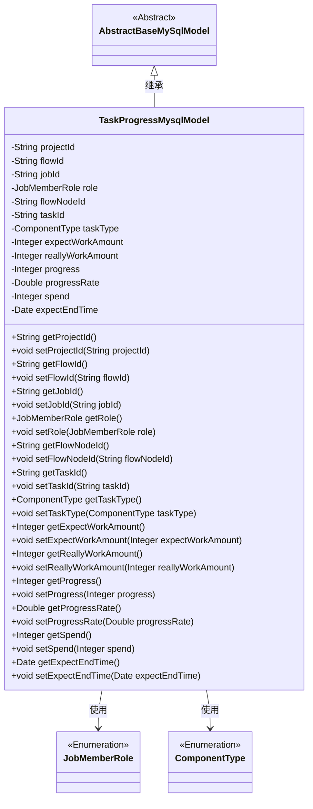

# 基础信息

|      |      |
|------|------|
| 名称 | TaskProgressMysqlModel |
| 编码语言 | .java |
| 代码路径 | WeFe/board/board-service/src/main/java/com/welab/wefe/board/service/database/entity/job/TaskProgressMysqlModel.java |
| 包名 | com.welab.wefe.board.service.database.entity.job |
| 依赖项 | ['com.welab.wefe.board.service.database.entity.base.AbstractBaseMySqlModel', 'com.welab.wefe.common.wefe.enums.ComponentType', 'com.welab.wefe.common.wefe.enums.JobMemberRole', 'javax.persistence.Entity', 'javax.persistence.EnumType', 'javax.persistence.Enumerated', 'java.util.Date'] |
| 概述说明 | 任务进度实体类，包含项目ID、流程号、任务ID、角色、节点ID、任务类型、工程量、进度、耗时和预计结束时间等字段。 |

# 说明

该代码定义了一个名为TaskProgressMysqlModel的Java类，用于表示任务进度信息。类中包含多个属性，包括项目ID、流程号、任务ID、角色、流程节点ID、任务类型、预计和实际工程量、进度值、进度百分比、耗时以及预计结束时间。每个属性都有对应的getter和setter方法。该类继承自AbstractBaseMySqlModel，并使用@Entity注解标记为数据库实体。

# 类列表 Class Summary

| 名称   | 类型  | 说明 |
|-------|------|-------------|
| TaskProgressMysqlModel | class | 任务进度MySQL模型，包含项目ID、流程号、任务ID、角色、流程节点ID、子任务类型、预计/实际工程量、进度、耗时及预计结束时间等字段。 |

## 类 TaskProgressMysqlModel

|      |      |
|------|------|
| 访问范围 | @Entity(name = "task_progress");public |
| 类型 | class |
| 名称 | TaskProgressMysqlModel |
| 说明 | 任务进度MySQL模型，包含项目ID、流程号、任务ID、角色、流程节点ID、子任务类型、预计/实际工程量、进度、耗时及预计结束时间等字段。 |

### UML类图

类图描述：TaskProgressMysqlModel类继承自AbstractBaseMySqlModel抽象类，用于表示任务进度数据在MySQL中的存储模型。该类包含项目ID、流程ID、任务ID等核心字段，以及工程量、进度、耗时等统计信息，其中role和taskType使用枚举类型。通过继承关系复用基类功能，并通过枚举类型确保字段取值规范性，整体设计符合JPA实体规范。

### 内部方法调用关系图

这段代码定义了一个名为TaskProgressMysqlModel的实体类，用于跟踪任务进度信息。该类继承自AbstractBaseMySqlModel，包含13个属性，分别表示项目ID、流程ID、任务ID、角色类型、流程节点ID、任务ID、任务类型、预计工作量、实际工作量、进度值、进度百分比、耗时和预计结束时间。每个属性都有对应的getter和setter方法，用于数据的获取和设置。这个类主要用于在MySQL数据库中存储和管理任务进度相关的数据。

### 字段列表 Field List

| 名称  | 类型  | 说明 |
|-------|-------|------|
| flowId | String | 私有字符串变量flowId，用于存储流程标识。 |
| expectEndTime | Date | 私有日期类型变量expectEndTime，表示预期结束时间。 |
| jobId | String | 私有字符串类型变量jobId。 |
| flowNodeId | String | 定义私有字符串变量flowNodeId。 |
| projectId | String | 项目ID字符串变量声明 |
| progress | Integer | 私有整型变量progress，用于记录进度。 |
| expectWorkAmount | Integer | 私有整型变量，表示预期工作量。 |
| role | JobMemberRole | 定义枚举类型字段role，使用字符串值存储枚举常量。 |
| reallyWorkAmount | Integer | 私有整型变量，表示实际工作量。 |
| taskType | ComponentType | 定义枚举类型字段taskType，使用字符串形式存储枚举值。 |
| taskId | String | 任务ID字符串变量 |
| spend | Integer | 私有整型变量spend，用于存储数值。 |
| progressRate | Double | 私有双精度浮点变量progressRate，用于存储进度比率。 |

### 方法列表

| 名称  | 类型  | 说明 |
|-------|-------|------|
| getTaskId | String | 方法getTaskId返回字符串类型的taskId值。 |
| getTaskType | ComponentType | 获取任务类型的方法，返回ComponentType对象。 |
| setFlowId | void | 设置流程ID的方法，将输入参数flowId赋值给当前对象的flowId属性。 |
| setProgressRate | void | 设置进度率的方法，接收Double类型参数并赋值给成员变量progressRate。 |
| getRole | JobMemberRole | 方法getRole返回JobMemberRole类型的成员变量role的值。 |
| setRole | void | 这是一个Java方法，用于设置成员角色属性。方法名为setRole，接受JobMemberRole类型参数role，并将其赋值给当前对象的role字段。 |
| setExpectWorkAmount | void | 这是一个Java方法，用于设置期望工作量的整数值。方法名为setExpectWorkAmount，接受一个Integer参数，并将其赋值给类成员变量expectWorkAmount。 |
| getProgressRate | Double | 该方法返回一个Double类型的进度率值progressRate。 |
| setJobId | void | 设置任务ID的方法，将输入参数jobId赋值给当前对象的jobId属性。 |
| getSpend | Integer | 获取消费金额的方法，返回整型数值spend。 |
| setSpend | void | 这是一个Java方法，用于设置spend变量的值。方法接受一个Integer参数，并将其赋值给类的成员变量spend。 |
| getExpectEndTime | Date | 这是一个Java方法，返回名为expectEndTime的Date类型变量。 |
| setExpectEndTime | void | 设置预期结束时间的方法，参数为Date类型。 |
| getProgress | Integer | 方法getProgress返回整型变量progress的值。 |
| setTaskId | void | 设置任务ID的方法，将传入的taskId赋值给当前对象的taskId属性。 |
| getProjectId | String | 获取项目ID的方法，返回字符串类型的projectId。 |
| getFlowId | String | 这是一个Java方法，返回字符串类型的flowId变量值。 |
| setReallyWorkAmount | void | Java方法：设置实际工作量参数。 |
| setProgress | void | 设置进度值的方法，将输入参数progress赋值给当前对象的progress属性。 |
| setProjectId | void | 这是一个Java方法，用于设置类的projectId属性。方法接收一个字符串参数projectId，并将其赋值给类的同名成员变量。 |
| setFlowNodeId | void | 设置流程节点ID的方法，将参数flowNodeId赋值给当前对象的同名属性。 |
| getFlowNodeId | String | 获取当前流程节点ID的方法，返回字符串类型的flowNodeId值。 |
| setTaskType | void | 方法setTaskType用于设置任务类型，参数为ComponentType类型，赋值给成员变量taskType。 |
| getJobId | String | 获取当前任务的唯一标识符jobId。 |
| getExpectWorkAmount | Integer | 获取预期工作量的整数值。 |
| getReallyWorkAmount | Integer | 获取实际工作量的整数值方法。 |

