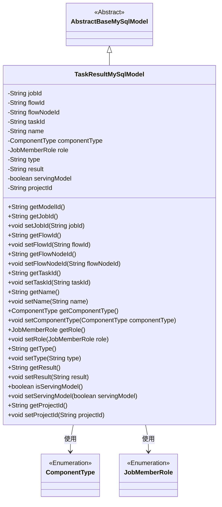
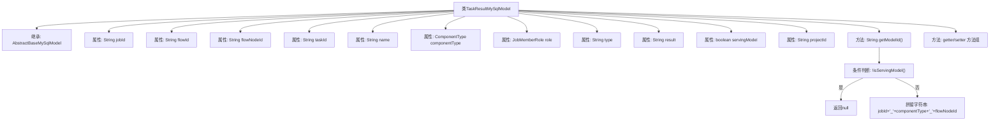

# 基础信息

|      |      |
|------|------|
| 名称 | TaskResultMySqlModel |
| 编码语言 | .java |
| 代码路径 | WeFe/board/board-service/src/main/java/com/welab/wefe/board/service/database/entity/job/TaskResultMySqlModel.java |
| 包名 | com.welab.wefe.board.service.database.entity.job |
| 依赖项 | ['com.welab.wefe.board.service.database.entity.base.AbstractBaseMySqlModel', 'com.welab.wefe.common.wefe.enums.ComponentType', 'com.welab.wefe.common.wefe.enums.JobMemberRole', 'javax.persistence.Entity', 'javax.persistence.EnumType', 'javax.persistence.Enumerated'] |
| 概述说明 | TaskResultMySqlModel类存储任务结果数据，包含任务ID、流程ID、节点ID、任务名称、组件类型、成员角色、结果类型、执行结果及是否可导出模型等字段，并提供getter/setter方法。 |

# 说明

TaskResultMySqlModel是一个继承自AbstractBaseMySqlModel的实体类，对应数据库表task_result。该类包含任务相关字段：jobId（任务Id）、flowId（流程Id）、flowNodeId（流程节点Id）、taskId（子任务Id）、name（任务名称）、componentType（组件类型枚举）、role（成员角色枚举）、type（结果类型）、result（执行结果）、servingModel（是否可导出模型标志）、projectId（项目Id）。其中modelId通过拼接jobId、componentType和flowNodeId生成，前提是servingModel为true。类中为所有字段提供了getter和setter方法。

# 类列表 Class Summary

| 名称   | 类型  | 说明 |
|-------|------|-------------|
| TaskResultMySqlModel | class | TaskResultMySqlModel类存储任务结果，包含任务ID、流程ID、节点ID、任务名称、组件类型、成员角色、结果类型、执行结果、是否可导出模型及项目ID等字段，并提供getModelId方法生成模型ID。 |

## 类 TaskResultMySqlModel

|      |      |
|------|------|
| 访问范围 | @Entity(name = "task_result");public |
| 类型 | class |
| 名称 | TaskResultMySqlModel |
| 说明 | TaskResultMySqlModel类存储任务结果，包含任务ID、流程ID、节点ID、任务名称、组件类型、成员角色、结果类型、执行结果、是否可导出模型及项目ID等字段，并提供getModelId方法生成模型ID。 |

### UML类图

这段代码定义了一个名为`TaskResultMySqlModel`的实体类，继承自抽象基类`AbstractBaseMySqlModel`，用于存储任务执行结果的相关信息。该类包含多个私有字段，如任务ID、流程ID、节点ID等，并通过公有getter和setter方法进行访问和修改。其中`ComponentType`和`JobMemberRole`是枚举类型，用于表示组件类型和成员角色。特别地，`getModelId()`方法会根据条件生成模型ID。整体设计体现了数据库实体与业务模型的映射关系。

### 内部方法调用关系图

这段代码定义了一个名为TaskResultMySqlModel的JPA实体类，继承自AbstractBaseMySqlModel。该类主要包含任务执行结果相关的属性，如任务ID、流程ID、节点ID等基础信息，以及组件类型、成员角色等枚举字段。特别值得注意的是getModelId()方法，它会根据servingModel标志决定是否返回由多个字段拼接而成的模型ID。所有属性都配有标准的getter/setter方法，符合JavaBean规范。

### 字段列表 Field List

| 名称  | 类型  | 说明 |
|-------|-------|------|
| taskId | String | 任务ID字符串变量 |
| type | String | 声明一个私有字符串变量type。 |
| flowId | String | 私有字符串变量flowId，用于存储流程标识。 |
| servingModel | boolean | 布尔变量，表示是否正在服务模型。 |
| role | JobMemberRole | 枚举类型字段role，使用字符串值存储JobMemberRole枚举。 |
| name | String | 私有字符串变量name |
| componentType | ComponentType | 枚举类型字段componentType，使用字符串形式存储。 |
| flowNodeId | String | 私有字符串变量flowNodeId，用于存储流程节点标识。 |
| projectId | String | 项目ID字符串变量 |
| result | String | 声明一个私有字符串变量result。 |
| jobId | String | 私有字符串类型变量jobId，用于存储任务ID。 |

### 方法列表

| 名称  | 类型  | 说明 |
|-------|-------|------|
| getName | String | 方法返回字符串类型的name变量值。 |
| setComponentType | void | 方法设置组件类型，参数为ComponentType对象，赋值给成员变量componentType。 |
| getFlowNodeId | String | 方法返回flowNodeId字符串。 |
| getFlowId | String | 这是一个Java方法，返回字符串类型的flowId变量值。 |
| setJobId | void | 设置任务ID的方法，将参数jobId赋值给类的成员变量jobId。 |
| getTaskId | String | 这是一个Java方法，返回私有变量taskId的值。 |
| getModelId | String | 该方法返回模型ID，若未运行模型则返回null。运行中则拼接任务ID、组件类型和流程节点ID生成模型ID。 |
| setFlowNodeId | void | 设置流程节点ID的方法，将参数flowNodeId赋值给当前对象的同名属性。 |
| getType | String | 这是一个Java方法，返回字符串类型的变量type的值。 |
| getRole | JobMemberRole | 获取当前对象的角色信息。 |
| getJobId | String | 获取当前任务的唯一标识符jobId。 |
| setName | void | 这是一个Java方法，用于设置对象的名称属性，将传入的字符串参数赋值给成员变量name。 |
| setRole | void | 方法setRole用于设置成员角色，参数为JobMemberRole类型，赋值给当前对象的role属性。 |
| setFlowId | void | 设置流程ID的方法，将参数flowId赋值给当前对象的flowId属性。 |
| setTaskId | void | 设置任务ID的方法，将输入参数taskId赋值给当前对象的taskId属性。 |
| getComponentType | ComponentType | 获取组件类型的方法，返回componentType。 |
| setType | void | 这是一个Java方法，用于设置对象的类型属性。方法名为setType，接收一个String参数type，并将其赋值给当前对象的type成员变量。 |
| getResult | String | 这是一个Java方法，返回字符串类型的result变量值。 |
| setResult | void | 设置结果字符串的方法。 |
| isServingModel | boolean | 该方法返回布尔值servingModel，表示是否正在服务模型。 |
| setServingModel | void | 设置服务模型状态的方法，参数为布尔值servingModel，用于更新当前对象的状态。 |
| getProjectId | String | 获取项目ID的方法，返回字符串类型的projectId。 |
| setProjectId | void | 这是一个Java方法，用于设置类的projectId属性，接收一个字符串参数projectId并将其赋值给类的同名成员变量。 |

