# 基础信息

|      |      |
|------|------|
| 名称 | job |
| 编码语言 | .java |
| 代码路径 | WeFe/board/board-service/src/main/java/com/welab/wefe/board/service/database/entity/job |
| 包名 | docs.board.board-service.src.main.java.com.welab.wefe.board.service.database.entity.job |
| 概述说明 | ModelOotRecordMysqlModel映射model_oot_record表，含流程ID、作业ID、节点ID字段。TaskMySqlModel表示任务实体，含名称、深度、状态等属性。JobMemberMySqlModel映射job_member表，含项目ID、角色等字段。TaskResultMySqlModel对应task_result表，含任务ID、结果类型等字段。ProjectMemberAuditMySqlModel记录成员审核信息。JobMySqlModel表示联邦学习任务。ProjectFlowNodeMySqlModel表示流程节点。ProjectFlowMySqlModel映射project_flow表。ProjectDataSetMySqlModel表示项目数据集。TaskProgressMysqlModel记录任务进度。TaskContextMySqlModel存储任务上下文。ProjectMySqlModel表示项目数据。ProjectMemberMySqlModel记录项目成员信息。 |

# 说明

## 概述  
该模块是联邦学习平台的核心数据模型层，负责管理项目、任务、成员及流程等实体关系。所有实体类继承AbstractBaseMySqlModel基类，通过JPA注解映射到MySQL表，例如JobMySqlModel记录横向/纵向联邦任务，ProjectFlowNodeMySqlModel存储流程节点拓扑。关键数据结构包括流程ID（flowId）、任务ID（jobId）、角色枚举（promoter/provider/arbiter）和审核状态枚举（adopt/disagree）。依赖项主要为MySQL数据库和JPA规范，类似传统CRUD架构模式。

## 主要业务场景  
模块支持联邦学习全生命周期管理，例如ProjectFlowMySqlModel定义流程图，TaskMySqlModel跟踪子任务状态，TaskResultMySqlModel存储组件执行结果。典型交互模式为：成员通过ProjectMemberMySqlModel加入项目，流程节点通过ProjectFlowNodeMySqlModel构建DAG，任务进度由TaskProgressMysqlModel监控。集成案例包括模型OOT记录（ModelOotRecordMysqlModel）和数据集审核（ProjectDataSetMySqlModel），形成端到端工作流。

### 包内部结构视图

```mermaid
graph TD
    job --> ModelOotRecordMysqlModel.java
    job --> TaskMySqlModel.java
    job --> JobMemberMySqlModel.java
    job --> TaskResultMySqlModel.java
    job --> ProjectMemberAuditMySqlModel.java
    job --> JobMySqlModel.java
    job --> ProjectFlowNodeMySqlModel.java
    job --> ProjectFlowMySqlModel.java
    job --> ProjectDataSetMySqlModel.java
    job --> TaskProgressMysqlModel.java
    job --> TaskContextMySqlModel.java
    job --> ProjectMySqlModel.java
    job --> ProjectMemberMySqlModel.java
```

该流程图展示了WeFe项目中board-service模块下job目录中的实体类文件结构。所有Java实体类文件都直接隶属于job目录，包括任务模型、项目模型、成员模型等各类数据库实体类，共13个文件节点，清晰地呈现了该目录下的文件组织关系。

# 文件列表

| 名称   | 类型  | 说明 |
|-------|------|-------------|
| [ModelOotRecordMysqlModel.java](ModelOotRecordMysqlModel.md) | file | 实体类ModelOotRecordMysqlModel包含流程ID、被oot的作业ID和被oot的模型id三个字段及其getter和setter方法。 |
| [TaskMySqlModel.java](TaskMySqlModel.md) | file | TaskMySqlModel是任务实体类，包含名称、深度、任务ID、角色、流程号、节点ID、父任务、依赖、类型、配置、状态、时间、消息、错误原因、执行顺序、耗时和项目ID等字段。 |
| [JobMemberMySqlModel.java](JobMemberMySqlModel.md) | file | JobMemberMySqlModel类表示任务成员，包含项目、流程、任务ID，成员角色（promoter/provider/arbiter）、成员ID和数据集ID。 |
| [TaskResultMySqlModel.java](TaskResultMySqlModel.md) | file | TaskResultMySqlModel类存储任务结果数据，包含任务ID、流程ID、节点ID、任务名称、组件类型、成员角色、结果类型、执行结果及是否可导出模型等字段，并提供getter/setter方法。 |
| [ProjectMemberAuditMySqlModel.java](ProjectMemberAuditMySqlModel.md) | file | 项目成员审核实体类，包含项目ID、成员ID、审核人ID、审核结果和审核意见字段。 |
| [JobMySqlModel.java](JobMySqlModel.md) | file | JobMySqlModel类定义了联邦学习任务的数据模型，包含任务类型、ID、状态、时间、进度、配置等字段，支持JSON存储配置信息。 |
| [ProjectFlowNodeMySqlModel.java](ProjectFlowNodeMySqlModel.md) | file | 项目流程节点实体类，包含起始节点标识、节点ID、项目ID、流程ID、父节点列表、组件类型、参数及版本号等字段。 |
| [ProjectFlowMySqlModel.java](ProjectFlowMySqlModel.md) | file | 项目流程实体类，包含流程ID、名称、描述、状态、类型、创建者、排序等属性，用于管理联邦学习项目流程。 |
| [ProjectDataSetMySqlModel.java](ProjectDataSetMySqlModel.md) | file | 项目数据集MySQL模型类，包含项目ID、成员ID、角色、数据集ID、审核状态、来源组件类型、任务ID、子任务ID及数据集类型等字段，提供getter/setter方法。 |
| [TaskProgressMysqlModel.java](TaskProgressMysqlModel.md) | file | 任务进度实体类，包含项目ID、流程号、任务ID、角色、节点ID、任务类型、工程量、进度、耗时和预计结束时间等字段。 |
| [TaskContextMySqlModel.java](TaskContextMySqlModel.md) | file | TaskContextMySqlModel是MySQL实体类，包含任务ID、子任务ID、名称和值字段及其getter/setter方法。 |
| [ProjectMySqlModel.java](ProjectMySqlModel.md) | file | 项目实体类，包含ID、名称、描述、审核状态、进度、时间、成员角色、操作记录等字段，用于管理项目信息。 |
| [ProjectMemberMySqlModel.java](ProjectMemberMySqlModel.md) | file | 项目成员实体类，包含成员ID、项目ID、邀请人ID、角色、审核状态及意见、是否退出等字段，提供排序和getter/setter方法。 |

