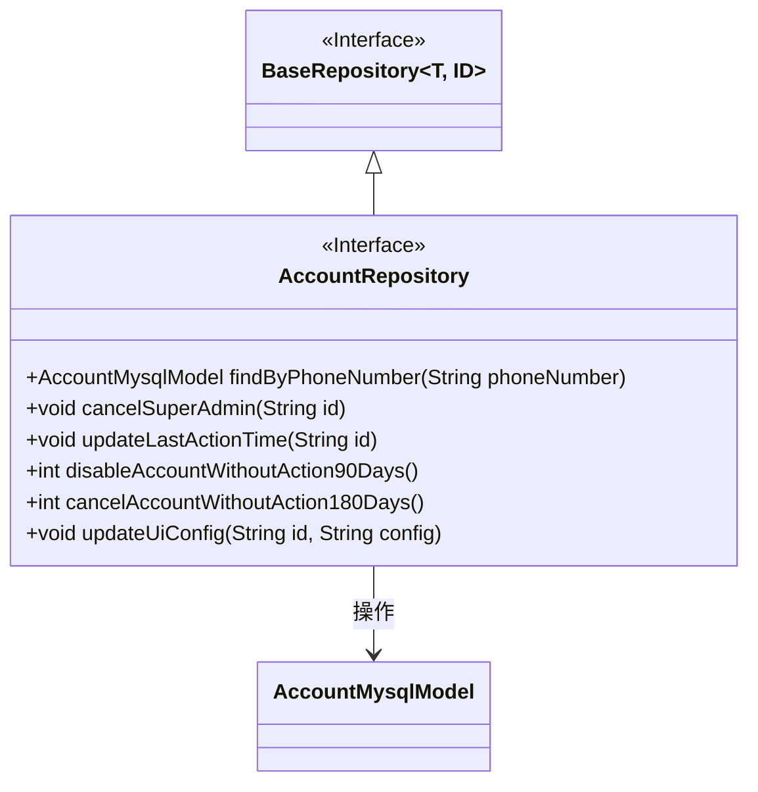
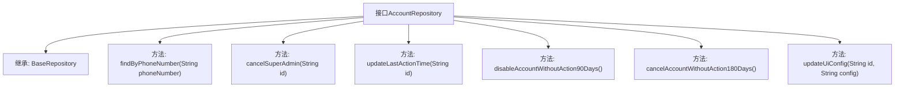

# 基础信息

|      |      |
|------|------|
| 名称 | AccountRepository |
| 编码语言 | .java |
| 代码路径 | WeFe/board/board-service/src/main/java/com/welab/wefe/board/service/database/repository/AccountRepository.java |
| 包名 | com.welab.wefe.board.service.database.repository |
| 依赖项 | ['com.welab.wefe.board.service.database.entity.AccountMysqlModel', 'com.welab.wefe.board.service.database.repository.base.BaseRepository', 'org.springframework.data.jpa.repository.Modifying', 'org.springframework.data.jpa.repository.Query', 'org.springframework.stereotype.Repository', 'org.springframework.transaction.annotation.Transactional'] |
| 概述说明 | AccountRepository接口提供账号管理功能，包括按手机号查询、取消管理员权限、更新最后操作时间、禁用90天未活动账号、注销180天未活动账号及更新UI配置。 |

# 说明

AccountRepository是一个继承BaseRepository的接口，用于操作AccountMysqlModel数据。它包含多个方法：通过手机号查询账号、取消超级管理员权限、更新最后操作时间、禁用90天未活动的账号、注销180天未活动的账号以及更新用户UI配置。所有修改操作均使用@Modifying和@Transactional注解确保自动清除缓存和事务回滚。部分方法使用原生SQL实现特定业务逻辑，如时间差计算和条件更新。

# 类列表 Class Summary

| 名称   | 类型  | 说明 |
|-------|------|-------------|
| AccountRepository | interface | AccountRepository接口扩展BaseRepository，提供账号管理功能：按手机号查询、取消管理员权限、更新最后操作时间、禁用90天未活动账号、注销180天未活动账号、更新UI配置。 |

## 类 AccountRepository

|      |      |
|------|------|
| 访问范围 | @Repository;public |
| 类型 | interface |
| 名称 | AccountRepository |
| 说明 | AccountRepository接口扩展BaseRepository，提供账号管理功能：按手机号查询、取消管理员权限、更新最后操作时间、禁用90天未活动账号、注销180天未活动账号、更新UI配置。 |

### UML类图

这段代码描述了一个Spring Data JPA的AccountRepository接口，它继承了BaseRepository接口并提供了多种账户操作功能。该接口包含6个方法：通过电话号码查询账户、取消超级管理员权限、更新最后操作时间、禁用90天未活动账户、注销180天未活动账户以及更新UI配置。所有修改操作都带有@Modifying和@Transactional注解，确保操作的事务性和自动清除持久化上下文。接口通过原生SQL语句直接操作数据库，主要围绕账户状态管理和最后操作时间跟踪等功能。

### 内部方法调用关系图

这段代码定义了一个Spring Data JPA的Repository接口AccountRepository，它继承了BaseRepository并提供了多个数据库操作方法。主要功能包括通过电话号码查询账户、取消管理员权限、更新最后操作时间、禁用90天未活动的账户、注销180天未活动的账户以及更新用户UI配置。所有修改操作都带有事务管理和自动清除缓存配置，确保数据一致性和性能优化。

### 字段列表 Field List

| 名称  | 类型  | 说明 |
|-------|-------|------|

### 方法列表

| 名称  | 类型  | 说明 |
|-------|-------|------|
| updateLastActionTime | void | 方法使用事务注解，异常时回滚。自动清除缓存，通过原生SQL更新指定ID记录的last_action_time为当前时间。 |
| cancelSuperAdmin | void | 更新账户表，根据ID取消超级管理员和管理员权限。 |
| cancelAccountWithoutAction180Days | int | 使用事务注解和原生SQL，自动取消180天无活动的账户，执行后自动清除缓存。 |
| disableAccountWithoutAction90Days | int | 使用事务注解的Spring Data JPA方法，90天未活跃账户自动禁用，执行原生SQL更新操作。 |
| findByPhoneNumber | AccountMysqlModel | 根据手机号查询账户信息的MySQL模型方法。 |
| updateUiConfig | void | 方法使用事务注解确保异常回滚，自动清除缓存，通过原生SQL更新指定ID的ui_config字段。 |

