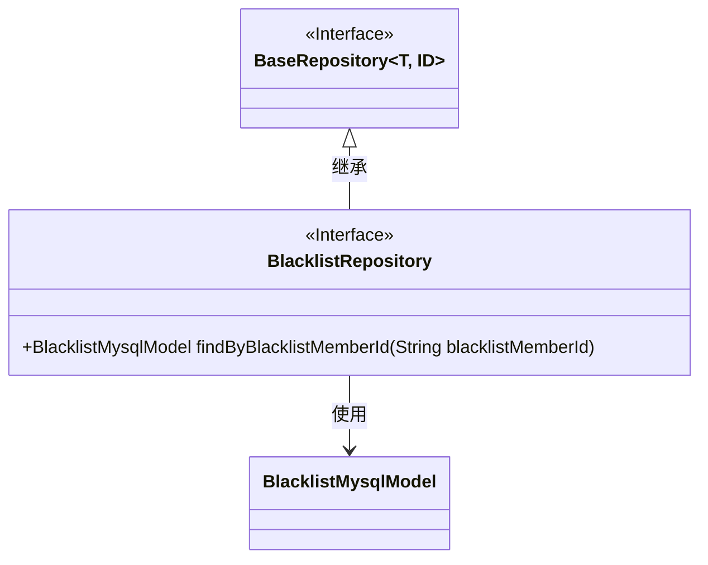
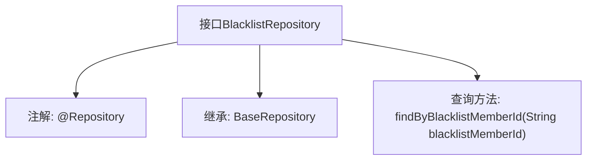

# 基础信息

|      |      |
|------|------|
| 名称 | BlacklistRepository |
| 编码语言 | .java |
| 代码路径 | WeFe/board/board-service/src/main/java/com/welab/wefe/board/service/database/repository/BlacklistRepository.java |
| 包名 | com.welab.wefe.board.service.database.repository |
| 依赖项 | ['com.welab.wefe.board.service.database.entity.BlacklistMysqlModel', 'com.welab.wefe.board.service.database.repository.base.BaseRepository', 'org.springframework.stereotype.Repository'] |
| 概述说明 | 这是一个Spring Data JPA仓库接口，继承基础仓库类，提供按成员ID查询黑名单数据的方法。 |

# 说明

这是一个名为BlacklistRepository的Spring数据仓库接口，使用@Repository注解标记。它继承自BaseRepository基类，泛型参数指定了实体类型为BlacklistMysqlModel，主键类型为String。接口中定义了一个查询方法findByBlacklistMemberId，通过blacklistMemberId字段查询对应的黑名单记录。该设计遵循了Spring Data JPA的命名规范，能够自动生成查询实现。

# 类列表 Class Summary

| 名称   | 类型  | 说明 |
|-------|------|-------------|
| BlacklistRepository | interface | 这是一个Spring的仓库接口，继承基础仓库，用于查询黑名单成员ID对应的模型。 |

## 类 BlacklistRepository

|      |      |
|------|------|
| 访问范围 | @Repository;public |
| 类型 | interface |
| 名称 | BlacklistRepository |
| 说明 | 这是一个Spring的仓库接口，继承基础仓库，用于查询黑名单成员ID对应的模型。 |

### UML类图

该类图展示了BlacklistRepository接口继承自泛型接口BaseRepository，并关联BlacklistMysqlModel实体类。BaseRepository是一个泛型接口，接受类型参数T和ID；BlacklistRepository作为数据访问层接口，通过继承BaseRepository获得基础CRUD能力，并扩展了按blacklistMemberId查询的特定方法。图中清晰体现了Spring Data JPA中Repository接口的典型继承关系和泛型参数传递机制。

### 内部方法调用关系图

该流程图展示了Spring Data JPA中BlacklistRepository接口的结构，它是一个标注了@Repository的接口，继承自BaseRepository并声明了一个按blacklistMemberId查询的方法。该接口通过方法命名约定自动生成SQL查询，用于从数据库中检索黑名单成员数据，体现了Spring Data的"约定优于配置"设计原则。

### 字段列表 Field List

| 名称  | 类型  | 说明 |
|-------|-------|------|

### 方法列表

| 名称  | 类型  | 说明 |
|-------|-------|------|
| findByBlacklistMemberId | BlacklistMysqlModel | 根据黑名单成员ID查询黑名单Mysql模型记录。 |

