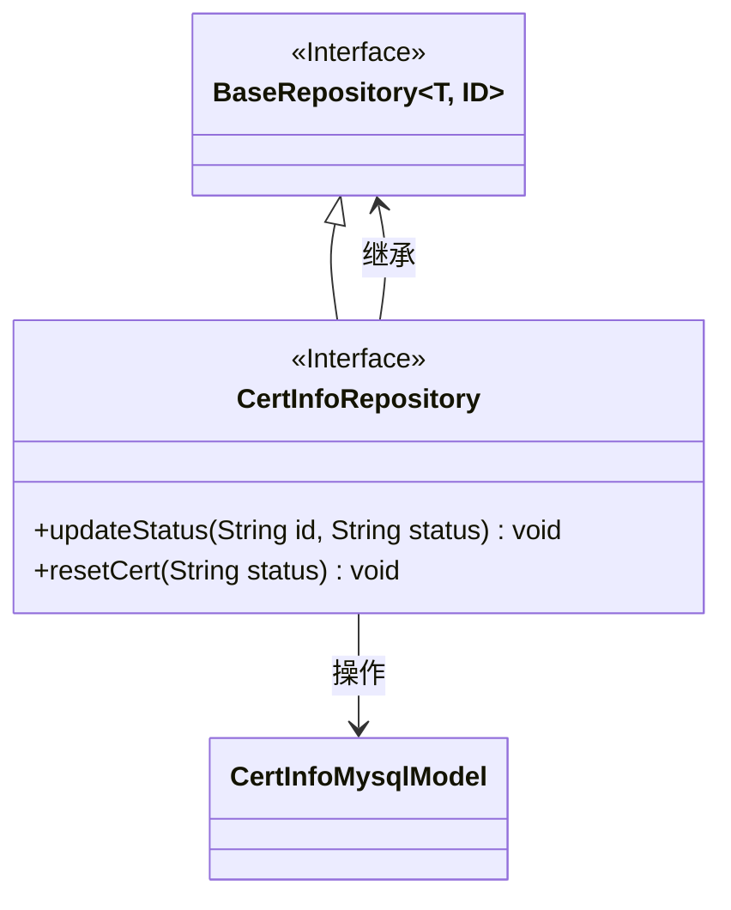
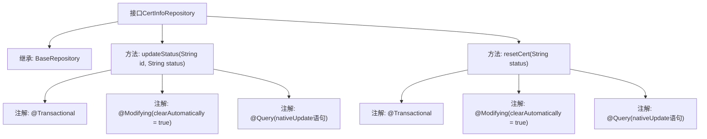

# 基础信息

|      |      |
|------|------|
| 名称 | CertInfoRepository |
| 编码语言 | .java |
| 代码路径 | WeFe/board/board-service/src/main/java/com/welab/wefe/board/service/database/repository/CertInfoRepository.java |
| 包名 | com.welab.wefe.board.service.database.repository |
| 依赖项 | ['org.springframework.data.jpa.repository.Modifying', 'org.springframework.data.jpa.repository.Query', 'org.springframework.stereotype.Repository', 'org.springframework.transaction.annotation.Transactional', 'com.welab.wefe.board.service.database.entity.cert.CertInfoMysqlModel', 'com.welab.wefe.board.service.database.repository.base.BaseRepository'] |
| 概述说明 | CertInfoRepository接口定义了两个方法：updateStatus根据ID更新状态，resetCert重置所有证书状态。均使用原生SQL并支持事务。 |

# 说明

这是一个名为CertInfoRepository的Spring Data JPA仓库接口，继承自BaseRepository，操作CertInfoMysqlModel实体类，主键类型为String。接口包含两个数据修改方法：updateStatus方法通过原生SQL更新指定ID记录的status字段；resetCert方法通过原生SQL批量更新所有记录的status字段。两个方法都使用@Transactional注解确保事务性，并通过@Modifying(clearAutomatically=true)自动清除持久化上下文。

# 类列表 Class Summary

| 名称   | 类型  | 说明 |
|-------|------|-------------|
| CertInfoRepository | interface | CertInfoRepository接口继承BaseRepository，提供两个原生SQL更新方法：updateStatus按ID更新状态，resetCert重置所有状态。使用事务和自动清除缓存。 |

## 类 CertInfoRepository

|      |      |
|------|------|
| 访问范围 | @Repository;public |
| 类型 | interface |
| 名称 | CertInfoRepository |
| 说明 | CertInfoRepository接口继承BaseRepository，提供两个原生SQL更新方法：updateStatus按ID更新状态，resetCert重置所有状态。使用事务和自动清除缓存。 |

### UML类图

这段代码展示了一个Spring Data JPA的Repository接口`CertInfoRepository`，它继承自泛型接口`BaseRepository`，专门用于操作`CertInfoMysqlModel`实体类。接口定义了两个更新方法：`updateStatus`根据ID更新单个记录状态，`resetCert`批量重置所有记录状态。注解`@Repository`标识其为持久层组件，`@Transactional`和`@Modifying`表明方法会修改数据库。类图清晰呈现了接口继承关系与实体类关联，符合JPA规范的设计模式。

### 内部方法调用关系图

这段代码展示了一个Spring Data JPA仓库接口CertInfoRepository，它继承自BaseRepository并定义了两个数据修改方法。updateStatus方法通过原生SQL更新指定ID记录的status字段，resetCert方法则批量更新所有记录的status字段。两个方法均使用@Transactional保证原子性，@Modifying(clearAutomatically=true)确保执行后自动清除持久化上下文，并通过@Query注解直接定义原生SQL更新语句。该接口典型用于证书状态管理场景，提供原子性的状态更新操作。

### 字段列表 Field List

| 名称  | 类型  | 说明 |
|-------|-------|------|

### 方法列表

| 名称  | 类型  | 说明 |
|-------|-------|------|
| updateStatus | void | 使用Spring Data JPA注解定义原生SQL更新方法，根据ID修改实体状态字段。 |
| resetCert | void | 使用原生SQL更新实体状态，自动清除缓存，事务支持。 |

