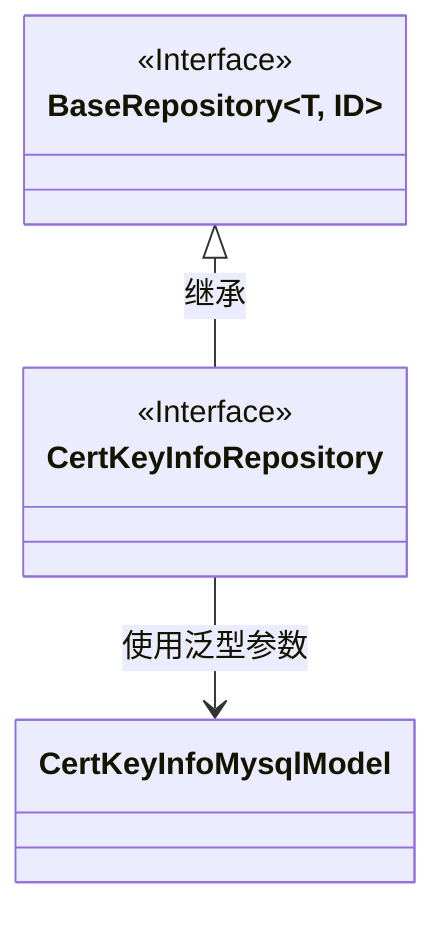
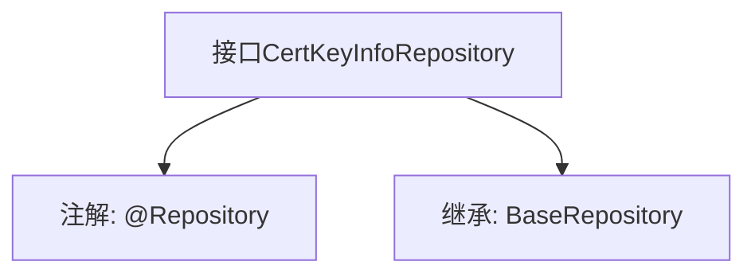

# 基础信息

|      |      |
|------|------|
| 名称 | CertKeyInfoRepository |
| 编码语言 | .java |
| 代码路径 | WeFe/board/board-service/src/main/java/com/welab/wefe/board/service/database/repository/CertKeyInfoRepository.java |
| 包名 | com.welab.wefe.board.service.database.repository |
| 依赖项 | ['org.springframework.stereotype.Repository', 'com.welab.wefe.board.service.database.entity.cert.CertKeyInfoMysqlModel', 'com.welab.wefe.board.service.database.repository.base.BaseRepository'] |
| 概述说明 | 这是一个Spring的JPA仓库接口，继承基础仓库类，用于操作CertKeyInfoMysqlModel数据模型，主键类型为String。 |

# 说明

该内容定义了一个名为CertKeyInfoRepository的Spring数据仓库接口，使用@Repository注解标识。该接口继承自BaseRepository泛型基类，指定了实体类型为CertKeyInfoMysqlModel，主键类型为String。这表明该仓库用于操作CertKeyInfoMysqlModel类型的数据实体，并提供了基础的CRUD操作功能。整个定义简洁明了，符合Spring Data JPA的标准仓库接口规范。

# 类列表 Class Summary

| 名称   | 类型  | 说明 |
|-------|------|-------------|
| CertKeyInfoRepository | interface | 接口CertKeyInfoRepository继承BaseRepository，用于操作CertKeyInfoMysqlModel数据，主键类型为String。 |

## 类 CertKeyInfoRepository

|      |      |
|------|------|
| 访问范围 | @Repository;public |
| 类型 | interface |
| 名称 | CertKeyInfoRepository |
| 说明 | 接口CertKeyInfoRepository继承BaseRepository，用于操作CertKeyInfoMysqlModel数据，主键类型为String。 |

### UML类图

这段类图展示了Spring Data JPA中的仓库接口继承关系。CertKeyInfoRepository接口继承了BaseRepository泛型接口，并指定了CertKeyInfoMysqlModel作为实体类型、String作为ID类型。BaseRepository是一个标记为接口的泛型基类，提供基础的CRUD操作。CertKeyInfoMysqlModel是具体的实体类，通过泛型参数与仓库建立关联。这种结构体现了Spring Data的通用仓库模式，通过接口继承实现类型安全的数据库操作。

### 内部方法调用关系图

这段代码定义了一个Spring Data JPA的仓库接口`CertKeyInfoRepository`，通过`@Repository`注解标记为持久层组件，并继承了`BaseRepository`接口，指定了实体类型`CertKeyInfoMysqlModel`和主键类型`String`。该接口继承了基础CRUD操作能力，无需手动实现方法，由Spring Data JPA自动生成实现。流程图展示了接口的注解和继承关系，层级清晰。

### 字段列表 Field List

| 名称  | 类型  | 说明 |
|-------|-------|------|

### 方法列表

| 名称  | 类型  | 说明 |
|-------|-------|------|

