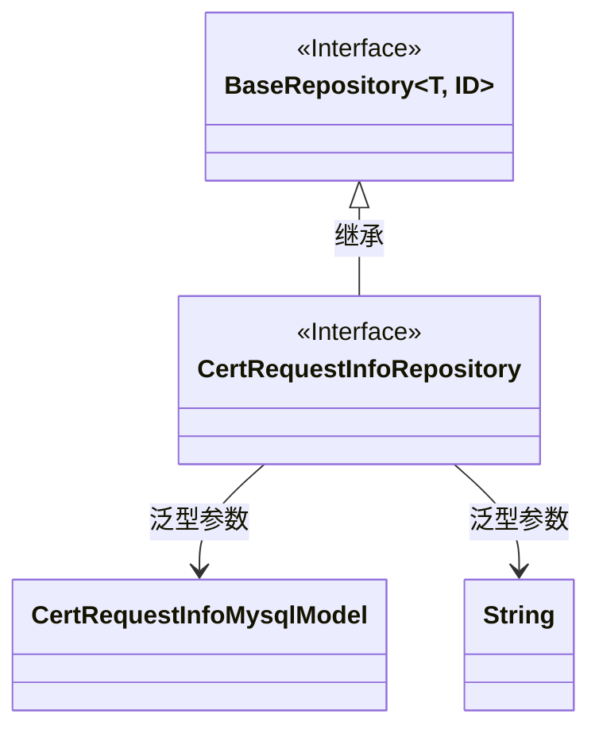
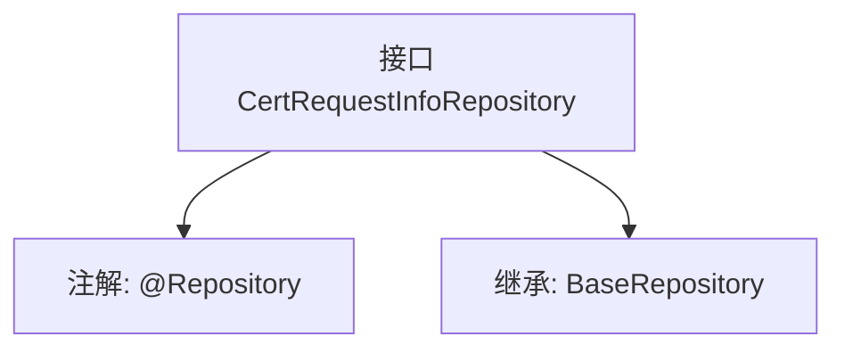

# 基础信息

|      |      |
|------|------|
| 名称 | CertRequestInfoRepository |
| 编码语言 | .java |
| 代码路径 | WeFe/board/board-service/src/main/java/com/welab/wefe/board/service/database/repository/CertRequestInfoRepository.java |
| 包名 | com.welab.wefe.board.service.database.repository |
| 依赖项 | ['org.springframework.stereotype.Repository', 'com.welab.wefe.board.service.database.entity.cert.CertRequestInfoMysqlModel', 'com.welab.wefe.board.service.database.repository.base.BaseRepository'] |
| 概述说明 | 接口CertRequestInfoRepository继承BaseRepository，用于操作CertRequestInfoMysqlModel数据，主键类型为String。 |

# 说明

该内容定义了一个名为CertRequestInfoRepository的Spring数据仓库接口，使用@Repository注解标记为持久层组件。该接口继承自BaseRepository泛型基类，指定了实体类型为CertRequestInfoMysqlModel，主键类型为String。这表明该仓库用于处理证书请求信息的数据访问操作，基于MySQL数据库实现。

# 类列表 Class Summary

| 名称   | 类型  | 说明 |
|-------|------|-------------|
| CertRequestInfoRepository | interface | 这是一个Spring的仓库接口，继承基础仓库类，用于管理证书请求信息的MySQL模型数据。 |

## 类 CertRequestInfoRepository

|      |      |
|------|------|
| 访问范围 | @Repository;public |
| 类型 | interface |
| 名称 | CertRequestInfoRepository |
| 说明 | 这是一个Spring的仓库接口，继承基础仓库类，用于管理证书请求信息的MySQL模型数据。 |

### UML类图

这段类图展示了CertRequestInfoRepository接口继承自BaseRepository泛型接口的关系。BaseRepository是一个带有两个泛型参数T和ID的接口，其中T被具体化为CertRequestInfoMysqlModel实体类，ID被具体化为String类型。CertRequestInfoRepository作为数据访问层的接口，通过继承BaseRepository获得了基本的CRUD操作能力，同时通过泛型参数指定了操作的实体类型和主键类型。这种设计遵循了Spring Data JPA的Repository模式，实现了对CertRequestInfoMysqlModel实体的数据访问抽象。

### 内部方法调用关系图

这段代码定义了一个名为CertRequestInfoRepository的Spring数据仓库接口，通过@Repository注解标记为持久层组件。该接口继承了BaseRepository泛型接口，指定了实体类型为CertRequestInfoMysqlModel，主键类型为String。流程图清晰地展示了接口的注解标记和继承关系，体现了Spring Data JPA中通过扩展基础仓库接口快速实现CRUD操作的典型模式。

### 字段列表 Field List

| 名称  | 类型  | 说明 |
|-------|-------|------|

### 方法列表

| 名称  | 类型  | 说明 |
|-------|-------|------|

