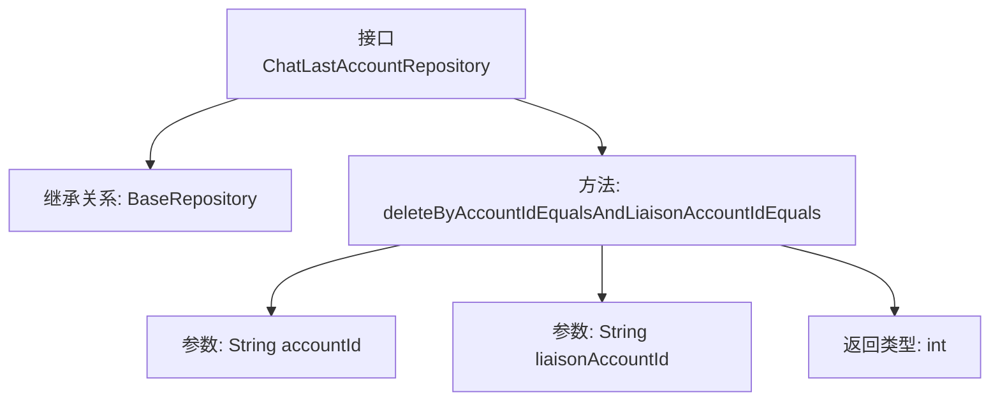

# 基础信息

|      |      |
|------|------|
| 名称 | ChatLastAccountRepository |
| 编码语言 | .java |
| 代码路径 | WeFe/board/board-service/src/main/java/com/welab/wefe/board/service/database/repository/ChatLastAccountRepository.java |
| 包名 | com.welab.wefe.board.service.database.repository |
| 依赖项 | ['com.welab.wefe.board.service.database.entity.chat.ChatLastAccountMysqlModel', 'com.welab.wefe.board.service.database.repository.base.BaseRepository', 'org.springframework.stereotype.Repository'] |
| 概述说明 | 这是一个Spring的Repository接口，用于操作ChatLastAccountMysqlModel数据，提供按accountId和liaisonAccountId删除记录的方法。 |

# 说明

这是一个名为ChatLastAccountRepository的Spring数据仓库接口，继承自BaseRepository基类。该接口使用@Repository注解标注，操作ChatLastAccountMysqlModel实体类，主键类型为String。接口定义了一个删除方法deleteByAccountIdEqualsAndLiaisonAccountIdEquals，通过两个相等条件参数accountId和liaisonAccountId来删除匹配的记录，返回受影响的行数。

# 类列表 Class Summary

| 名称   | 类型  | 说明 |
|-------|------|-------------|
| ChatLastAccountRepository | interface | 接口ChatLastAccountRepository继承BaseRepository，提供按accountId和liaisonAccountId删除数据的方法。 |


## 类 ChatLastAccountRepository

|      |      |
|------|------|
| 访问范围 | @Repository;public |
| 类型 | interface |
| 名称 | ChatLastAccountRepository |
| 说明 | 接口ChatLastAccountRepository继承BaseRepository，提供按accountId和liaisonAccountId删除数据的方法。 |


### UML类图

```mermaid
classDiagram
    class BaseRepository~T, ID~ {
        <<Interface>>
    }
    
    class ChatLastAccountRepository {
        <<Interface>>
        +deleteByAccountIdEqualsAndLiaisonAccountIdEquals(String accountId, String liaisonAccountId) int
    }
    
    BaseRepository <|-- ChatLastAccountRepository
    // ChatLastAccountRepository 继承自泛型接口 BaseRepository
    // 定义删除方法，根据两个账户ID删除记录
```

该类图展示了一个Spring Data JPA仓库接口的结构。ChatLastAccountRepository接口继承自泛型基础接口BaseRepository，指定了实体类型ChatLastAccountMysqlModel和主键类型String。接口中定义了一个删除方法，通过两个账户ID作为条件来删除记录。这种设计遵循了Spring Data的仓库模式，提供了类型安全的数据库操作方式，同时保持了接口的简洁性。


### 内部方法调用关系图



该流程图展示了Spring Data JPA中一个Repository接口的结构。ChatLastAccountRepository接口继承自BaseRepository，并声明了一个自定义删除方法。该方法通过两个String类型参数accountId和liaisonAccountId进行条件匹配，返回受影响的行数(int)。这种设计遵循了Spring Data的派生查询命名规范，实现了通过复合条件删除数据库记录的功能。

### 字段列表 Field List

| 名称  | 类型  | 说明 |
|-------|-------|------|

### 方法列表

| 名称  | 类型  | 说明 |
|-------|-------|------|
| deleteByAccountIdEqualsAndLiaisonAccountIdEquals | int | 删除符合指定账户ID和联络账户ID的记录。 |


