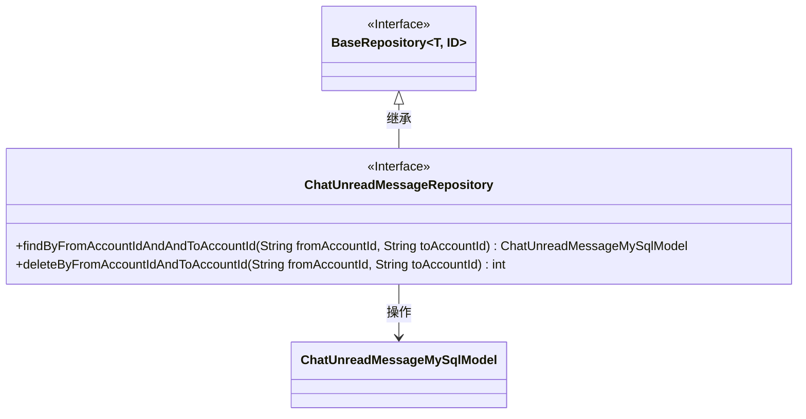
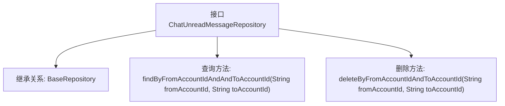

# 基础信息

|      |      |
|------|------|
| 名称 | ChatUnreadMessageRepository |
| 编码语言 | .java |
| 代码路径 | WeFe/board/board-service/src/main/java/com/welab/wefe/board/service/database/repository/ChatUnreadMessageRepository.java |
| 包名 | com.welab.wefe.board.service.database.repository |
| 依赖项 | ['com.welab.wefe.board.service.database.entity.chat.ChatUnreadMessageMySqlModel', 'com.welab.wefe.board.service.database.repository.base.BaseRepository', 'org.springframework.stereotype.Repository'] |
| 概述说明 | ChatUnreadMessageRepository接口继承BaseRepository，提供按发送和接收账号查询未读消息及删除记录的方法。 |

# 说明

这是一个名为ChatUnreadMessageRepository的Spring数据仓库接口，继承自BaseRepository，用于操作ChatUnreadMessageMySqlModel类型的数据，主键类型为String。接口定义了两个方法：findByFromAccountIdAndAndToAccountId用于根据发送方和接收方账号ID查询未读消息记录，deleteByFromAccountIdAndToAccountId用于根据发送方和接收方账号ID删除未读消息记录并返回删除数量。该接口通过@Repository注解标识为Spring管理的持久层组件。

# 类列表 Class Summary

| 名称   | 类型  | 说明 |
|-------|------|-------------|
| ChatUnreadMessageRepository | interface | ChatUnreadMessageRepository接口继承BaseRepository，提供按发送和接收账号查询未读消息及删除记录的方法。 |

## 类 ChatUnreadMessageRepository

|      |      |
|------|------|
| 访问范围 | @Repository;public |
| 类型 | interface |
| 名称 | ChatUnreadMessageRepository |
| 说明 | ChatUnreadMessageRepository接口继承BaseRepository，提供按发送和接收账号查询未读消息及删除记录的方法。 |

### UML类图

这段代码展示了一个Spring Data JPA仓库接口`ChatUnreadMessageRepository`，它继承自泛型接口`BaseRepository`，专门用于操作`ChatUnreadMessageMySqlModel`实体类。该接口定义了两个核心方法：通过发送方和接收方账号ID查询未读消息，以及删除指定账号间的未读消息记录。类图清晰地体现了接口继承关系和实体操作依赖。

### 内部方法调用关系图

该流程图展示了Spring Data JPA仓库接口的结构，主要包含继承基础仓库和定义两个衍生查询方法。接口通过`@Repository`注解标记为持久层组件，继承的`BaseRepository`提供基础CRUD操作，自定义方法`findBy...`和`deleteBy...`分别实现按账户ID查询未读消息和删除记录的功能，遵循JPA方法命名约定自动生成SQL。

### 字段列表 Field List

| 名称  | 类型  | 说明 |
|-------|-------|------|

### 方法列表

| 名称  | 类型  | 说明 |
|-------|-------|------|
| deleteByFromAccountIdAndToAccountId | int | 删除指定转出和转入账户ID的记录。 |
| findByFromAccountIdAndAndToAccountId | ChatUnreadMessageMySqlModel | 根据fromAccountId和toAccountId查询未读消息的MySQL模型方法。 |

