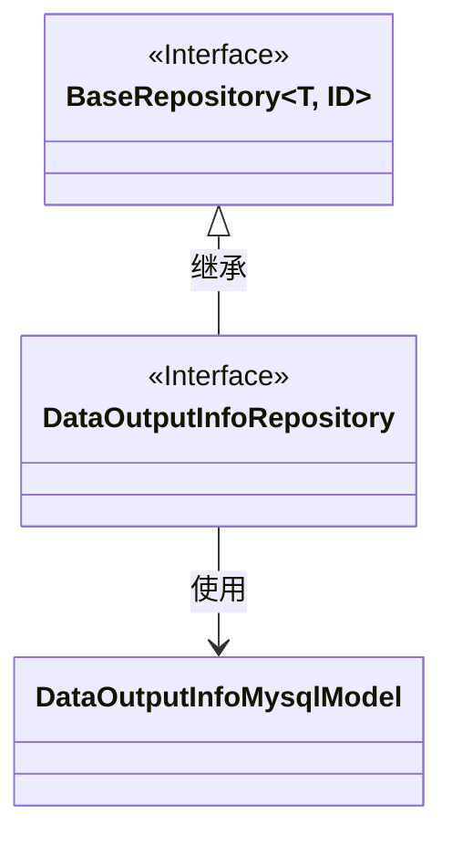
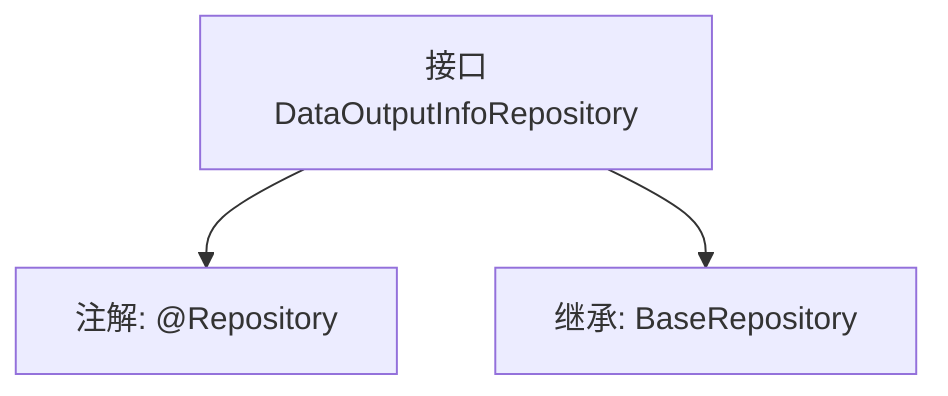

# 基础信息

|      |      |
|------|------|
| 名称 | DataOutputInfoRepository |
| 编码语言 | .java |
| 代码路径 | WeFe/board/board-service/src/main/java/com/welab/wefe/board/service/database/repository/DataOutputInfoRepository.java |
| 包名 | com.welab.wefe.board.service.database.repository |
| 依赖项 | ['com.welab.wefe.board.service.database.entity.DataOutputInfoMysqlModel', 'com.welab.wefe.board.service.database.repository.base.BaseRepository', 'org.springframework.stereotype.Repository'] |
| 概述说明 | 数据输出信息仓库接口，继承基础仓库类，操作数据输出信息MySQL模型，主键类型为字符串。 |

# 说明

该内容描述了一个名为DataOutputInfoRepository的Java接口，使用@Repository注解标记为Spring数据仓库组件。该接口继承自BaseRepository泛型接口，指定了实体类型为DataOutputInfoMysqlModel，主键类型为String。这表明它是一个用于操作DataOutputInfoMysqlModel实体数据的数据访问层接口，具备基本的CRUD操作能力。

# 类列表 Class Summary

| 名称   | 类型  | 说明 |
|-------|------|-------------|
| DataOutputInfoRepository | interface | 这是一个Spring Data JPA仓库接口，继承基础仓库，用于操作DataOutputInfoMysqlModel实体类，主键类型为String。 |

## 类 DataOutputInfoRepository

|      |      |
|------|------|
| 访问范围 | @Repository;public |
| 类型 | interface |
| 名称 | DataOutputInfoRepository |
| 说明 | 这是一个Spring Data JPA仓库接口，继承基础仓库，用于操作DataOutputInfoMysqlModel实体类，主键类型为String。 |

### UML类图

这段类图展示了DataOutputInfoRepository接口继承自泛型接口BaseRepository，并指定了泛型参数为DataOutputInfoMysqlModel和String。DataOutputInfoRepository是一个标记了@Repository的Spring数据访问层接口，它通过继承BaseRepository获得了基本的CRUD操作能力，专用于处理DataOutputInfoMysqlModel类型的数据实体，主键类型为String。这种设计遵循了Spring Data JPA的规范模式。

### 内部方法调用关系图

这段代码定义了一个Spring Data JPA仓库接口DataOutputInfoRepository，通过@Repository注解标记为持久层组件，并继承BaseRepository接口获得基础CRUD操作能力。该接口泛型指定实体类型为DataOutputInfoMysqlModel，主键类型为String，框架会自动生成代理实现类完成数据库交互。

### 字段列表 Field List

| 名称  | 类型  | 说明 |
|-------|-------|------|

### 方法列表

| 名称  | 类型  | 说明 |
|-------|-------|------|

