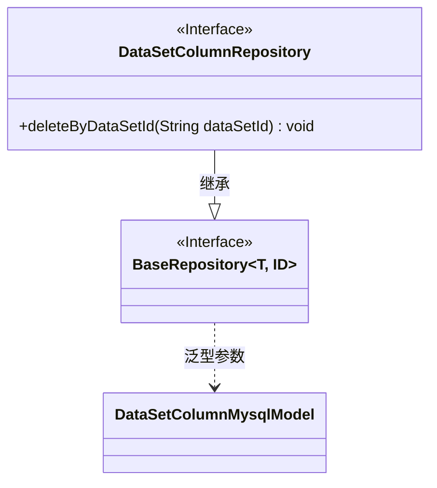
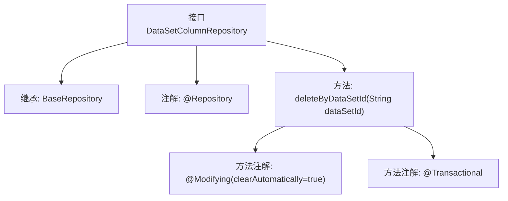

# 基础信息

|      |      |
|------|------|
| 名称 | DataSetColumnRepository |
| 编码语言 | .java |
| 代码路径 | WeFe/board/board-service/src/main/java/com/welab/wefe/board/service/database/repository/DataSetColumnRepository.java |
| 包名 | com.welab.wefe.board.service.database.repository |
| 依赖项 | ['com.welab.wefe.board.service.database.entity.data_set.DataSetColumnMysqlModel', 'com.welab.wefe.board.service.database.repository.base.BaseRepository', 'org.springframework.data.jpa.repository.Modifying', 'org.springframework.stereotype.Repository', 'org.springframework.transaction.annotation.Transactional'] |
| 概述说明 | 这是一个Spring Data JPA仓库接口，用于操作数据集列模型。它继承基础仓库并定义了一个删除方法，根据数据集ID删除记录，支持事务和自动清除缓存。 |

# 说明

这是一个Spring Data JPA的仓库接口定义，继承自基础仓库接口BaseRepository，泛型参数指定实体类型为DataSetColumnMysqlModel，主键类型为String。接口包含一个自定义删除方法deleteByDataSetId，通过数据集ID删除记录。该方法添加了@Modifying注解并设置clearAutomatically为true以自动清除持久化上下文，同时使用@Transactional注解确保事务性执行。

# 类列表 Class Summary

| 名称   | 类型  | 说明 |
|-------|------|-------------|
| DataSetColumnRepository | interface | 数据集列存储库接口，继承基础存储库，提供按数据集ID删除列的方法，支持自动清除和事务处理。 |

## 类 DataSetColumnRepository

|      |      |
|------|------|
| 访问范围 | @Repository;public |
| 类型 | interface |
| 名称 | DataSetColumnRepository |
| 说明 | 数据集列存储库接口，继承基础存储库，提供按数据集ID删除列的方法，支持自动清除和事务处理。 |

### UML类图

该类图展示了一个Spring Data JPA仓库接口的结构。DataSetColumnRepository接口继承自泛型接口BaseRepository，指定DataSetColumnMysqlModel作为实体类型，String作为ID类型。接口中定义了一个删除方法deleteByDataSetId，使用@Modifying和@Transactional注解标注，表明这是一个修改操作且需要事务支持。BaseRepository作为通用仓库接口，通过泛型参数T和ID提供了基本的CRUD操作能力。

### 内部方法调用关系图

这段代码展示了一个Spring Data JPA的Repository接口，继承自BaseRepository并标注了@Repository注解。核心方法deleteByDataSetId使用@Modifying和@Transactional注解，表示该方法会修改数据库且需要事务支持。流程图清晰地呈现了接口的继承关系、类级别注解与方法级别注解的层级结构，体现了JPA仓库的典型设计模式。

### 字段列表 Field List

| 名称  | 类型  | 说明 |
|-------|-------|------|

### 方法列表

| 名称  | 类型  | 说明 |
|-------|-------|------|
| deleteByDataSetId | void | 删除指定数据集ID的记录，自动清除缓存并支持事务。 |

