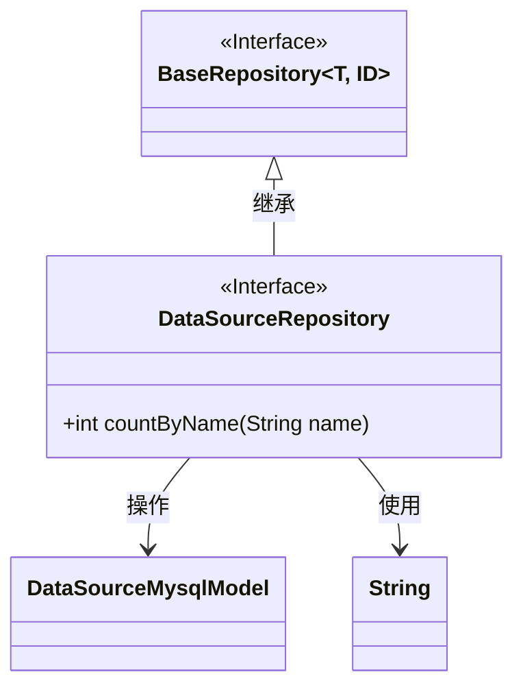
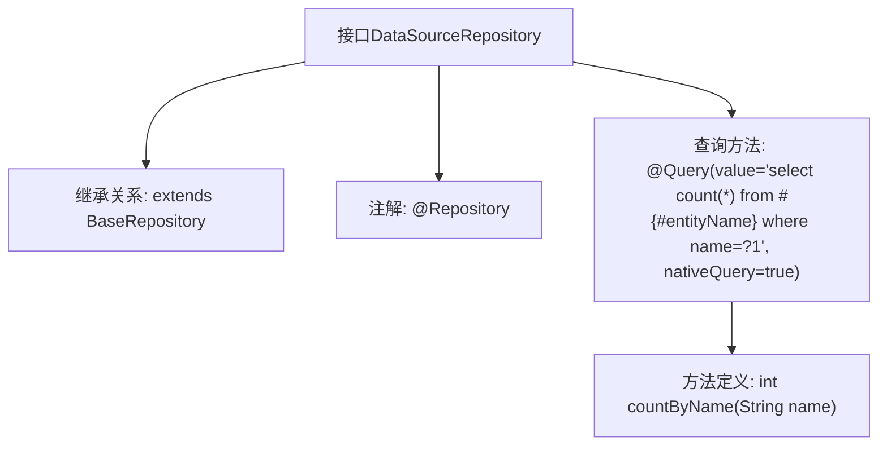

# 基础信息

|      |      |
|------|------|
| 名称 | DataSourceRepository |
| 编码语言 | .java |
| 代码路径 | WeFe/board/board-service/src/main/java/com/welab/wefe/board/service/database/repository/DataSourceRepository.java |
| 包名 | com.welab.wefe.board.service.database.repository |
| 依赖项 | ['com.welab.wefe.board.service.database.entity.DataSourceMysqlModel', 'com.welab.wefe.board.service.database.repository.base.BaseRepository', 'org.springframework.data.jpa.repository.Query', 'org.springframework.stereotype.Repository'] |
| 概述说明 | 这是一个Spring Data JPA仓库接口，继承基础仓库并定义了一个原生SQL查询方法，用于按名称统计数据源数量。 |

# 说明

这是一个名为DataSourceRepository的Spring Data JPA仓库接口，继承自BaseRepository基类，泛型参数指定实体类型为DataSourceMysqlModel，主键类型为String。接口中定义了一个countByName方法，使用@Query注解执行原生SQL查询，统计表中name字段值与参数匹配的记录总数。该查询通过#{#entityName}引用实体名称，使用位置参数?1接收方法参数name。

# 类列表 Class Summary

| 名称   | 类型  | 说明 |
|-------|------|-------------|
| DataSourceRepository | interface | 数据源仓库接口继承基础仓库，提供按名称统计数量的原生SQL查询方法。 |

## 类 DataSourceRepository

|      |      |
|------|------|
| 访问范围 | @Repository;public |
| 类型 | interface |
| 名称 | DataSourceRepository |
| 说明 | 数据源仓库接口继承基础仓库，提供按名称统计数量的原生SQL查询方法。 |

### UML类图

类图描述：
该图展示了一个Spring Data JPA的仓储接口结构。DataSourceRepository接口继承自泛型接口BaseRepository<DataSourceMysqlModel, String>，表明这是一个针对DataSourceMysqlModel实体类、主键类型为String的仓储接口。接口中定义了countByName()方法，使用@Query注解指定原生SQL查询。BaseRepository作为父接口提供基础CRUD操作，DataSourceMysqlModel是实体类，String用于主键类型标识。

### 内部方法调用关系图

这段流程图描述了DataSourceRepository接口的结构和功能。该接口通过@Repository注解标记为Spring数据仓库，继承自BaseRepository泛型基类，指定了DataSourceMysqlModel作为实体类型和String作为ID类型。核心功能是通过@Query注解定义了一个原生SQL查询方法countByName，该方法接收名称参数并返回匹配记录数。流程图清晰展现了从接口定义到具体查询方法的层级关系，体现了Spring Data JPA的典型仓库模式实现方式。

### 字段列表 Field List

| 名称  | 类型  | 说明 |
|-------|-------|------|

### 方法列表

| 名称  | 类型  | 说明 |
|-------|-------|------|
| countByName | int | 查询方法：统计指定名称的记录总数，使用原生SQL查询。 |

