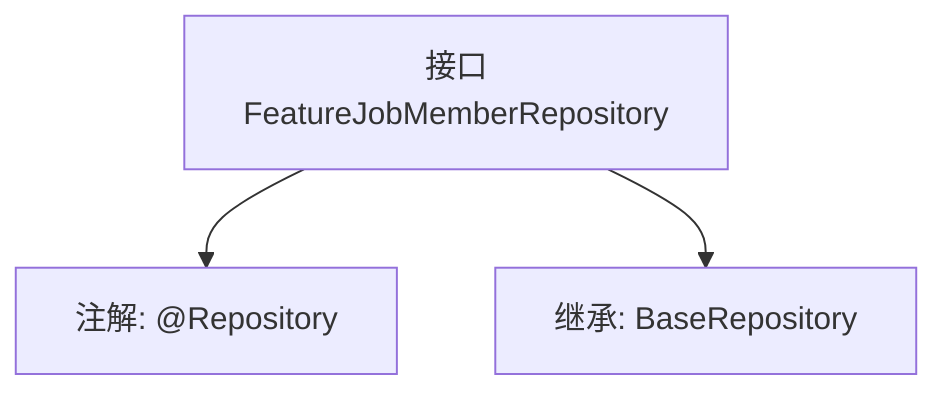

# 基础信息

|      |      |
|------|------|
| 名称 | FeatureJobMemberRepository |
| 编码语言 | .java |
| 代码路径 | WeFe/board/board-service/src/main/java/com/welab/wefe/board/service/database/repository/FeatureJobMemberRepository.java |
| 包名 | com.welab.wefe.board.service.database.repository |
| 依赖项 | ['com.welab.wefe.board.service.database.entity.job.JobMemberMySqlModel', 'com.welab.wefe.board.service.database.repository.base.BaseRepository', 'org.springframework.stereotype.Repository'] |
| 概述说明 | 这是一个Spring的仓库接口，继承基础仓库类，用于管理JobMemberMySqlModel类型数据，主键为String类型。 |

# 说明

这是一个名为FeatureJobMemberRepository的Spring数据仓库接口，使用@Repository注解标识。它继承了BaseRepository基类，指定了实体类型为JobMemberMySqlModel，主键类型为String。该接口主要用于操作JobMemberMySqlModel实体对应的数据库表，继承了基类提供的通用CRUD操作方法。

# 类列表 Class Summary

| 名称   | 类型  | 说明 |
|-------|------|-------------|
| FeatureJobMemberRepository | interface | 这是一个Spring数据仓库接口，继承基础仓库类，用于操作JobMemberMySqlModel类型数据，主键为String类型。 |


## 类 FeatureJobMemberRepository

|      |      |
|------|------|
| 访问范围 | @Repository;public |
| 类型 | interface |
| 名称 | FeatureJobMemberRepository |
| 说明 | 这是一个Spring数据仓库接口，继承基础仓库类，用于操作JobMemberMySqlModel类型数据，主键为String类型。 |


### UML类图

```mermaid
classDiagram
    class BaseRepository~T, ID~ {
        <<Interface>>
    }
    
    class FeatureJobMemberRepository {
        <<Interface>>
    }
    
    BaseRepository <|-- FeatureJobMemberRepository : 继承
    // FeatureJobMemberRepository 继承自泛型接口 BaseRepository
    // 泛型参数 T 被指定为 JobMemberMySqlModel，ID 被指定为 String
```

这段类图展示了FeatureJobMemberRepository接口继承自BaseRepository泛型接口的关系。BaseRepository是一个带有两个泛型参数(T和ID)的接口，而FeatureJobMemberRepository通过继承将其特化为处理JobMemberMySqlModel类型实体和String类型ID的版本。图中清晰体现了Spring Data JPA中常见的仓库接口继承模式，其中子接口通过继承获得父接口的所有CRUD操作方法，同时通过泛型参数指定了具体操作的实体类型和主键类型。


### 内部方法调用关系图



这段流程图展示了FeatureJobMemberRepository接口的结构关系。该接口被标记为@Repository注解，表明它是一个Spring数据访问层的组件。同时它继承了BaseRepository泛型接口，指定了实体类型为JobMemberMySqlModel，主键类型为String。这种设计遵循了Spring Data JPA的规范，通过继承基础仓库接口自动获得CRUD操作能力，无需手动实现基础数据访问方法。

### 字段列表 Field List

| 名称  | 类型  | 说明 |
|-------|-------|------|

### 方法列表

| 名称  | 类型  | 说明 |
|-------|-------|------|


