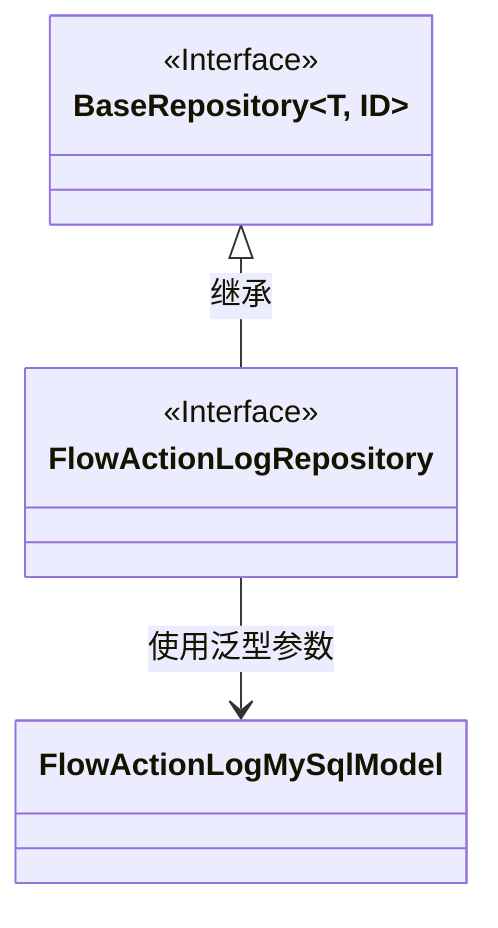
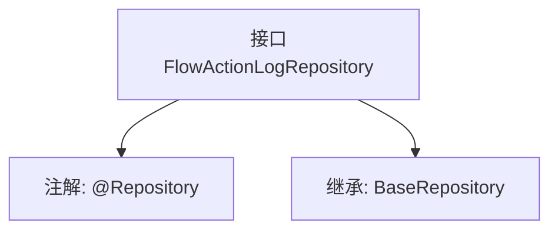

# 基础信息

|      |      |
|------|------|
| 名称 | FlowActionLogRepository |
| 编码语言 | .java |
| 代码路径 | WeFe/board/board-service/src/main/java/com/welab/wefe/board/service/database/repository/FlowActionLogRepository.java |
| 包名 | com.welab.wefe.board.service.database.repository |
| 依赖项 | ['com.welab.wefe.board.service.database.entity.flow.FlowActionLogMySqlModel', 'com.welab.wefe.board.service.database.repository.base.BaseRepository', 'org.springframework.stereotype.Repository'] |
| 概述说明 | 这是一个Spring的仓库接口，继承基础仓库类，用于操作FlowActionLogMySqlModel类型数据，主键为String类型。 |

# 说明

该代码片段定义了一个名为FlowActionLogRepository的Spring数据仓库接口，使用@Repository注解标识。该接口继承自BaseRepository泛型基类，指定了实体类型为FlowActionLogMySqlModel，主键类型为String。这表明该仓库用于操作MySQL数据库中的流程动作日志数据，继承了基础仓库的CRUD操作方法。

# 类列表 Class Summary

| 名称   | 类型  | 说明 |
|-------|------|-------------|
| FlowActionLogRepository | interface | 这是一个Spring的仓库接口，继承基础仓库类，用于操作FlowActionLogMySqlModel类型数据，主键为String类型。 |

## 类 FlowActionLogRepository

|      |      |
|------|------|
| 访问范围 | @Repository;public |
| 类型 | interface |
| 名称 | FlowActionLogRepository |
| 说明 | 这是一个Spring的仓库接口，继承基础仓库类，用于操作FlowActionLogMySqlModel类型数据，主键为String类型。 |

### UML类图

这段类图展示了FlowActionLogRepository接口继承自BaseRepository泛型接口的关系。BaseRepository是一个泛型接口，接受两个类型参数T和ID，而FlowActionLogRepository特化为使用FlowActionLogMySqlModel作为实体类型，String作为ID类型。这是一个典型的数据访问层设计模式，其中基础仓储接口提供了通用CRUD操作，具体仓储接口则通过类型特化来操作特定领域模型。

### 内部方法调用关系图

这段代码定义了一个Spring Data JPA仓库接口`FlowActionLogRepository`，通过`@Repository`注解标记为持久层组件，并继承了`BaseRepository`接口。该接口泛型参数指定了实体类型为`FlowActionLogMySqlModel`，主键类型为`String`。流程图展示了接口的注解和继承关系，层级清晰体现了JPA仓库的标准定义方式。

### 字段列表 Field List

| 名称  | 类型  | 说明 |
|-------|-------|------|

### 方法列表

| 名称  | 类型  | 说明 |
|-------|-------|------|

