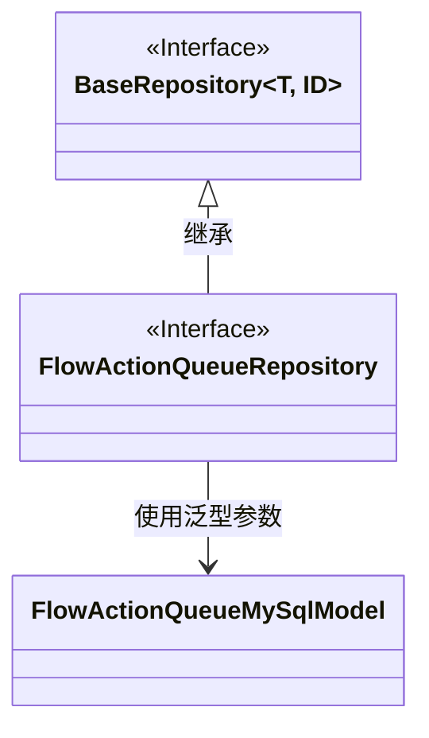
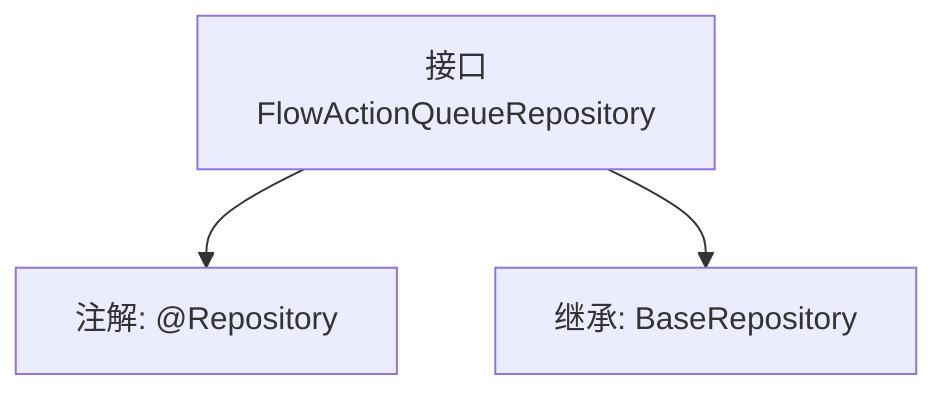

# 基础信息

|      |      |
|------|------|
| 名称 | FlowActionQueueRepository |
| 编码语言 | .java |
| 代码路径 | WeFe/board/board-service/src/main/java/com/welab/wefe/board/service/database/repository/FlowActionQueueRepository.java |
| 包名 | com.welab.wefe.board.service.database.repository |
| 依赖项 | ['com.welab.wefe.board.service.database.entity.flow.FlowActionQueueMySqlModel', 'com.welab.wefe.board.service.database.repository.base.BaseRepository', 'org.springframework.stereotype.Repository'] |
| 概述说明 | 这是一个Spring框架的仓库接口，继承基础仓库类，用于操作FlowActionQueueMySqlModel类型数据，主键为String类型。 |

# 说明

该代码片段定义了一个名为FlowActionQueueRepository的Spring数据仓库接口，使用@Repository注解标识。该接口继承自BaseRepository泛型基类，指定了实体类型为FlowActionQueueMySqlModel，主键类型为String。这表明该仓库用于操作MySQL数据库中的流程动作队列相关数据，提供了基础的CRUD操作能力。

# 类列表 Class Summary

| 名称   | 类型  | 说明 |
|-------|------|-------------|
| FlowActionQueueRepository | interface | 这是一个Spring框架的仓库接口，继承基础仓库类，用于操作FlowActionQueueMySqlModel类型数据，主键为String类型。 |

## 类 FlowActionQueueRepository

|      |      |
|------|------|
| 访问范围 | @Repository;public |
| 类型 | interface |
| 名称 | FlowActionQueueRepository |
| 说明 | 这是一个Spring框架的仓库接口，继承基础仓库类，用于操作FlowActionQueueMySqlModel类型数据，主键为String类型。 |

### UML类图

这段类图展示了FlowActionQueueRepository接口继承自BaseRepository泛型接口的关系。BaseRepository是一个泛型接口，接受两个类型参数T和ID；FlowActionQueueRepository指定了具体类型参数FlowActionQueueMySqlModel和String。图中清晰体现了接口继承关系和泛型参数的具体化，其中FlowActionQueueMySqlModel作为实体模型类被泛型接口使用。

### 内部方法调用关系图

这段流程图展示了FlowActionQueueRepository接口的结构关系。该接口被标记为@Repository注解，表明它是一个Spring数据访问组件。同时它继承了BaseRepository泛型接口，指定了实体类型为FlowActionQueueMySqlModel，主键类型为String。这种设计模式是典型的数据访问层(DAO)实现方式，通过继承基础仓库接口获得基本的CRUD操作能力，同时保持接口的简洁性。

### 字段列表 Field List

| 名称  | 类型  | 说明 |
|-------|-------|------|

### 方法列表

| 名称  | 类型  | 说明 |
|-------|-------|------|

