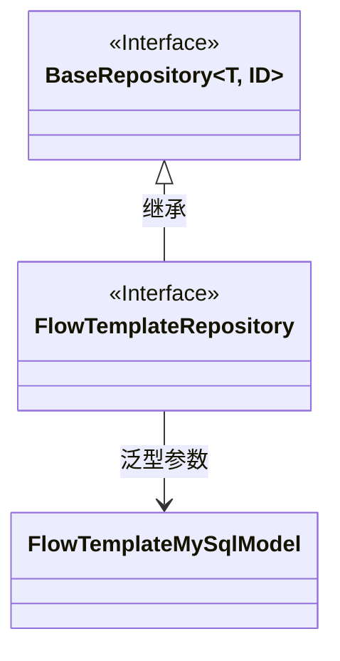
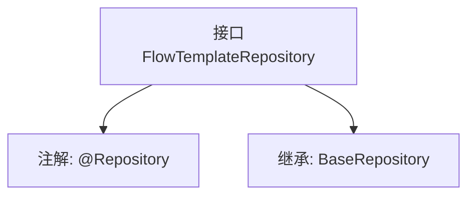

# 基础信息

|      |      |
|------|------|
| 名称 | FlowTemplateRepository |
| 编码语言 | .java |
| 代码路径 | WeFe/board/board-service/src/main/java/com/welab/wefe/board/service/database/repository/FlowTemplateRepository.java |
| 包名 | com.welab.wefe.board.service.database.repository |
| 依赖项 | ['com.welab.wefe.board.service.database.entity.flow.FlowTemplateMySqlModel', 'com.welab.wefe.board.service.database.repository.base.BaseRepository', 'org.springframework.stereotype.Repository'] |
| 概述说明 | 这是一个Spring的仓库接口，继承基础仓库类，用于操作FlowTemplateMySqlModel数据，主键类型为String。 |

# 说明

该内容定义了一个名为FlowTemplateRepository的Spring数据仓库接口，使用@Repository注解标识。该接口继承自BaseRepository泛型基类，指定了实体类型为FlowTemplateMySqlModel，主键类型为String。这表明它是一个用于操作FlowTemplateMySqlModel实体数据的持久层组件，遵循Spring Data的仓库模式设计。

# 类列表 Class Summary

| 名称   | 类型  | 说明 |
|-------|------|-------------|
| FlowTemplateRepository | interface | 这是一个Spring的FlowTemplateRepository接口，继承自BaseRepository，用于操作FlowTemplateMySqlModel类型数据，主键为String类型。 |

## 类 FlowTemplateRepository

|      |      |
|------|------|
| 访问范围 | @Repository;public |
| 类型 | interface |
| 名称 | FlowTemplateRepository |
| 说明 | 这是一个Spring的FlowTemplateRepository接口，继承自BaseRepository，用于操作FlowTemplateMySqlModel类型数据，主键为String类型。 |

### UML类图

这段类图展示了FlowTemplateRepository接口继承自泛型接口BaseRepository的关系。BaseRepository是一个带有两个泛型参数(T和ID)的接口，其中T被具体化为FlowTemplateMySqlModel实体类，ID类型为String。FlowTemplateRepository作为数据访问层接口，通过继承BaseRepository获得了基础的CRUD操作能力，同时指定了操作的实体类型为FlowTemplateMySqlModel，主键类型为String。这种设计遵循了Spring Data JPA的仓库模式，实现了数据访问层的抽象。

### 内部方法调用关系图

这段流程图描述了一个Spring Data JPA的Repository接口定义。FlowTemplateRepository通过@Repository注解被标记为持久层组件，同时继承了BaseRepository接口，指定了实体类型为FlowTemplateMySqlModel，主键类型为String。该接口继承了BaseRepository的所有基础CRUD操作方法，无需显式声明即可直接使用。这种设计遵循了Spring Data的规范，实现了对数据库表的标准操作接口。

### 字段列表 Field List

| 名称  | 类型  | 说明 |
|-------|-------|------|

### 方法列表

| 名称  | 类型  | 说明 |
|-------|-------|------|

