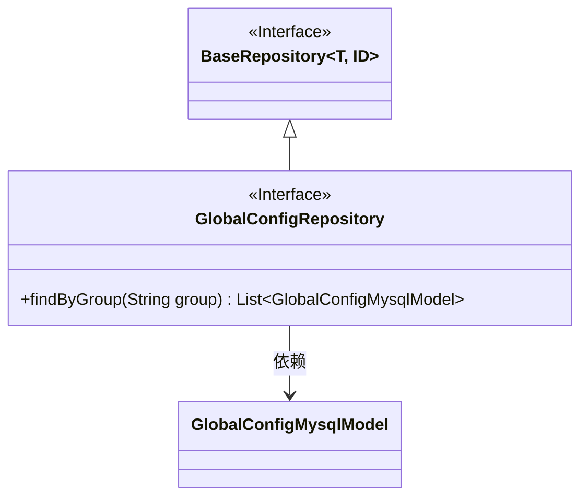
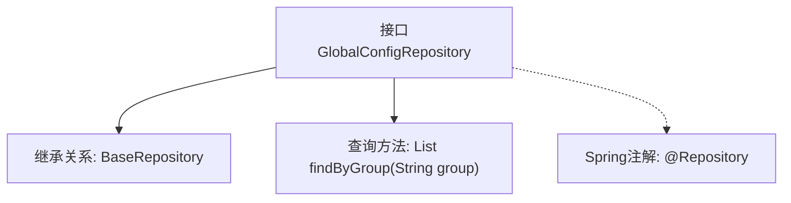

# 基础信息

|      |      |
|------|------|
| 名称 | GlobalConfigRepository |
| 编码语言 | .java |
| 代码路径 | WeFe/board/board-service/src/main/java/com/welab/wefe/board/service/database/repository/GlobalConfigRepository.java |
| 包名 | com.welab.wefe.board.service.database.repository |
| 依赖项 | ['com.welab.wefe.board.service.database.entity.GlobalConfigMysqlModel', 'com.welab.wefe.board.service.database.repository.base.BaseRepository', 'org.springframework.stereotype.Repository', 'java.util.List'] |
| 概述说明 | 这是一个Spring的Repository接口，继承BaseRepository，用于操作GlobalConfigMysqlModel数据，提供按group字段查询的功能。 |

# 说明

该代码片段定义了一个名为GlobalConfigRepository的Spring数据仓库接口，继承自BaseRepository基类。该接口操作GlobalConfigMysqlModel类型实体，主键类型为String。它声明了一个按group字段查询的方法findByGroup，返回匹配的实体列表。通过@Repository注解标识为Spring管理的持久层组件，遵循Spring Data JPA的命名规范自动实现查询逻辑。

# 类列表 Class Summary

| 名称   | 类型  | 说明 |
|-------|------|-------------|
| GlobalConfigRepository | interface | 这是一个Spring Data JPA仓库接口，扩展了基础仓库，用于操作GlobalConfigMysqlModel实体，提供按组查询功能。 |

## 类 GlobalConfigRepository

|      |      |
|------|------|
| 访问范围 | @Repository;public |
| 类型 | interface |
| 名称 | GlobalConfigRepository |
| 说明 | 这是一个Spring Data JPA仓库接口，扩展了基础仓库，用于操作GlobalConfigMysqlModel实体，提供按组查询功能。 |

### UML类图

这段类图展示了GlobalConfigRepository接口继承自泛型接口BaseRepository，并定义了findByGroup方法。GlobalConfigRepository操作GlobalConfigMysqlModel实体类，形成清晰的层级关系。BaseRepository作为通用仓储接口，GlobalConfigRepository通过继承获得基础CRUD能力并扩展了特定查询功能。图中准确反映了接口泛型参数、继承关系和模型依赖。

### 内部方法调用关系图

这段流程图展示了Spring Data JPA中GlobalConfigRepository接口的结构。该接口通过@Repository注解标记为数据访问组件，并继承自BaseRepository泛型接口（指定实体类型为GlobalConfigMysqlModel，主键类型为String）。核心功能是提供按group字段查询的派生查询方法findByGroup，该方法返回匹配的实体列表。这种设计遵循了Spring Data的Repository模式，通过方法命名约定自动生成查询实现。

### 字段列表 Field List

| 名称  | 类型  | 说明 |
|-------|-------|------|

### 方法列表

| 名称  | 类型  | 说明 |
|-------|-------|------|
| findByGroup | List<GlobalConfigMysqlModel> | 根据组名查询全局配置MySQL模型列表。 |

