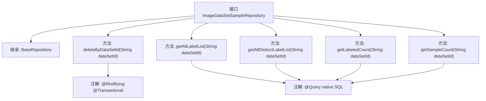

# 基础信息

|      |      |
|------|------|
| 名称 | ImageDataSetSampleRepository |
| 编码语言 | .java |
| 代码路径 | WeFe/board/board-service/src/main/java/com/welab/wefe/board/service/database/repository/ImageDataSetSampleRepository.java |
| 包名 | com.welab.wefe.board.service.database.repository |
| 依赖项 | ['com.welab.wefe.board.service.database.entity.data_set.ImageDataSetSampleMysqlModel', 'com.welab.wefe.board.service.database.repository.base.BaseRepository', 'org.springframework.data.jpa.repository.Modifying', 'org.springframework.data.jpa.repository.Query', 'org.springframework.stereotype.Repository', 'org.springframework.transaction.annotation.Transactional', 'java.util.List'] |
| 概述说明 | ImageDataSetSampleRepository接口扩展BaseRepository，提供删除、查询标签列表及统计样本数量的方法，支持数据集ID操作。 |

# 说明

该代码定义了一个名为ImageDataSetSampleRepository的Spring Data JPA仓库接口，继承自BaseRepository，操作ImageDataSetSampleMysqlModel实体类，主键类型为String。接口包含五个方法：deleteByDataSetId用于根据数据集ID删除记录；getAllLabelList获取指定数据集已标注样本的标签列表；getAllDistinctLabelList获取去重后的标签列表；getLabeledCount统计已标注样本数量；getSampleCount统计总样本数量。所有查询均使用原生SQL，并通过@Query注解定义。

# 类列表 Class Summary

| 名称   | 类型  | 说明 |
|-------|------|-------------|
| ImageDataSetSampleRepository | interface | 图像数据集样本仓库接口，提供删除、查询标签列表及统计功能。包含按数据集ID删除样本、获取标签列表、去重标签列表、统计已标记样本数和总样本数等方法。 |


## 类 ImageDataSetSampleRepository

|      |      |
|------|------|
| 访问范围 | @Repository;public |
| 类型 | interface |
| 名称 | ImageDataSetSampleRepository |
| 说明 | 图像数据集样本仓库接口，提供删除、查询标签列表及统计功能。包含按数据集ID删除样本、获取标签列表、去重标签列表、统计已标记样本数和总样本数等方法。 |


### UML类图

```mermaid
classDiagram
    class BaseRepository~T, ID~ {
        <<Interface>>
    }

    class ImageDataSetSampleRepository {
        <<Interface>>
        +deleteByDataSetId(String dataSetId) void
        +getAllLabelList(String dataSetId) List~String~
        +getAllDistinctLabelList(String dataSetId) List~String~
        +getLabeledCount(String dataSetId) long
        +getSampleCount(String dataSetId) long
    }

    BaseRepository <|-- ImageDataSetSampleRepository
    // ImageDataSetSampleRepository继承自BaseRepository泛型接口
    // 提供对ImageDataSetSampleMysqlModel的CRUD操作及特定查询方法
```

这段代码定义了一个Spring Data JPA仓库接口`ImageDataSetSampleRepository`，它继承自泛型接口`BaseRepository`，专用于操作`ImageDataSetSampleMysqlModel`实体类。该接口包含五个自定义查询方法：按数据集ID删除记录、获取标注列表、获取去重标注列表、统计标注样本数和总样本数。所有方法都通过`@Query`注解直接使用原生SQL查询，并通过`@Modifying`和`@Transactional`注解支持数据修改操作。


### 内部方法调用关系图



这段代码展示了一个Spring Data JPA仓库接口，定义了5个数据操作方法。接口继承自BaseRepository，包含删除操作和4个查询方法，其中3个使用原生SQL查询。所有查询方法都基于dataSetId参数进行数据过滤，涉及标签列表查询、去重标签统计、已标注样本计数和总样本计数功能。每个查询方法都通过@Query注解配置了特定的原生SQL语句，delete操作则配置了事务和自动清除缓存特性。

### 字段列表 Field List

| 名称  | 类型  | 说明 |
|-------|-------|------|

### 方法列表

| 名称  | 类型  | 说明 |
|-------|-------|------|
| deleteByDataSetId | void | 使用JPA删除指定数据集ID的记录，自动清除缓存并支持事务。 |
| getLabeledCount | long | 查询指定数据集ID下已标记数据的数量。 |
| getAllDistinctLabelList | List<String> | 查询指定数据集ID下所有已标记数据的唯一标签列表。 |
| getAllLabelList | List<String> | 查询指定数据集ID下已标记数据的标签列表。 |
| getSampleCount | long | 查询指定数据集ID的记录总数。 |


