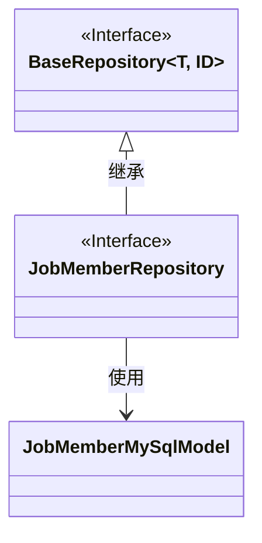
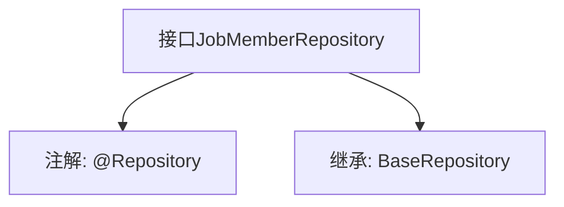

# 基础信息

|      |      |
|------|------|
| 名称 | JobMemberRepository |
| 编码语言 | .java |
| 代码路径 | WeFe/board/board-service/src/main/java/com/welab/wefe/board/service/database/repository/JobMemberRepository.java |
| 包名 | com.welab.wefe.board.service.database.repository |
| 依赖项 | ['com.welab.wefe.board.service.database.entity.job.JobMemberMySqlModel', 'com.welab.wefe.board.service.database.repository.base.BaseRepository', 'org.springframework.stereotype.Repository'] |
| 概述说明 | JobMemberRepository接口继承BaseRepository，操作JobMemberMySqlModel实体，主键类型为String。 |

# 说明

该内容定义了一个名为JobMemberRepository的Spring数据仓库接口，使用@Repository注解标识。该接口继承自BaseRepository泛型基类，指定了实体类型为JobMemberMySqlModel，主键类型为String。这表明它是一个针对JobMemberMySqlModel实体的数据访问层组件，用于处理数据库操作。

# 类列表 Class Summary

| 名称   | 类型  | 说明 |
|-------|------|-------------|
| JobMemberRepository | interface | JobMemberRepository接口继承BaseRepository，用于操作JobMemberMySqlModel数据，使用字符串作为主键类型。 |

## 类 JobMemberRepository

|      |      |
|------|------|
| 访问范围 | @Repository;public |
| 类型 | interface |
| 名称 | JobMemberRepository |
| 说明 | JobMemberRepository接口继承BaseRepository，用于操作JobMemberMySqlModel数据，使用字符串作为主键类型。 |

### UML类图

这段类图展示了JobMemberRepository接口继承自泛型接口BaseRepository，并指定了泛型参数为JobMemberMySqlModel和String。JobMemberRepository是一个Spring数据仓库接口（通过@Repository标注），专用于操作JobMemberMySqlModel类型的数据实体，其中String表示该实体的主键类型。BaseRepository作为基础仓库接口提供了通用的CRUD操作，而JobMemberRepository通过继承获得这些能力，同时保持接口的轻量级特性。

### 内部方法调用关系图

这段代码定义了一个Spring Data JPA的Repository接口JobMemberRepository，通过@Repository注解标识为数据访问组件。该接口继承了BaseRepository泛型接口，指定了实体类型为JobMemberMySqlModel，主键类型为String。这种设计遵循了Spring Data的规范，无需实现基础CRUD操作，框架会自动生成代理实现类来完成数据库交互。

### 字段列表 Field List

| 名称  | 类型  | 说明 |
|-------|-------|------|

### 方法列表

| 名称  | 类型  | 说明 |
|-------|-------|------|

