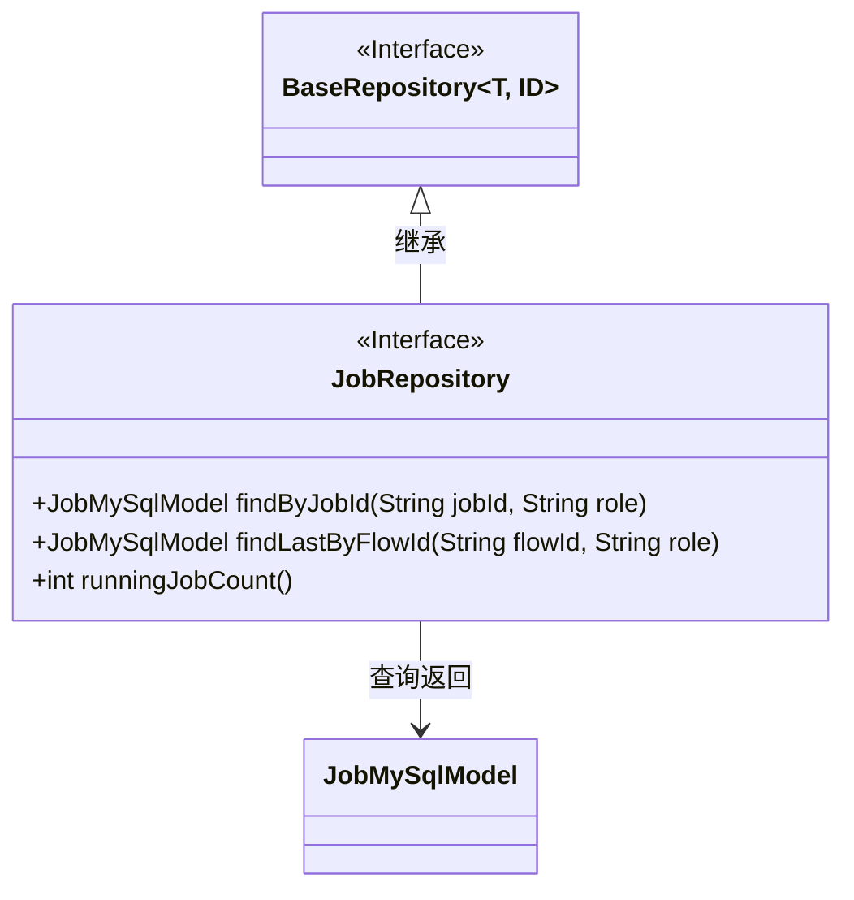
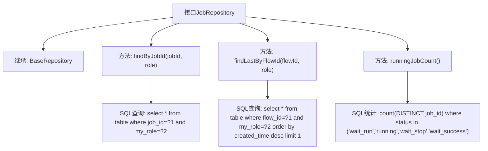

# 基础信息

|      |      |
|------|------|
| 名称 | JobRepository |
| 编码语言 | .java |
| 代码路径 | WeFe/board/board-service/src/main/java/com/welab/wefe/board/service/database/repository/JobRepository.java |
| 包名 | com.welab.wefe.board.service.database.repository |
| 依赖项 | ['com.welab.wefe.board.service.database.entity.job.JobMySqlModel', 'com.welab.wefe.board.service.database.repository.base.BaseRepository', 'org.springframework.data.jpa.repository.Query', 'org.springframework.stereotype.Repository'] |
| 概述说明 | JobRepository接口扩展BaseRepository，提供三个原生SQL查询方法：按jobId和role查找任务，按flowId和role查找最新任务，统计未结束任务数量。 |

# 说明

JobRepository是一个继承BaseRepository的接口，用于操作JobMySqlModel数据。它包含三个方法：findByJobId通过jobId和role查询记录；findLastByFlowId按flowId和role查询最新记录；runningJobCount统计状态为未结束的job数量，未结束状态包括wait_run、running、wait_stop和wait_success。所有查询均使用原生SQL实现。

# 类列表 Class Summary

| 名称   | 类型  | 说明 |
|-------|------|-------------|
| JobRepository | interface | JobRepository接口扩展BaseRepository，包含三个方法：按jobId和role查询Job，按flowId和role查询最新Job，统计未结束Job数量。 |

## 类 JobRepository

|      |      |
|------|------|
| 访问范围 | @Repository;public |
| 类型 | interface |
| 名称 | JobRepository |
| 说明 | JobRepository接口扩展BaseRepository，包含三个方法：按jobId和role查询Job，按flowId和role查询最新Job，统计未结束Job数量。 |

### UML类图

这段代码展示了一个Spring Data JPA的Repository接口设计。JobRepository接口继承自BaseRepository泛型接口，指定了实体类型JobMySqlModel和主键类型String。接口中定义了三个原生SQL查询方法：通过jobId和role查询单个记录、通过flowId和role查询最新记录，以及统计处于活跃状态的job数量。类图清晰地反映了接口继承关系和实体类依赖，符合JPA Repository的标准设计模式。

### 内部方法调用关系图

这段代码定义了一个Spring Data JPA的Repository接口，包含三个核心查询方法：通过jobId和role精确查询任务记录，通过flowId和role获取最新任务记录，以及统计处于未结束状态的任务数量。每个方法都通过@Query注解定义了原生SQL查询逻辑，分别对应不同的业务场景需求，继承了BaseRepository的基础CRUD功能。

### 字段列表 Field List

| 名称  | 类型  | 说明 |
|-------|-------|------|

### 方法列表

| 名称  | 类型  | 说明 |
|-------|-------|------|
| findByJobId | JobMySqlModel | 查询数据库中指定jobId和role的JobMySqlModel记录。使用原生SQL语句，参数按位置绑定。 |
| findLastByFlowId | JobMySqlModel | 查询指定流程ID和角色的最新记录，按创建时间降序排列并返回第一条结果。 |
| runningJobCount | int | 查询统计处于等待运行、运行中、等待停止或等待成功状态的唯一任务数量。 |

