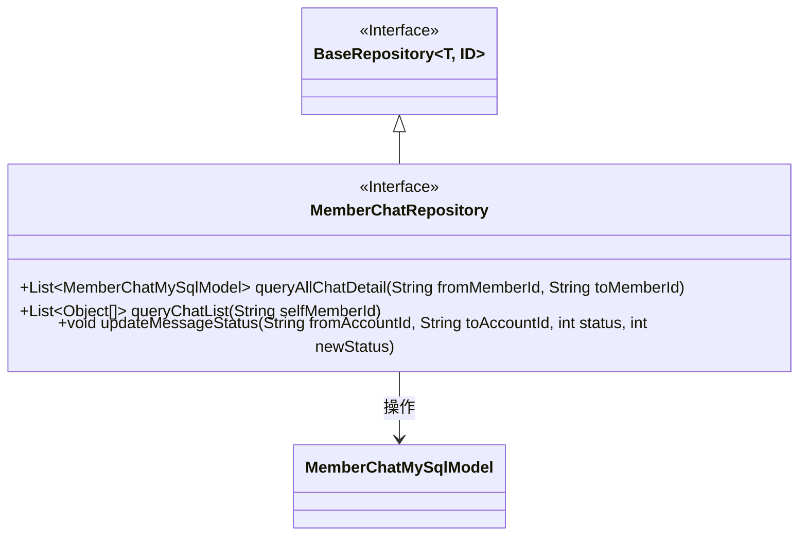
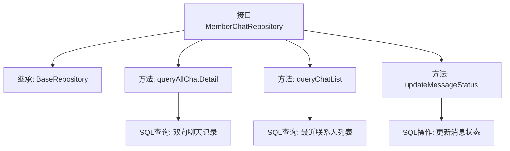

# 基础信息

|      |      |
|------|------|
| 名称 | MemberChatRepository |
| 编码语言 | .java |
| 代码路径 | WeFe/board/board-service/src/main/java/com/welab/wefe/board/service/database/repository/MemberChatRepository.java |
| 包名 | com.welab.wefe.board.service.database.repository |
| 依赖项 | ['com.welab.wefe.board.service.database.entity.chat.MemberChatMySqlModel', 'com.welab.wefe.board.service.database.repository.base.BaseRepository', 'org.springframework.data.jpa.repository.Modifying', 'org.springframework.data.jpa.repository.Query', 'org.springframework.data.repository.query.Param', 'org.springframework.stereotype.Repository', 'java.util.List'] |
| 概述说明 | 成员聊天仓库接口，包含查询双方聊天记录、获取聊天列表及更新消息状态的方法。 |

# 说明

该代码定义了一个名为MemberChatRepository的Spring Data JPA仓库接口，继承自BaseRepository。接口包含三个方法：queryAllChatDetail用于查询两个成员间的所有聊天记录；queryChatList获取与指定成员聊天的其他成员列表及最后聊天时间；updateMessageStatus更新指定发送方和接收方之间消息的状态。所有方法均使用原生SQL查询，通过@Query注解实现。

# 类列表 Class Summary

| 名称   | 类型  | 说明 |
|-------|------|-------------|
| MemberChatRepository | interface | 成员聊天仓库接口，包含查询双方聊天记录、获取聊天列表及更新消息状态的方法。 |

## 类 MemberChatRepository

|      |      |
|------|------|
| 访问范围 | @Repository;public |
| 类型 | interface |
| 名称 | MemberChatRepository |
| 说明 | 成员聊天仓库接口，包含查询双方聊天记录、获取聊天列表及更新消息状态的方法。 |

### UML类图

该类图展示了一个Spring Data JPA仓库接口MemberChatRepository，它继承自泛型接口BaseRepository，操作MemberChatMySqlModel实体类。接口包含三个主要方法：queryAllChatDetail用于查询两个成员间的聊天记录，queryChatList获取用户聊天列表，updateMessageStatus更新消息状态。通过原生SQL查询实现数据访问，体现了JPA仓库模式与复杂查询的结合使用。

### 内部方法调用关系图

该流程图展示了Spring Data JPA仓库接口的结构，包含三个核心查询方法。queryAllChatDetail通过组合条件查询双向聊天记录，queryChatList使用UNION查询生成最近联系人列表并按时间排序，updateMessageStatus执行消息状态批量更新。每个方法都通过@Query注解直接定义原生SQL操作，体现了JPA与复杂SQL语句的集成能力。

### 字段列表 Field List

| 名称  | 类型  | 说明 |
|-------|-------|------|

### 方法列表

| 名称  | 类型  | 说明 |
|-------|-------|------|
| queryChatList | List<Object[]> | 查询非当前用户与其他成员的最新聊天记录，按时间降序返回成员ID和最大时间。 |
| queryAllChatDetail | List<MemberChatMySqlModel> | 查询两个成员间的所有聊天记录，SQL通过双方ID双向匹配获取数据。 |
| updateMessageStatus | void | 更新member_chat表中指定发送方、接收方和状态的消息状态为新状态。 |

