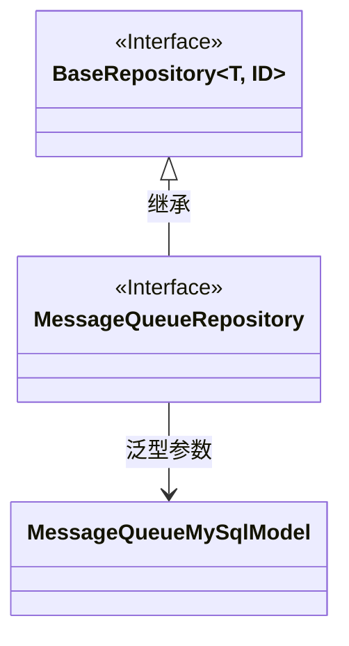
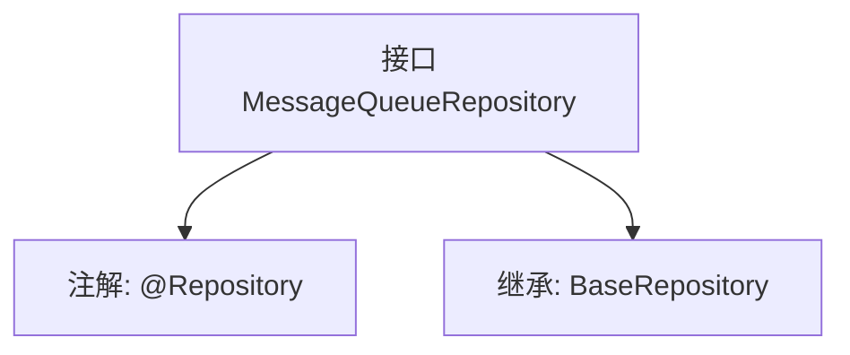

# 基础信息

|      |      |
|------|------|
| 名称 | MessageQueueRepository |
| 编码语言 | .java |
| 代码路径 | WeFe/board/board-service/src/main/java/com/welab/wefe/board/service/database/repository/MessageQueueRepository.java |
| 包名 | com.welab.wefe.board.service.database.repository |
| 依赖项 | ['com.welab.wefe.board.service.database.entity.chat.MessageQueueMySqlModel', 'com.welab.wefe.board.service.database.repository.base.BaseRepository', 'org.springframework.stereotype.Repository'] |
| 概述说明 | 消息队列仓库接口，继承基础仓库，操作消息队列MySQL模型，主键类型为字符串。 |

# 说明

这是一个名为MessageQueueRepository的Spring数据仓库接口，使用@Repository注解标记。它继承了BaseRepository泛型接口，指定了实体类型为MessageQueueMySqlModel，主键类型为String。该接口主要用于对MessageQueueMySqlModel实体进行数据库操作，继承了BaseRepository提供的基础CRUD功能。

# 类列表 Class Summary

| 名称   | 类型  | 说明 |
|-------|------|-------------|
| MessageQueueRepository | interface | 消息队列存储接口，继承基础存储接口，操作消息队列MySQL模型。 |

## 类 MessageQueueRepository

|      |      |
|------|------|
| 访问范围 | @Repository;public |
| 类型 | interface |
| 名称 | MessageQueueRepository |
| 说明 | 消息队列存储接口，继承基础存储接口，操作消息队列MySQL模型。 |

### UML类图

这段类图展示了MessageQueueRepository接口继承自泛型接口BaseRepository的关系。BaseRepository定义了两个泛型参数T和ID，其中T被具体化为MessageQueueMySqlModel类型，ID为String类型。MessageQueueRepository作为数据访问层接口，通过继承基础仓库接口获得通用CRUD操作能力，同时指定了实体类型为MessageQueueMySqlModel。该设计遵循了Spring Data JPA的仓库模式，实现了类型安全的数据库操作。

### 内部方法调用关系图

这段代码定义了一个名为MessageQueueRepository的Spring数据仓库接口，使用@Repository注解标识其为持久层组件。该接口继承了BaseRepository泛型接口，指定了实体类型为MessageQueueMySqlModel，主键类型为String。流程图清晰地展示了接口的注解和继承关系，体现了Spring Data JPA中简化数据库操作的典型设计模式，通过继承基础仓库接口即可获得基本的CRUD操作能力。

### 字段列表 Field List

| 名称  | 类型  | 说明 |
|-------|-------|------|

### 方法列表

| 名称  | 类型  | 说明 |
|-------|-------|------|

