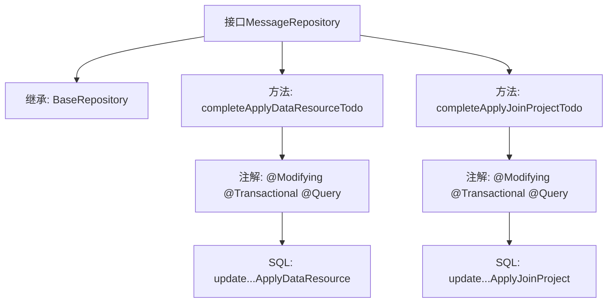

# 基础信息

|      |      |
|------|------|
| 名称 | MessageRepository |
| 编码语言 | .java |
| 代码路径 | WeFe/board/board-service/src/main/java/com/welab/wefe/board/service/database/repository/MessageRepository.java |
| 包名 | com.welab.wefe.board.service.database.repository |
| 依赖项 | ['com.welab.wefe.board.service.database.entity.MessageMysqlModel', 'com.welab.wefe.board.service.database.repository.base.BaseRepository', 'org.springframework.data.jpa.repository.Modifying', 'org.springframework.data.jpa.repository.Query', 'org.springframework.stereotype.Repository', 'org.springframework.transaction.annotation.Transactional'] |
| 概述说明 | MessageRepository接口定义了两个方法：completeApplyDataResourceTodo更新指定项目和数据资源的待办状态为已完成和已读；completeApplyJoinProjectTodo更新指定关联ID的加入项目待办状态为已完成和已读。均使用原生SQL并支持事务。 |

# 说明

该代码定义了一个名为MessageRepository的Spring Data JPA仓库接口，继承自BaseRepository，操作MessageMysqlModel实体类。接口包含两个自定义更新方法：completeApplyDataResourceTodo方法通过项目ID和数据资源ID更新特定事件为已读和已完成状态；completeApplyJoinProjectTodo方法通过相关ID更新另一类事件状态。两个方法均使用原生SQL查询，并配置了自动清除缓存和事务支持。

# 类列表 Class Summary

| 名称   | 类型  | 说明 |
|-------|------|-------------|
| MessageRepository | interface | MessageRepository接口定义了两个原生SQL更新方法：completeApplyDataResourceTodo更新指定项目和数据资源的待办状态为已完成；completeApplyJoinProjectTodo更新指定关联ID的加入项目待办状态为已完成。均自动清除缓存并支持事务。 |


## 类 MessageRepository

|      |      |
|------|------|
| 访问范围 | @Repository;public |
| 类型 | interface |
| 名称 | MessageRepository |
| 说明 | MessageRepository接口定义了两个原生SQL更新方法：completeApplyDataResourceTodo更新指定项目和数据资源的待办状态为已完成；completeApplyJoinProjectTodo更新指定关联ID的加入项目待办状态为已完成。均自动清除缓存并支持事务。 |


### UML类图

```mermaid
classDiagram
    class BaseRepository~T, ID~ {
        <<Interface>>
    }
    
    class MessageRepository {
        <<Interface>>
        +completeApplyDataResourceTodo(String projectId, String dataResourceId) void
        +completeApplyJoinProjectTodo(String relatedId1) void
    }
    
    BaseRepository <|-- MessageRepository : 继承
    // MessageRepository 继承自泛型接口 BaseRepository，提供两个原生SQL更新方法
    // 用于处理特定类型的待办事项完成操作，涉及数据资源和项目加入两种场景
```

类图描述：该图展示了一个Spring Data JPA仓库接口MessageRepository，它继承自泛型基础接口BaseRepository。MessageRepository定义了两个原生SQL更新方法，分别用于标记"申请数据资源"和"申请加入项目"两种类型的待办事项为已完成状态。这两个方法都使用了@Modifying和@Transactional注解，确保操作的事务性和自动清除持久化上下文。


### 内部方法调用关系图



该流程图展示了MessageRepository接口的结构和功能。接口继承自BaseRepository，包含两个核心方法：completeApplyDataResourceTodo和completeApplyJoinProjectTodo，分别用于更新不同类型的待办事项状态。每个方法都标注了Spring Data JPA的修改注解(@Modifying, @Transactional)并包含原生SQL查询(@Query)，通过参数化方式更新数据库记录。箭头清晰地表示了接口继承关系和方法调用层级。

### 字段列表 Field List

| 名称  | 类型  | 说明 |
|-------|-------|------|

### 方法列表

| 名称  | 类型  | 说明 |
|-------|-------|------|
| completeApplyJoinProjectTodo | void | 更新数据库，将未读标记为已读、待办标记为完成，条件为事件类型是申请加入项目且关联ID匹配。 |
| completeApplyDataResourceTodo | void | 更新数据库，标记特定项目和资源ID的待办为已完成和已读。 |


