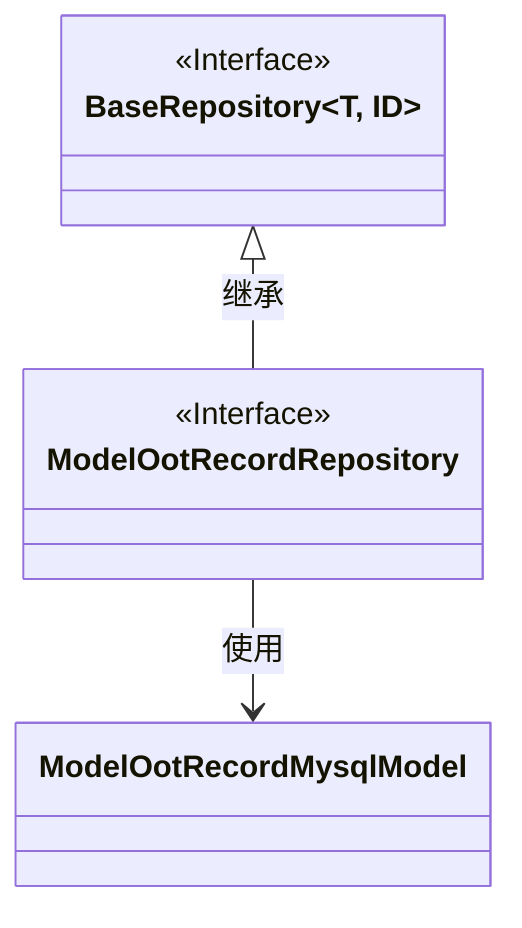
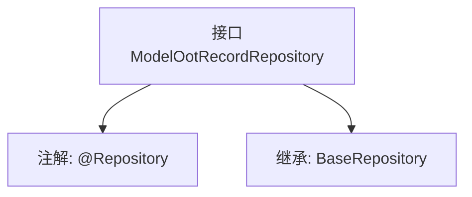

# 基础信息

|      |      |
|------|------|
| 名称 | ModelOotRecordRepository |
| 编码语言 | .java |
| 代码路径 | WeFe/board/board-service/src/main/java/com/welab/wefe/board/service/database/repository/ModelOotRecordRepository.java |
| 包名 | com.welab.wefe.board.service.database.repository |
| 依赖项 | ['com.welab.wefe.board.service.database.entity.job.ModelOotRecordMysqlModel', 'com.welab.wefe.board.service.database.repository.base.BaseRepository', 'org.springframework.stereotype.Repository'] |
| 概述说明 | 这是一个Spring的Repository接口，继承自BaseRepository，用于操作ModelOotRecordMysqlModel实体类，主键类型为String。 |

# 说明

该内容描述了一个名为ModelOotRecordRepository的Spring数据仓库接口，使用@Repository注解标识。该接口继承自BaseRepository基类，泛型参数指定了实体类型为ModelOotRecordMysqlModel，主键类型为String。这表明它是一个用于操作ModelOotRecordMysqlModel实体数据的持久层组件，遵循Spring Data的仓库模式设计。

# 类列表 Class Summary

| 名称   | 类型  | 说明 |
|-------|------|-------------|
| ModelOotRecordRepository | interface | 这是一个Spring的仓库接口，继承基础仓库类，用于操作ModelOotRecordMysqlModel数据，主键类型为String。 |

## 类 ModelOotRecordRepository

|      |      |
|------|------|
| 访问范围 | @Repository;public |
| 类型 | interface |
| 名称 | ModelOotRecordRepository |
| 说明 | 这是一个Spring的仓库接口，继承基础仓库类，用于操作ModelOotRecordMysqlModel数据，主键类型为String。 |

### UML类图

这段类图展示了ModelOotRecordRepository接口继承自泛型接口BaseRepository，并指定了泛型参数为ModelOotRecordMysqlModel和String。BaseRepository是一个泛型接口，ModelOotRecordMysqlModel是一个实体类。ModelOotRecordRepository作为Spring的Repository接口，通过继承BaseRepository获得了基本的CRUD操作能力，专门用于操作ModelOotRecordMysqlModel类型的数据。

### 内部方法调用关系图

该流程图展示了`ModelOotRecordRepository`接口的结构，它是一个带有`@Repository`注解的Spring数据接口，继承了泛型`BaseRepository`接口，指定了实体类型为`ModelOotRecordMysqlModel`和主键类型为`String`。这种设计通常用于Spring Data JPA中，提供对数据库的基本CRUD操作能力，无需手动实现接口方法。

### 字段列表 Field List

| 名称  | 类型  | 说明 |
|-------|-------|------|

### 方法列表

| 名称  | 类型  | 说明 |
|-------|-------|------|

