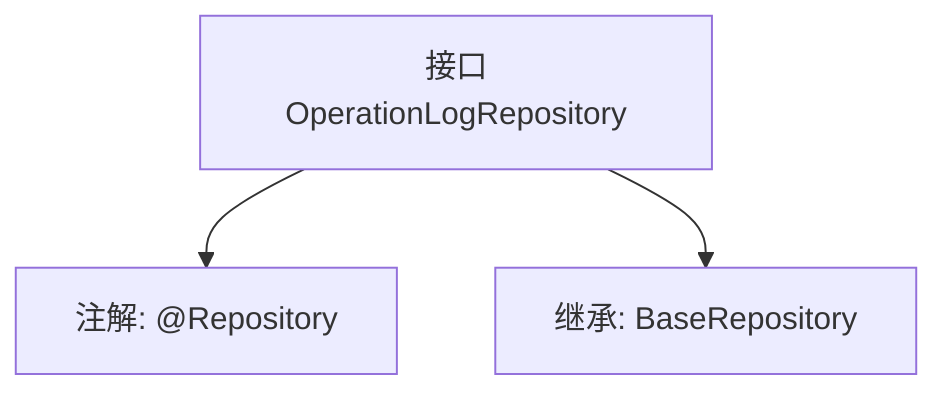

# 基础信息

|      |      |
|------|------|
| 名称 | OperationLogRepository |
| 编码语言 | .java |
| 代码路径 | WeFe/board/board-service/src/main/java/com/welab/wefe/board/service/database/repository/OperationLogRepository.java |
| 包名 | com.welab.wefe.board.service.database.repository |
| 依赖项 | ['com.welab.wefe.board.service.database.entity.OperationLogMysqlModel', 'com.welab.wefe.board.service.database.repository.base.BaseRepository', 'org.springframework.stereotype.Repository'] |
| 概述说明 | 操作日志仓库接口，继承基础仓库类，操作日志模型为MySQL类型，主键为字符串。 |

# 说明

这是一个名为OperationLogRepository的Spring数据仓库接口，使用@Repository注解标记。它继承自BaseRepository泛型接口，指定了实体类型为OperationLogMysqlModel，主键类型为String。该接口主要用于操作数据库中的操作日志记录，遵循Spring Data JPA的规范，无需实现具体方法即可提供基础的CRUD功能。

# 类列表 Class Summary

| 名称   | 类型  | 说明 |
|-------|------|-------------|
| OperationLogRepository | interface | 这是一个操作日志的MySQL存储接口，继承基础仓库类，用于操作日志数据访问。 |


## 类 OperationLogRepository

|      |      |
|------|------|
| 访问范围 | @Repository;public |
| 类型 | interface |
| 名称 | OperationLogRepository |
| 说明 | 这是一个操作日志的MySQL存储接口，继承基础仓库类，用于操作日志数据访问。 |


### UML类图

```mermaid
classDiagram
    class OperationLogRepository {
        <<Interface>>
    }
    class BaseRepository~T, ID~ {
        <<Interface>>
    }
    
    OperationLogRepository --|> BaseRepository : 继承
    // OperationLogRepository 继承自泛型接口 BaseRepository，指定泛型参数为 OperationLogMysqlModel 和 String
```

这段类图展示了 OperationLogRepository 接口通过继承 BaseRepository 泛型接口实现的层级关系。OperationLogRepository 是一个标记为 @Repository 的 Spring 数据访问接口，其泛型参数明确指定了实体类型 OperationLogMysqlModel 和主键类型 String。该设计遵循了 Spring Data JPA 的规范，通过继承基础仓库接口自动获得标准 CRUD 操作方法，同时保持了类型安全性。图中清晰体现了接口间的泛型特化关系，是典型的数据访问层抽象模式。


### 内部方法调用关系图



这段流程图描述了OperationLogRepository接口的结构。该接口被@Repository注解标记，表明它是一个Spring数据访问层组件。同时它继承了BaseRepository泛型接口，指定了实体类型为OperationLogMysqlModel，主键类型为String。这种设计遵循了Spring Data JPA的Repository模式，通过继承基础接口自动获得CRUD操作能力，无需手动实现基础数据访问方法。

### 字段列表 Field List

| 名称  | 类型  | 说明 |
|-------|-------|------|

### 方法列表

| 名称  | 类型  | 说明 |
|-------|-------|------|


