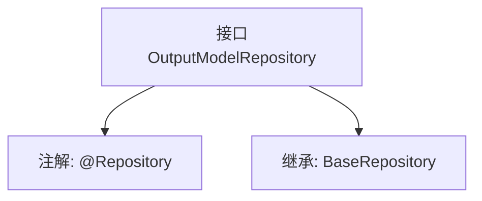

# 基础信息

|      |      |
|------|------|
| 名称 | OutputModelRepository |
| 编码语言 | .java |
| 代码路径 | WeFe/board/board-service/src/main/java/com/welab/wefe/board/service/database/repository/OutputModelRepository.java |
| 包名 | com.welab.wefe.board.service.database.repository |
| 依赖项 | ['com.welab.wefe.board.service.database.entity.OutputModelMysqlModel', 'com.welab.wefe.board.service.database.repository.base.BaseRepository', 'org.springframework.stereotype.Repository'] |
| 概述说明 | 这是一个Spring Data JPA仓库接口，继承基础仓库类，用于操作OutputModelMysqlModel实体，主键类型为String。 |

# 说明

该内容定义了一个名为OutputModelRepository的Spring数据仓库接口，使用@Repository注解标记为持久层组件。该接口继承自BaseRepository泛型基类，指定了实体类型为OutputModelMysqlModel，主键类型为String。这表明该仓库用于操作MySQL数据库中的OutputModel相关数据，继承了基础CRUD操作功能。整个定义简洁地建立了与数据库表OutputModelMysqlModel的映射关系。

# 类列表 Class Summary

| 名称   | 类型  | 说明 |
|-------|------|-------------|
| OutputModelRepository | interface | 这是一个Spring Data JPA仓库接口，继承基础仓库类，用于操作OutputModelMysqlModel实体，主键类型为String。 |


## 类 OutputModelRepository

|      |      |
|------|------|
| 访问范围 | @Repository;public |
| 类型 | interface |
| 名称 | OutputModelRepository |
| 说明 | 这是一个Spring Data JPA仓库接口，继承基础仓库类，用于操作OutputModelMysqlModel实体，主键类型为String。 |


### UML类图

```mermaid
classDiagram
    class OutputModelRepository {
        <<Interface>>
    }
    class BaseRepository~T, ID~ {
        <<Interface>>
    }
    OutputModelRepository --|> BaseRepository : 继承
    // OutputModelRepository 继承自泛型接口 BaseRepository
    // 泛型参数 T 绑定为 OutputModelMysqlModel，ID 绑定为 String
```

该类图展示了OutputModelRepository接口继承自泛型接口BaseRepository的关系。BaseRepository定义了两个泛型参数T和ID，在继承时分别被具体化为OutputModelMysqlModel和String类型。通过<<Interface>>标注表明两者均为接口，箭头方向正确表达了继承层级关系，符合Spring Data JPA中Repository的设计模式。


### 内部方法调用关系图



这段代码定义了一个Spring Data JPA仓库接口OutputModelRepository，通过@Repository注解标记为持久层组件，并继承BaseRepository接口获得基础CRUD操作能力。该接口泛型指定实体类型为OutputModelMysqlModel，主键类型为String，整体结构体现了JPA仓库模式的标准实现方式。

### 字段列表 Field List

| 名称  | 类型  | 说明 |
|-------|-------|------|

### 方法列表

| 名称  | 类型  | 说明 |
|-------|-------|------|


