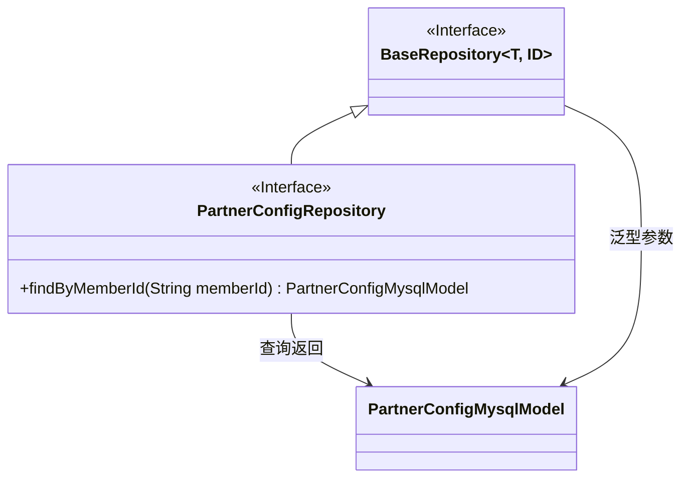
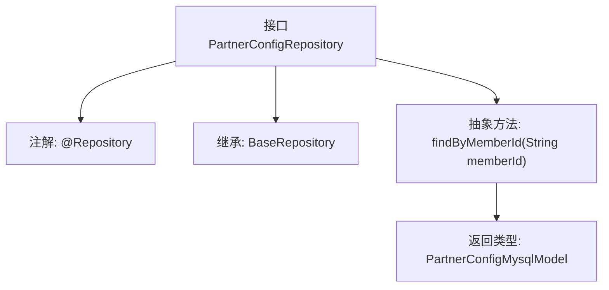

# 基础信息

|      |      |
|------|------|
| 名称 | PartnerConfigRepository |
| 编码语言 | .java |
| 代码路径 | WeFe/board/board-service/src/main/java/com/welab/wefe/board/service/database/repository/PartnerConfigRepository.java |
| 包名 | com.welab.wefe.board.service.database.repository |
| 依赖项 | ['com.welab.wefe.board.service.database.entity.PartnerConfigMysqlModel', 'com.welab.wefe.board.service.database.repository.base.BaseRepository', 'org.springframework.stereotype.Repository'] |
| 概述说明 | PartnerConfigRepository接口继承BaseRepository，提供按memberId查询PartnerConfigMysqlModel的方法。 |

# 说明

这是一个Spring Data JPA仓库接口PartnerConfigRepository，继承自BaseRepository，用于操作PartnerConfigMysqlModel实体类，主键类型为String。该接口定义了一个查询方法findByMemberId，通过memberId字段查询并返回PartnerConfigMysqlModel对象。@Repository注解表明这是一个Spring管理的持久层组件。

# 类列表 Class Summary

| 名称   | 类型  | 说明 |
|-------|------|-------------|
| PartnerConfigRepository | interface | PartnerConfigRepository接口继承BaseRepository，提供按memberId查询PartnerConfigMysqlModel的方法。 |

## 类 PartnerConfigRepository

|      |      |
|------|------|
| 访问范围 | @Repository;public |
| 类型 | interface |
| 名称 | PartnerConfigRepository |
| 说明 | PartnerConfigRepository接口继承BaseRepository，提供按memberId查询PartnerConfigMysqlModel的方法。 |

### UML类图

该类图展示了Spring Data JPA中的仓库接口继承关系。PartnerConfigRepository接口继承自泛型接口BaseRepository，并添加了按memberId查询的方法。BaseRepository作为基础仓库接口，通过泛型参数T(PartnerConfigMysqlModel)和ID(String)指定实体类型和主键类型。PartnerConfigRepository通过扩展基础接口获得CRUD能力，同时声明自定义查询方法，形成典型的数据访问层结构。

### 内部方法调用关系图

该流程图展示了Spring Data JPA接口`PartnerConfigRepository`的结构。作为数据访问层组件，它通过`@Repository`注解标记，并继承泛型基础仓库`BaseRepository`，其中指定了实体类型`PartnerConfigMysqlModel`和主键类型`String`。核心功能是通过抽象查询方法`findByMemberId`实现按会员ID查询，遵循JPA方法命名规范自动生成查询逻辑。

### 字段列表 Field List

| 名称  | 类型  | 说明 |
|-------|-------|------|

### 方法列表

| 名称  | 类型  | 说明 |
|-------|-------|------|
| findByMemberId | PartnerConfigMysqlModel | 根据会员ID查询合作伙伴配置的MySQL模型方法。 |

