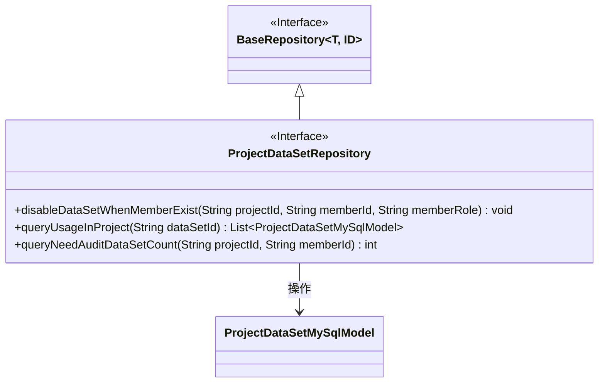
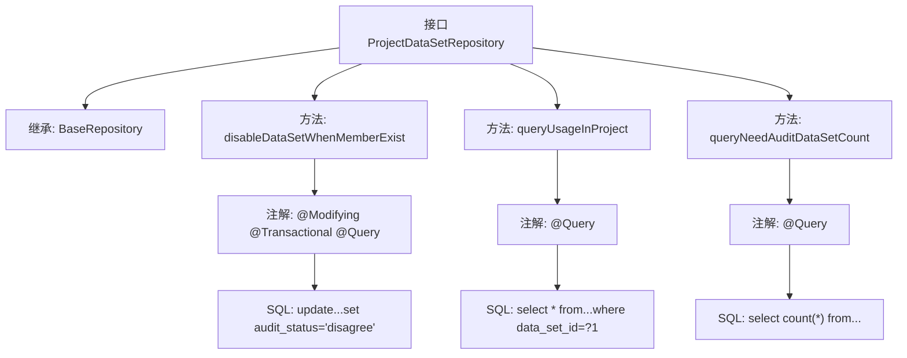

# 基础信息

|      |      |
|------|------|
| 名称 | ProjectDataSetRepository |
| 编码语言 | .java |
| 代码路径 | WeFe/board/board-service/src/main/java/com/welab/wefe/board/service/database/repository/ProjectDataSetRepository.java |
| 包名 | com.welab.wefe.board.service.database.repository |
| 依赖项 | ['com.welab.wefe.board.service.database.entity.job.ProjectDataSetMySqlModel', 'com.welab.wefe.board.service.database.repository.base.BaseRepository', 'org.springframework.data.jpa.repository.Modifying', 'org.springframework.data.jpa.repository.Query', 'org.springframework.stereotype.Repository', 'org.springframework.transaction.annotation.Transactional', 'java.util.List'] |
| 概述说明 | ProjectDataSetRepository接口定义：1.成员退出时禁用数据集；2.查询项目中可用数据集；3.统计待审核数据集数量。 |

# 说明

该代码定义了一个名为ProjectDataSetRepository的Spring Data JPA仓库接口，继承自BaseRepository。包含三个核心方法：disableDataSetWhenMemberExist方法在成员退出时更新数据集状态为禁用，并添加注释；queryUsageInProject方法查询指定数据集ID且状态为同意的记录；queryNeedAuditDataSetCount方法统计指定项目和成员下待审核数据集的数量。所有方法均使用原生SQL查询，并包含事务和自动清除缓存等注解。

# 类列表 Class Summary

| 名称   | 类型  | 说明 |
|-------|------|-------------|
| ProjectDataSetRepository | interface | ProjectDataSetRepository接口扩展BaseRepository，包含三个方法：禁用成员退出时的数据集，查询项目中可用数据集，统计待审核数据集数量。 |

## 类 ProjectDataSetRepository

|      |      |
|------|------|
| 访问范围 | @Repository;public |
| 类型 | interface |
| 名称 | ProjectDataSetRepository |
| 说明 | ProjectDataSetRepository接口扩展BaseRepository，包含三个方法：禁用成员退出时的数据集，查询项目中可用数据集，统计待审核数据集数量。 |

### UML类图

这段代码展示了一个Spring Data JPA仓库接口`ProjectDataSetRepository`，它继承自泛型接口`BaseRepository`，主要处理项目数据集相关的数据库操作。接口包含三个核心方法：1) 禁用成员退出时的数据集；2) 查询项目中正在使用的数据集；3) 统计待审核数据集数量。类图清晰地反映了接口继承关系和实体模型依赖，其中`ProjectDataSetRepository`通过JPA注解实现了特定的SQL查询和更新操作，与`ProjectDataSetMySqlModel`实体类形成操作关系。

### 内部方法调用关系图

这段代码展示了一个Spring Data JPA仓库接口，主要包含三个核心功能：1) 当成员退出时禁用相关数据集（通过更新操作）；2) 查询项目中特定数据集的可用记录；3) 统计待审核数据集数量。每个方法都通过特定注解配置了对应的原生SQL查询，其中disableDataSetWhenMemberExist方法还额外配置了事务管理和自动清除缓存的功能。接口继承自基础仓库模板，提供了对ProjectDataSetMySqlModel实体的标准CRUD操作能力。

### 字段列表 Field List

| 名称  | 类型  | 说明 |
|-------|-------|------|

### 方法列表

| 名称  | 类型  | 说明 |
|-------|-------|------|
| queryUsageInProject | List<ProjectDataSetMySqlModel> | 查询项目中审核通过的数据集：根据数据集ID筛选状态为"agree"的记录，返回对应模型列表。 |
| disableDataSetWhenMemberExist | void | 更新数据集状态为不同意，注释为成员退出不可用，条件为项目ID、成员ID和角色匹配。 |
| queryNeedAuditDataSetCount | int | 查询指定项目和成员待审核数据集数量，条件为审核状态为auditing且来源类型为空。 |

