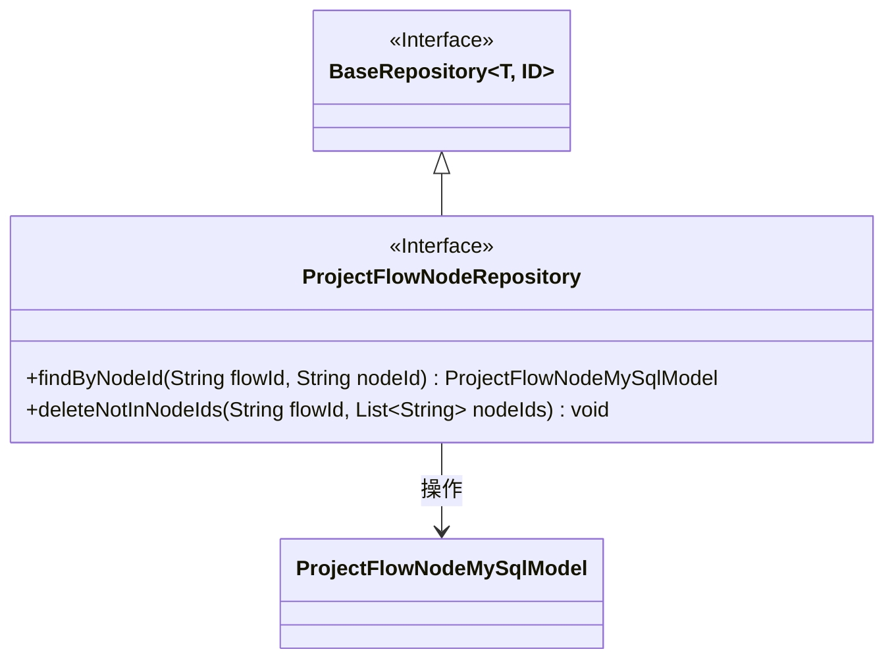
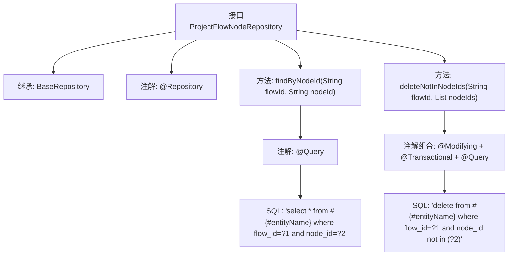

# 基础信息

|      |      |
|------|------|
| 名称 | ProjectFlowNodeRepository |
| 编码语言 | .java |
| 代码路径 | WeFe/board/board-service/src/main/java/com/welab/wefe/board/service/database/repository/ProjectFlowNodeRepository.java |
| 包名 | com.welab.wefe.board.service.database.repository |
| 依赖项 | ['com.welab.wefe.board.service.database.entity.job.ProjectFlowNodeMySqlModel', 'com.welab.wefe.board.service.database.repository.base.BaseRepository', 'org.springframework.data.jpa.repository.Modifying', 'org.springframework.data.jpa.repository.Query', 'org.springframework.stereotype.Repository', 'org.springframework.transaction.annotation.Transactional', 'java.util.List'] |
| 概述说明 | 项目流程节点仓库接口，提供按流程ID和节点ID查询节点方法，以及删除指定流程中不在给定节点ID列表中的节点功能。 |

# 说明

该代码定义了一个名为ProjectFlowNodeRepository的Spring Data JPA仓库接口，继承自BaseRepository，操作ProjectFlowNodeMySqlModel实体类，主键类型为String。接口包含两个方法：findByNodeId通过flowId和nodeId查询节点，使用原生SQL；deleteNotInNodeIds根据flowId删除不在指定nodeIds列表中的节点，具有自动清除缓存和事务支持。

# 类列表 Class Summary

| 名称   | 类型  | 说明 |
|-------|------|-------------|
| ProjectFlowNodeRepository | interface | 项目流程节点仓库接口，提供按流程ID和节点ID查询节点方法，以及删除不在指定节点ID列表中的节点功能。 |

## 类 ProjectFlowNodeRepository

|      |      |
|------|------|
| 访问范围 | @Repository;public |
| 类型 | interface |
| 名称 | ProjectFlowNodeRepository |
| 说明 | 项目流程节点仓库接口，提供按流程ID和节点ID查询节点方法，以及删除不在指定节点ID列表中的节点功能。 |

### UML类图

该类图展示了一个Spring Data JPA仓库接口的结构。ProjectFlowNodeRepository接口继承自泛型接口BaseRepository，指定了实体类型为ProjectFlowNodeMySqlModel和ID类型为String。接口定义了两个关键方法：findByNodeId用于根据流程ID和节点ID查询节点，deleteNotInNodeIds用于删除指定流程中不在给定节点ID列表中的所有节点。注解表明这是一个Spring Data仓库接口，包含原生SQL查询和事务性操作。

### 内部方法调用关系图

该流程图展示了Spring Data JPA仓库接口的结构，包含继承关系、类级别注解和两个自定义查询方法。findByNodeId方法通过原生SQL查询特定节点，deleteNotInNodeIds方法使用事务性删除操作清除不在指定列表中的节点。注解组合清晰地标明了每个方法的持久化操作特性，体现了Spring Data的声明式数据访问风格。

### 字段列表 Field List

| 名称  | 类型  | 说明 |
|-------|-------|------|

### 方法列表

| 名称  | 类型  | 说明 |
|-------|-------|------|
| deleteNotInNodeIds | void | 删除指定流程ID下不在给定节点ID列表中的节点数据，自动清除缓存并支持事务。 |
| findByNodeId | ProjectFlowNodeMySqlModel | 查询数据库表中指定流程ID和节点ID的记录。 |

