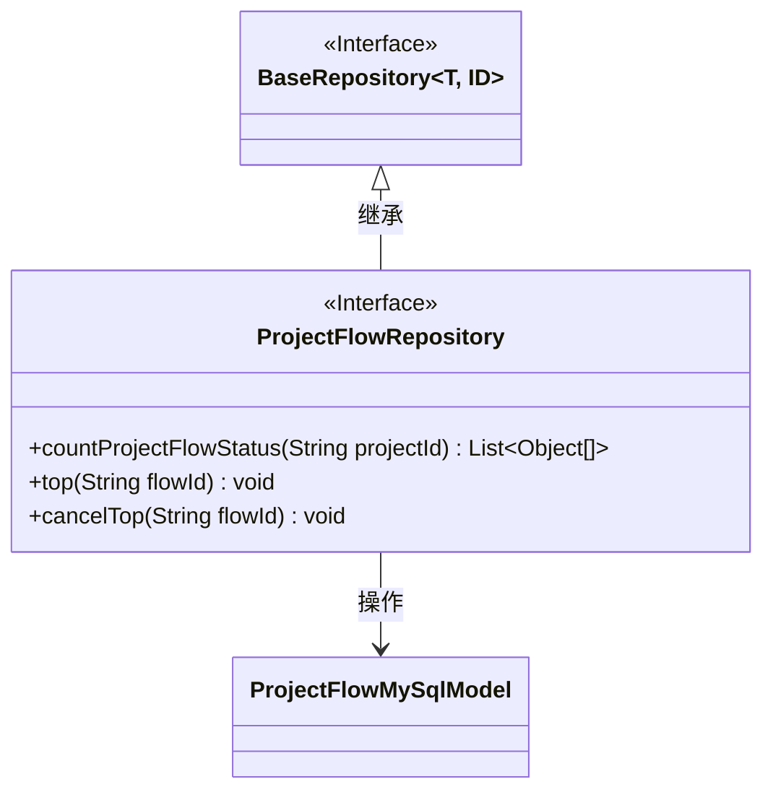
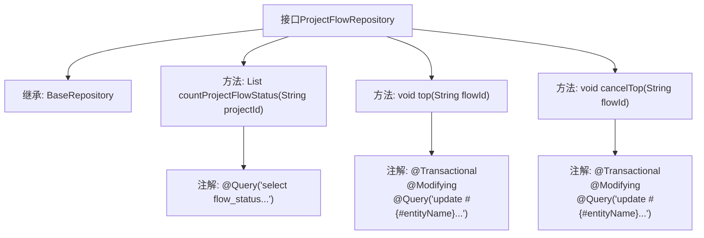

# 基础信息

|      |      |
|------|------|
| 名称 | ProjectFlowRepository |
| 编码语言 | .java |
| 代码路径 | WeFe/board/board-service/src/main/java/com/welab/wefe/board/service/database/repository/ProjectFlowRepository.java |
| 包名 | com.welab.wefe.board.service.database.repository |
| 依赖项 | ['com.welab.wefe.board.service.database.entity.job.ProjectFlowMySqlModel', 'com.welab.wefe.board.service.database.repository.base.BaseRepository', 'org.springframework.data.jpa.repository.Modifying', 'org.springframework.data.jpa.repository.Query', 'org.springframework.stereotype.Repository', 'org.springframework.transaction.annotation.Transactional', 'java.util.List'] |
| 概述说明 | ProjectFlowRepository接口提供项目流程状态统计、置顶及取消置顶功能，使用原生SQL查询和更新操作。 |

# 说明

该代码定义了一个名为ProjectFlowRepository的Spring Data JPA仓库接口，继承自BaseRepository。接口包含三个方法：countProjectFlowStatus用于统计项目中不同状态的流程数量；top方法将指定流程置顶并更新排序号；cancelTop方法取消指定流程的置顶状态并将排序号重置为0。所有方法均使用原生SQL查询并通过注解配置事务和修改行为。

# 类列表 Class Summary

| 名称   | 类型  | 说明 |
|-------|------|-------------|
| ProjectFlowRepository | interface | ProjectFlowRepository接口提供项目流程状态统计、置顶及取消置顶功能，使用原生SQL查询和更新操作。 |

## 类 ProjectFlowRepository

|      |      |
|------|------|
| 访问范围 | @Repository;public |
| 类型 | interface |
| 名称 | ProjectFlowRepository |
| 说明 | ProjectFlowRepository接口提供项目流程状态统计、置顶及取消置顶功能，使用原生SQL查询和更新操作。 |

### UML类图

类图描述：该图展示了一个Spring Data JPA仓库接口ProjectFlowRepository，它继承自泛型接口BaseRepository，操作ProjectFlowMySqlModel实体类。接口包含三个主要方法：统计项目流程状态数量、置顶和取消置顶操作，均通过原生SQL实现。通过@Repository注解标记为持久层组件，体现了JPA仓库模式的基本结构。

### 内部方法调用关系图

这段代码定义了一个Spring Data JPA仓库接口ProjectFlowRepository，主要用于管理项目流程数据。接口提供了三个核心功能：1) 统计项目中不同状态流程的数量（countProjectFlowStatus）；2) 将指定流程置顶（top），通过更新top字段和设置最大排序值实现；3) 取消流程置顶（cancelTop），重置top和sort_num字段。所有数据库操作都通过原生SQL查询实现，并使用了@Modifying和@Transactional注解确保数据一致性。该接口继承自BaseRepository，具备基础的CRUD功能。

### 字段列表 Field List

| 名称  | 类型  | 说明 |
|-------|-------|------|

### 方法列表

| 名称  | 类型  | 说明 |
|-------|-------|------|
| countProjectFlowStatus | List<Object[]> | 查询项目流程状态统计：按project_id和未删除条件分组计算各flow_status的数量，返回结果列表。 |
| top | void | 使用原生SQL更新指定flowId记录，设置top为true并将sort_num设为当前最大值加1，自动清除缓存。 |
| cancelTop | void | 使用@Transactional和@Modifying注解的JPA方法，通过原生SQL更新指定flowId记录的top和sort_num字段。 |

