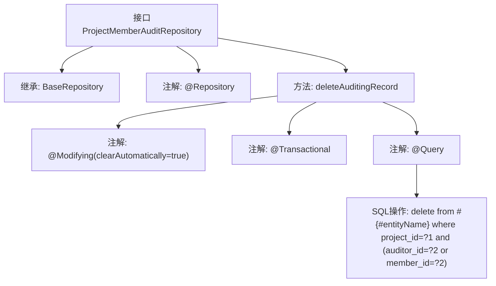

# 基础信息

|      |      |
|------|------|
| 名称 | ProjectMemberAuditRepository |
| 编码语言 | .java |
| 代码路径 | WeFe/board/board-service/src/main/java/com/welab/wefe/board/service/database/repository/ProjectMemberAuditRepository.java |
| 包名 | com.welab.wefe.board.service.database.repository |
| 依赖项 | ['com.welab.wefe.board.service.database.entity.job.ProjectMemberAuditMySqlModel', 'com.welab.wefe.board.service.database.repository.base.BaseRepository', 'org.springframework.data.jpa.repository.Modifying', 'org.springframework.data.jpa.repository.Query', 'org.springframework.stereotype.Repository', 'org.springframework.transaction.annotation.Transactional'] |
| 概述说明 | 项目成员审核仓库接口，继承基础仓库，提供删除指定成员审核记录功能，包括其审核和被审核记录，通过原生SQL实现。 |

# 说明

该代码定义了一个名为ProjectMemberAuditRepository的Spring Data JPA仓库接口，继承自BaseRepository，用于操作ProjectMemberAuditMySqlModel类型数据，主键类型为String。接口包含一个删除审核记录的方法deleteAuditingRecord，该方法会移除指定项目中与特定成员相关的所有审核记录，包括该成员需要审核的记录和针对该成员的审核记录。方法使用原生SQL查询，通过@Modifying和@Transactional注解确保数据修改操作的事务性和自动清除缓存。

# 类列表 Class Summary

| 名称   | 类型  | 说明 |
|-------|------|-------------|
| ProjectMemberAuditRepository | interface | ProjectMemberAuditRepository接口定义删除项目成员审核记录的方法，通过原生SQL删除指定项目ID和审核人或成员ID的记录。 |


## 类 ProjectMemberAuditRepository

|      |      |
|------|------|
| 访问范围 | @Repository;public |
| 类型 | interface |
| 名称 | ProjectMemberAuditRepository |
| 说明 | ProjectMemberAuditRepository接口定义删除项目成员审核记录的方法，通过原生SQL删除指定项目ID和审核人或成员ID的记录。 |


### UML类图

```mermaid
classDiagram
    class BaseRepository~T, ID~ {
        <<Interface>>
    }

    class ProjectMemberAuditRepository {
        <<Interface>>
        +deleteAuditingRecord(String projectId, String auditorId) void
    }

    BaseRepository <|-- ProjectMemberAuditRepository
    // ProjectMemberAuditRepository继承自泛型接口BaseRepository
    // 提供删除项目成员审核记录的方法，支持原生SQL操作
```

类图描述：该图展示了一个继承自BaseRepository泛型接口的ProjectMemberAuditRepository接口，其中BaseRepository带有两个泛型参数T和ID。ProjectMemberAuditRepository作为数据访问层接口，通过@Query注解实现了原生的SQL删除操作，用于移除指定项目成员的审核记录，包含清除审核人和被审核人相关记录的功能。


### 内部方法调用关系图



这段代码定义了一个Spring Data JPA仓库接口，用于管理项目成员审核记录的数据库操作。核心功能是通过deleteAuditingRecord方法执行原生SQL删除操作，该方法会删除指定项目中与特定成员相关的所有审核记录（包括该成员作为审核人或被审核人的记录）。方法通过@Modifying和@Transactional注解确保事务性，并使用@Query指定了原生SQL删除语句，其中#{#entityName}会被替换为实体名称。该接口继承了BaseRepository获得基础CRUD能力，并通过@Repository注解标记为Spring组件。

### 字段列表 Field List

| 名称  | 类型  | 说明 |
|-------|-------|------|

### 方法列表

| 名称  | 类型  | 说明 |
|-------|-------|------|
| deleteAuditingRecord | void | 删除指定项目ID和审核员或成员ID的审计记录，自动清除缓存并支持事务。 |


