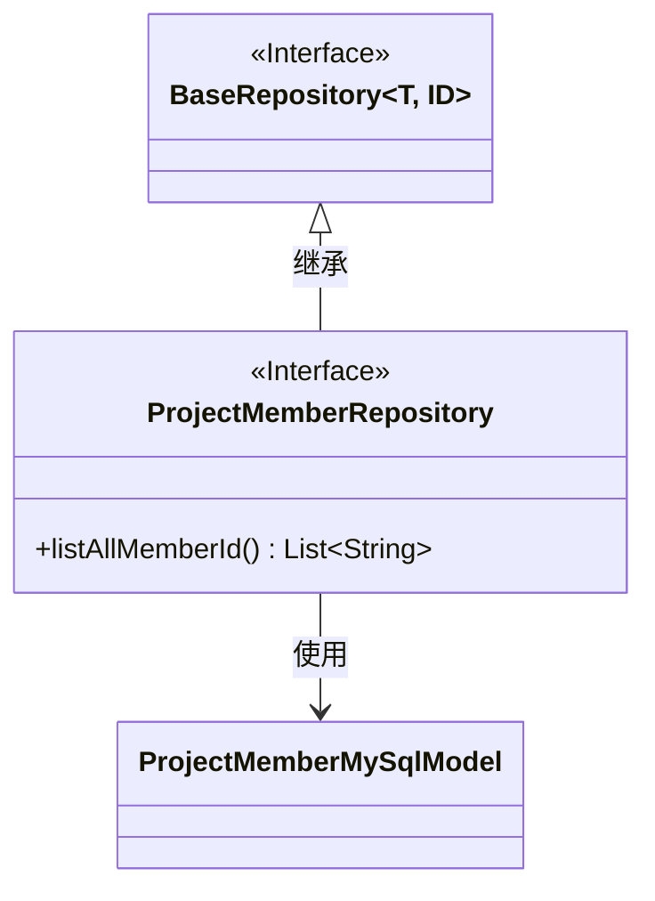
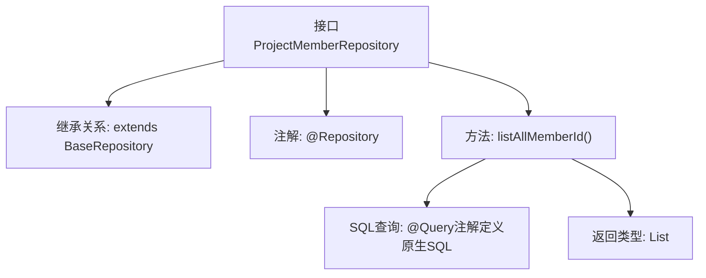

# 基础信息

|      |      |
|------|------|
| 名称 | ProjectMemberRepository |
| 编码语言 | .java |
| 代码路径 | WeFe/board/board-service/src/main/java/com/welab/wefe/board/service/database/repository/ProjectMemberRepository.java |
| 包名 | com.welab.wefe.board.service.database.repository |
| 依赖项 | ['com.welab.wefe.board.service.database.entity.job.ProjectMemberMySqlModel', 'com.welab.wefe.board.service.database.repository.base.BaseRepository', 'org.springframework.data.jpa.repository.Query', 'org.springframework.stereotype.Repository', 'java.util.List'] |
| 概述说明 | 项目成员仓库接口，继承基础仓库，定义查询方法获取所有合作成员ID。 |

# 说明

这是一个名为ProjectMemberRepository的Spring Data JPA仓库接口，继承自BaseRepository，用于操作ProjectMemberMySqlModel类型的数据实体，主键类型为String。接口中定义了一个原生SQL查询方法listAllMemberId，通过@Query注解指定查询语句，功能是从项目成员表中分组查询所有成员ID并返回字符串列表。该接口标记了@Repository注解，表明它是一个Spring管理的持久层组件。

# 类列表 Class Summary

| 名称   | 类型  | 说明 |
|-------|------|-------------|
| ProjectMemberRepository | interface | 项目成员仓库接口，继承基础仓库，提供按成员ID分组查询所有合作成员的功能。 |

## 类 ProjectMemberRepository

|      |      |
|------|------|
| 访问范围 | @Repository;public |
| 类型 | interface |
| 名称 | ProjectMemberRepository |
| 说明 | 项目成员仓库接口，继承基础仓库，提供按成员ID分组查询所有合作成员的功能。 |

### UML类图

这段代码展示了一个Spring Data JPA的仓库接口设计。ProjectMemberRepository接口继承自泛型接口BaseRepository，指定了实体类型为ProjectMemberMySqlModel，主键类型为String。该接口定义了一个原生SQL查询方法listAllMemberId()，用于分组查询所有成员ID。类图清晰地反映了接口继承关系和实体依赖，符合JPA仓库的标准设计模式，通过@Repository注解表明这是一个数据访问组件。

### 内部方法调用关系图

这段流程图展示了Spring Data JPA中ProjectMemberRepository接口的结构。该接口通过@Repository注解标识为数据访问组件，继承自泛型BaseRepository并指定了实体类型ProjectMemberMySqlModel和主键类型String。核心方法listAllMemberId()使用@Query注解定义了原生SQL查询，通过分组操作获取所有不重复的member_id，最终返回字符串列表。整个设计体现了Spring Data JPA的声明式Repository模式，将数据库操作抽象为接口方法。

### 字段列表 Field List

| 名称  | 类型  | 说明 |
|-------|-------|------|

### 方法列表

| 名称  | 类型  | 说明 |
|-------|-------|------|
| listAllMemberId | List<String> | 查询所有成员ID并按member_id分组，返回字符串列表。 |

