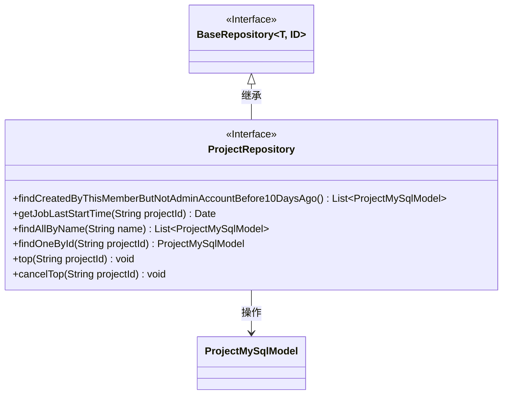
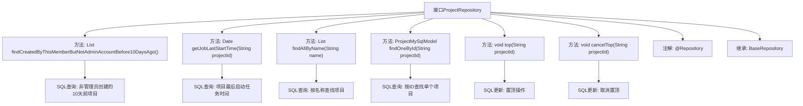

# 基础信息

|      |      |
|------|------|
| 名称 | ProjectRepository |
| 编码语言 | .java |
| 代码路径 | WeFe/board/board-service/src/main/java/com/welab/wefe/board/service/database/repository/ProjectRepository.java |
| 包名 | com.welab.wefe.board.service.database.repository |
| 依赖项 | ['com.welab.wefe.board.service.database.entity.job.ProjectMySqlModel', 'com.welab.wefe.board.service.database.repository.base.BaseRepository', 'org.springframework.data.jpa.repository.Modifying', 'org.springframework.data.jpa.repository.Query', 'org.springframework.stereotype.Repository', 'org.springframework.transaction.annotation.Transactional', 'java.util.Date', 'java.util.List'] |
| 概述说明 | ProjectRepository接口包含查询非管理员创建的10天前的项目、获取项目最后启动时间、按名称或ID查询项目、置顶及取消置顶功能。 |

# 说明

ProjectRepository接口扩展了BaseRepository，提供多种项目数据查询和操作方法。包含查询非管理员创建的10天前的项目、获取指定项目最后任务启动时间、按名称或ID查询项目等方法。还支持置顶和取消置顶操作，通过更新top和sort_num字段实现。所有查询均使用原生SQL语句，部分方法带有事务和自动清除缓存注解。

# 类列表 Class Summary

| 名称   | 类型  | 说明 |
|-------|------|-------------|
| ProjectRepository | interface | ProjectRepository接口包含查询非管理员创建的10天前的项目、获取项目最后启动时间、按名称或ID查询项目、置顶和取消置顶项目的方法。 |

## 类 ProjectRepository

|      |      |
|------|------|
| 访问范围 | @Repository;public |
| 类型 | interface |
| 名称 | ProjectRepository |
| 说明 | ProjectRepository接口包含查询非管理员创建的10天前的项目、获取项目最后启动时间、按名称或ID查询项目、置顶和取消置顶项目的方法。 |

### UML类图

这段代码展示了一个Spring Data JPA的Repository接口`ProjectRepository`，它继承自`BaseRepository`并提供了多个自定义查询方法。该接口主要用于操作`ProjectMySqlModel`实体类，包含查询非管理员创建的10天前的项目、获取项目最后启动任务时间、按名称查询项目、置顶/取消置顶项目等功能。所有方法都通过`@Query`注解定义了原生SQL查询，其中部分修改操作还使用了`@Transactional`和`@Modifying`注解来确保事务性和自动清除持久化上下文。

### 内部方法调用关系图

该流程图展示了ProjectRepository接口的结构和功能。作为数据访问层组件，它继承了BaseRepository并提供了6个核心方法：包括4个查询方法（复杂条件查询、时间查询、名称查询和ID查询）和2个更新方法（置顶/取消置顶操作）。每个方法都通过@Query注解绑定了特定的原生SQL语句，其中findCreatedByThisMemberButNotAdminAccountBefore10DaysAgo()实现了最复杂的多条件联合查询逻辑，而top()和cancelTop()方法则使用@Modifying和@Transactional注解确保数据修改的事务性。

### 字段列表 Field List

| 名称  | 类型  | 说明 |
|-------|-------|------|

### 方法列表

| 名称  | 类型  | 说明 |
|-------|-------|------|
| findAllByName | List<ProjectMySqlModel> | 查询数据库中与指定名称匹配的所有项目记录，返回结果列表。使用原生SQL语句。 |
| getJobLastStartTime | Date | 查询项目中任务的最新开始时间，根据项目ID返回最大开始时间。 |
| top | void | 更新指定project_id记录，置顶并设置sort_num为当前最大值加1。使用事务和自动清除缓存。 |
| findCreatedByThisMemberButNotAdminAccountBefore10DaysAgo | List<ProjectMySqlModel> | 查询未关闭、创建超过10天、由特定成员创建且非管理员账户的项目记录。 |
| findOneById | ProjectMySqlModel | 查询指定project_id的首条记录，返回ProjectMySqlModel对象。 |
| cancelTop | void | 使用@Transactional和@Modifying注解，通过原生SQL更新指定projectId的数据，将top设为false且sort_num归零。 |

