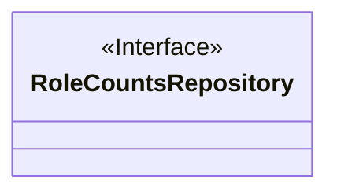
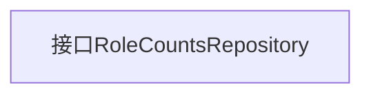

# 基础信息

|      |      |
|------|------|
| 名称 | RoleCountsRepository |
| 编码语言 | .java |
| 代码路径 | WeFe/board/board-service/src/main/java/com/welab/wefe/board/service/database/repository/RoleCountsRepository.java |
| 包名 | com.welab.wefe.board.service.database.repository |
| 依赖项 | [] |
| 概述说明 | 接口RoleCountsRepository定义，无具体方法。 |

# 说明

这是一个名为RoleCountsRepository的公共接口定义，目前为空接口，未声明任何方法。该接口可能用于角色计数相关的数据访问层抽象，遵循了面向接口编程的设计原则，为后续实现类提供规范基础。接口的public修饰符表明它可以被任何其他类访问。

# 类列表 Class Summary

| 名称   | 类型  | 说明 |
|-------|------|-------------|
| RoleCountsRepository | interface | 接口RoleCountsRepository定义，无具体方法。 |

## 类 RoleCountsRepository

|      |      |
|------|------|
| 访问范围 | public |
| 类型 | interface |
| 名称 | RoleCountsRepository |
| 说明 | 接口RoleCountsRepository定义，无具体方法。 |

### UML类图

这段类图描述了一个名为RoleCountsRepository的接口，使用<<Interface>>标记明确表示这是一个接口类型。由于接口内部没有定义任何方法或属性，图中仅展示了接口的基本结构。在面向对象设计中，这样的接口通常用于定义行为契约，后续可由具体类实现来提供具体功能。该图清晰地遵循了类图规范，使用正确标记和格式来区分接口与普通类。

### 内部方法调用关系图

这段流程图描述了一个名为RoleCountsRepository的Java接口。由于该接口为空接口（不包含任何方法或属性声明），流程图仅包含一个表示接口本身的节点。在面向对象编程中，这样的空接口通常用作标记接口（marker interface），用于标识实现该接口的类具有某种特定能力或特征。虽然当前没有定义任何方法，但后续可以通过实现该接口来扩展功能。

### 字段列表 Field List

| 名称  | 类型  | 说明 |
|-------|-------|------|

### 方法列表

| 名称  | 类型  | 说明 |
|-------|-------|------|

