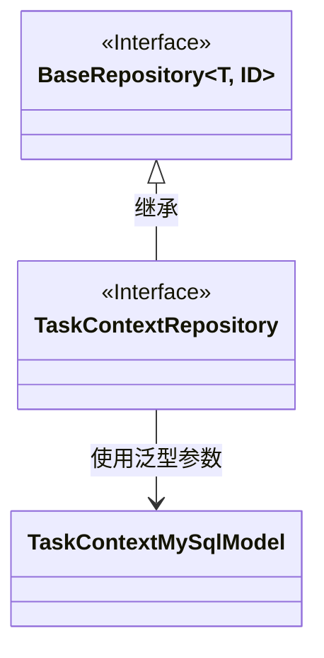
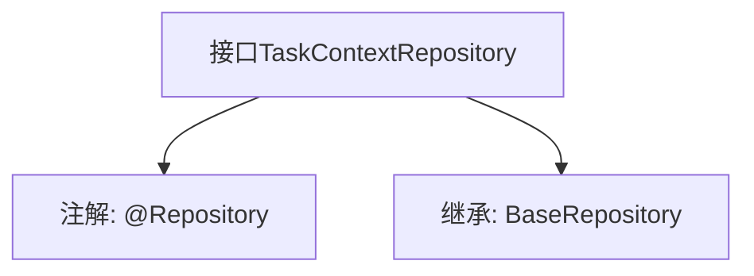

# 基础信息

|      |      |
|------|------|
| 名称 | TaskContextRepository |
| 编码语言 | .java |
| 代码路径 | WeFe/board/board-service/src/main/java/com/welab/wefe/board/service/database/repository/TaskContextRepository.java |
| 包名 | com.welab.wefe.board.service.database.repository |
| 依赖项 | ['com.welab.wefe.board.service.database.entity.job.TaskContextMySqlModel', 'com.welab.wefe.board.service.database.repository.base.BaseRepository', 'org.springframework.stereotype.Repository'] |
| 概述说明 | 这是一个Spring的Repository接口，继承自BaseRepository，用于操作TaskContextMySqlModel类型的数据，主键类型为String。 |

# 说明

这是一个名为TaskContextRepository的Spring数据仓库接口，使用@Repository注解标记。它继承自BaseRepository泛型接口，指定了实体类型为TaskContextMySqlModel，主键类型为String。该接口主要用于对TaskContextMySqlModel实体进行数据库操作，继承了基础仓库的CRUD功能。

# 类列表 Class Summary

| 名称   | 类型  | 说明 |
|-------|------|-------------|
| TaskContextRepository | interface | 这是一个Spring框架的仓库接口，继承基础仓库类，用于操作TaskContextMySqlModel类型数据，主键为String类型。 |

## 类 TaskContextRepository

|      |      |
|------|------|
| 访问范围 | @Repository;public |
| 类型 | interface |
| 名称 | TaskContextRepository |
| 说明 | 这是一个Spring框架的仓库接口，继承基础仓库类，用于操作TaskContextMySqlModel类型数据，主键为String类型。 |

### UML类图

这段代码展示了一个Spring Data JPA的仓库接口设计。TaskContextRepository接口继承自泛型接口BaseRepository，指定了实体类型为TaskContextMySqlModel，主键类型为String。类图清晰地呈现了接口继承关系和泛型参数绑定，其中BaseRepository作为泛型基接口，TaskContextRepository作为具体领域仓库接口，TaskContextMySqlModel作为持久化实体模型。这种设计遵循了Spring Data的仓库模式，实现了对特定实体类型的CRUD操作。

### 内部方法调用关系图

这段代码定义了一个Spring Data JPA的仓库接口TaskContextRepository，通过@Repository注解标记为持久层组件。该接口继承了BaseRepository泛型接口，指定了实体类型为TaskContextMySqlModel，主键类型为String。流程图清晰地展示了接口的注解和继承关系，体现了Spring Data JPA中通过继承基础仓库快速实现CRUD操作的典型模式，这种设计避免了重复编写基础数据访问代码。

### 字段列表 Field List

| 名称  | 类型  | 说明 |
|-------|-------|------|

### 方法列表

| 名称  | 类型  | 说明 |
|-------|-------|------|

