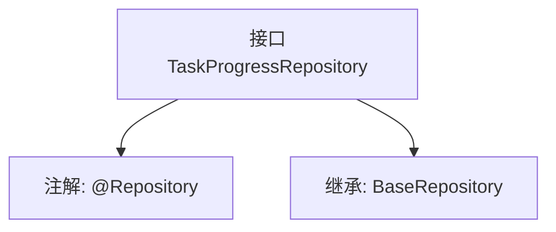

# 基础信息

|      |      |
|------|------|
| 名称 | TaskProgressRepository |
| 编码语言 | .java |
| 代码路径 | WeFe/board/board-service/src/main/java/com/welab/wefe/board/service/database/repository/TaskProgressRepository.java |
| 包名 | com.welab.wefe.board.service.database.repository |
| 依赖项 | ['com.welab.wefe.board.service.database.entity.job.TaskProgressMysqlModel', 'com.welab.wefe.board.service.database.repository.base.BaseRepository', 'org.springframework.stereotype.Repository'] |
| 概述说明 | 任务进度仓库接口，继承基础仓库，操作任务进度MySQL模型，主键类型为字符串。 |

# 说明

该代码片段定义了一个名为TaskProgressRepository的Spring数据仓库接口，使用@Repository注解标记。该接口继承自BaseRepository泛型基类，指定了实体类型为TaskProgressMysqlModel，主键类型为String。这表明该仓库用于处理与任务进度相关的MySQL数据库操作，继承了基础仓库的CRUD功能。

# 类列表 Class Summary

| 名称   | 类型  | 说明 |
|-------|------|-------------|
| TaskProgressRepository | interface | 任务进度仓库接口，继承基础仓库，操作任务进度MySQL模型，主键类型为字符串。 |


## 类 TaskProgressRepository

|      |      |
|------|------|
| 访问范围 | @Repository;public |
| 类型 | interface |
| 名称 | TaskProgressRepository |
| 说明 | 任务进度仓库接口，继承基础仓库，操作任务进度MySQL模型，主键类型为字符串。 |


### UML类图

```mermaid
classDiagram
    class TaskProgressRepository {
        <<Interface>>
    }
    class BaseRepository~T, ID~ {
        <<Interface>>
    }
    TaskProgressRepository --|> BaseRepository : 继承
    // TaskProgressRepository接口继承自泛型接口BaseRepository
    // 泛型参数T绑定为TaskProgressMysqlModel，ID绑定为String
```

该类图展示了一个Spring数据仓库接口TaskProgressRepository，它继承自泛型基础接口BaseRepository。其中BaseRepository定义了两个泛型参数：T（实体类型）指定为TaskProgressMysqlModel，ID（主键类型）指定为String。通过@Repository注解表明这是一个数据访问层组件，遵循Spring Data的仓库模式设计，用于处理TaskProgressMysqlModel实体的持久化操作。这种设计提供了标准CRUD操作的基础支持，同时保持类型安全性。


### 内部方法调用关系图



这段流程图展示了TaskProgressRepository接口的结构关系。该接口被标记为@Repository注解，表明它是一个Spring数据访问层组件。同时继承了BaseRepository泛型接口，指定了实体类型为TaskProgressMysqlModel，主键类型为String。这种设计遵循了Spring Data JPA的规范，通过继承基础仓库接口自动获得CRUD操作能力，无需手动实现基础数据访问方法。整个结构体现了JPA仓库接口的典型设计模式。

### 字段列表 Field List

| 名称  | 类型  | 说明 |
|-------|-------|------|

### 方法列表

| 名称  | 类型  | 说明 |
|-------|-------|------|


