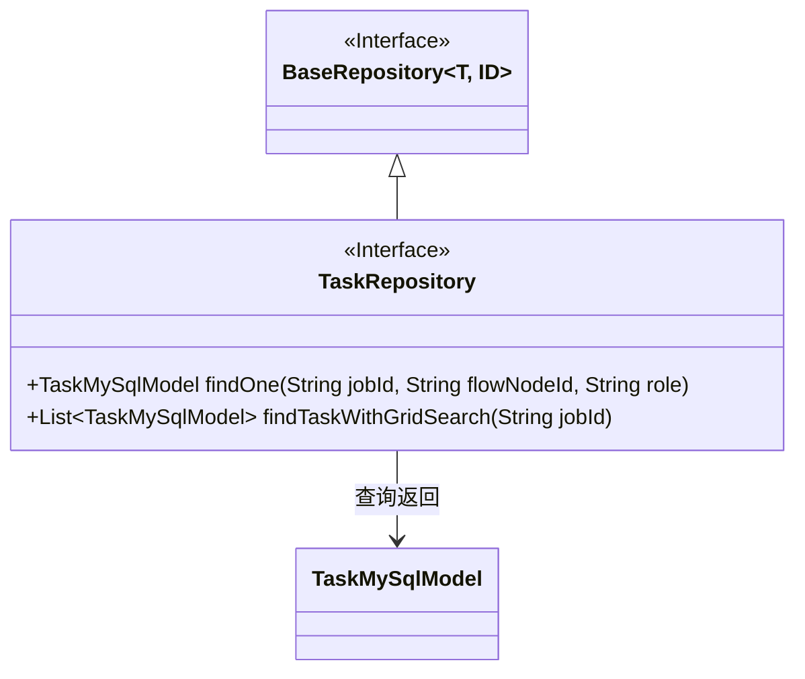
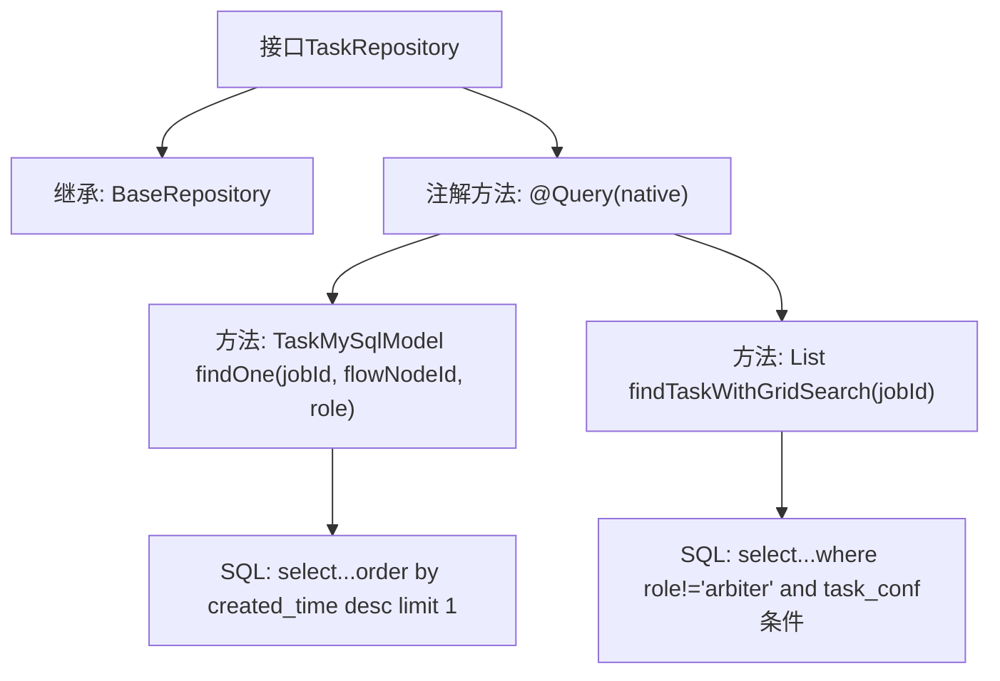

# 基础信息

|      |      |
|------|------|
| 名称 | TaskRepository |
| 编码语言 | .java |
| 代码路径 | WeFe/board/board-service/src/main/java/com/welab/wefe/board/service/database/repository/TaskRepository.java |
| 包名 | com.welab.wefe.board.service.database.repository |
| 依赖项 | ['com.welab.wefe.board.service.database.entity.job.TaskMySqlModel', 'com.welab.wefe.board.service.database.repository.base.BaseRepository', 'org.springframework.data.jpa.repository.Query', 'org.springframework.stereotype.Repository', 'java.util.List'] |
| 概述说明 | TaskRepository接口扩展BaseRepository，包含两个原生SQL查询方法：findOne按jobId、flowNodeId和role查找最新任务；findTaskWithGridSearch查找非arbiter角色且需要网格搜索的任务列表。 |

# 说明

该代码定义了一个名为TaskRepository的Spring Data JPA仓库接口，继承自BaseRepository，操作TaskMySqlModel实体类。接口包含两个原生SQL查询方法：findOne方法根据jobId、flowNodeId和role查询最新一条任务记录；findTaskWithGridSearch方法查询指定jobId下非仲裁者角色且需要网格搜索的任务列表。两个方法都使用@Query注解直接编写SQL语句，通过参数绑定实现条件查询。

# 类列表 Class Summary

| 名称   | 类型  | 说明 |
|-------|------|-------------|
| TaskRepository | interface | TaskRepository接口扩展BaseRepository，包含两个原生SQL查询方法：按jobId、flowNodeId和role查找最新任务；查找指定jobId下非仲裁者且需要网格搜索的任务列表。 |

## 类 TaskRepository

|      |      |
|------|------|
| 访问范围 | @Repository;public |
| 类型 | interface |
| 名称 | TaskRepository |
| 说明 | TaskRepository接口扩展BaseRepository，包含两个原生SQL查询方法：按jobId、flowNodeId和role查找最新任务；查找指定jobId下非仲裁者且需要网格搜索的任务列表。 |

### UML类图

该类图展示了Spring Data JPA中TaskRepository接口的结构及其关联关系。TaskRepository继承自泛型接口BaseRepository<TaskMySqlModel, String>，包含两个自定义查询方法：findOne通过jobId、flowNodeId和role组合条件查询单条记录；findTaskWithGridSearch查询需要网格搜索的非仲裁者任务。接口通过@Repository注解标记为持久层组件，与TaskMySqlModel实体类形成关联关系，体现了JPA仓库模式的基本设计。

### 内部方法调用关系图

这段代码展示了一个Spring Data JPA的Repository接口，主要包含两个自定义SQL查询方法。第一个方法findOne通过jobId、flowNodeId和role查询最新的单条任务记录，第二个方法findTaskWithGridSearch查找需要网格搜索的非仲裁者角色任务。流程图清晰地展示了接口继承关系和两个带原生SQL查询的注解方法的调用链路，每个方法都对应特定的数据库查询逻辑。

### 字段列表 Field List

| 名称  | 类型  | 说明 |
|-------|-------|------|

### 方法列表

| 名称  | 类型  | 说明 |
|-------|-------|------|
| findTaskWithGridSearch | List<TaskMySqlModel> | 查询指定jobId下需要网格搜索的非仲裁者角色任务。 |
| findOne | TaskMySqlModel | 查询指定任务：按jobId、flowNodeId和role条件筛选，返回最新一条记录。 |

