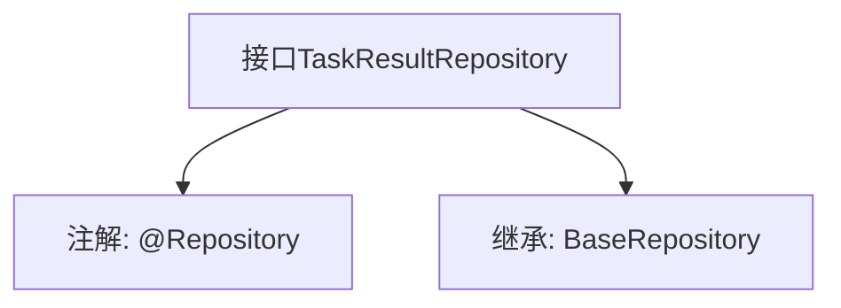

# 基础信息

|      |      |
|------|------|
| 名称 | TaskResultRepository |
| 编码语言 | .java |
| 代码路径 | WeFe/board/board-service/src/main/java/com/welab/wefe/board/service/database/repository/TaskResultRepository.java |
| 包名 | com.welab.wefe.board.service.database.repository |
| 依赖项 | ['com.welab.wefe.board.service.database.entity.job.TaskResultMySqlModel', 'com.welab.wefe.board.service.database.repository.base.BaseRepository', 'org.springframework.stereotype.Repository'] |
| 概述说明 | 这是一个Spring的TaskResultRepository接口，继承BaseRepository，用于操作TaskResultMySqlModel类型数据，主键为String类型。 |

# 说明

该内容描述了一个名为TaskResultRepository的Java接口，使用@Repository注解标记为Spring数据访问层组件。该接口继承自BaseRepository泛型基类，指定了实体类型为TaskResultMySqlModel，主键类型为String。这表明该接口用于对TaskResultMySqlModel实体进行数据库操作，继承了基类提供的通用CRUD方法。整个定义简洁，未包含额外自定义方法。

# 类列表 Class Summary

| 名称   | 类型  | 说明 |
|-------|------|-------------|
| TaskResultRepository | interface | 任务结果仓库接口，继承基础仓库，操作任务结果MySQL模型，主键类型为字符串。 |


## 类 TaskResultRepository

|      |      |
|------|------|
| 访问范围 | @Repository;public |
| 类型 | interface |
| 名称 | TaskResultRepository |
| 说明 | 任务结果仓库接口，继承基础仓库，操作任务结果MySQL模型，主键类型为字符串。 |


### UML类图

```mermaid
classDiagram
    class TaskResultRepository {
        <<Interface>>
    }
    class BaseRepository~T, ID~ {
        <<Interface>>
    }
    
    TaskResultRepository --|> BaseRepository : 继承
    // TaskResultRepository 继承了泛型接口 BaseRepository，指定了泛型参数为 TaskResultMySqlModel 和 String
```

这段类图展示了 TaskResultRepository 接口通过继承 BaseRepository 泛型接口的关系。BaseRepository 是一个带有两个泛型参数 T 和 ID 的接口，而 TaskResultRepository 在继承时具体化了这两个参数为 TaskResultMySqlModel 和 String 类型。@Repository 注解表明这是一个数据访问层的组件，通常用于数据库操作。这种设计遵循了Spring Data的仓库模式，通过继承基础接口获得基本的CRUD操作能力。


### 内部方法调用关系图



这段代码定义了一个Spring Data JPA的仓库接口TaskResultRepository，通过@Repository注解将其标记为Spring管理的组件。该接口继承了BaseRepository泛型接口，指定了实体类型为TaskResultMySqlModel，主键类型为String。流程图展示了接口的核心结构和继承关系，体现了Spring Data JPA中通过继承基础仓库快速实现数据访问层的典型模式。

### 字段列表 Field List

| 名称  | 类型  | 说明 |
|-------|-------|------|

### 方法列表

| 名称  | 类型  | 说明 |
|-------|-------|------|


